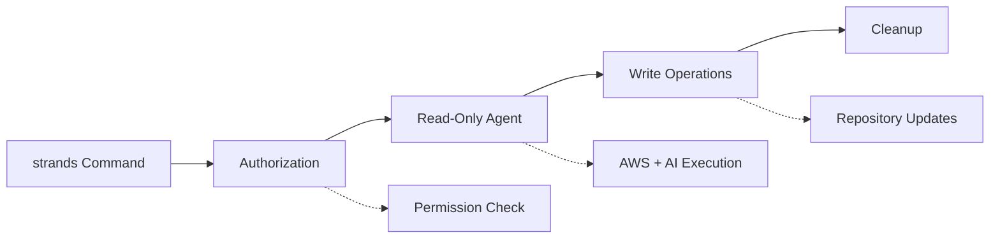

# Strands Command GitHub Actions

A comprehensive AI agent execution system for GitHub repositories that processes `/strands` commands in issues and pull requests.

## Overview

The Strands Command system enables AI-powered automation in GitHub repositories through:

- **Issue Comment Processing**: Responds to `/strands` commands in issues and PRs
- **Controlled AI Execution**: Runs AI agents with read-only and write-separated permissions
- **AWS Integration**: Secure OIDC-based authentication with Bedrock AI models
- **Security-First Design**: Manual approval gates and permission isolation

### Architecture



## Quick Start

1. **Set up AWS IAM Role** (see [IAM Role Policy](#iam-role-policy))
2. **Configure GitHub Secrets**:
   - `AWS_ROLE_ARN`: Your IAM role ARN
   - `STRANDS_SESSION_BUCKET`: S3 bucket for session storage
3. **Copy required files** to your repository:
   - `.github/workflows/strands-command.yml`
   - `.github/actions/` directory
   - `.github/scripts/` directory  
   - `.github/agent-sops/` directory
4. **Comment `/strands [your task]`** on any issue or PR
   - **On Issues**: 
     - Use `/strands <your task>` to have an agent help you refine an issue within the context of the current github repo
     - Use `/strands implement <your task>` to create a new PR based on the description of an issue
   - **On PRs**: `/strands <your task>` will instruct an Agent to review PR comments and make updates to the issue

## Actions

### strands-agent-runner

Executes AI agents with AWS integration and controlled permissions.

**Inputs:**
- `ref` (required): Git reference to checkout
- `system_prompt` (required): System instructions for the agent
- `session_id` (required): Session identifier for persistence
- `task_prompt` (required): Task description for the agent
- `aws_role_arn` (required): AWS IAM role ARN for authentication
- `sessions_bucket` (required): S3 bucket for session storage
- `write_permission` (required): Permission level flag for Read-only Sandbox mode (`true`/`false`)

**Features:**
- Strands Agent running with Agent SOPs specifically designed to instruct an Agent on how to develop in Github
- Python 3.13 and Node.js 20 environment setup (Node.js setup and npm install are optional and can be removed - only included for this repo's development)
- Read-only Sandbox support: Agent write actions can be deferred to the `strands-write-executor` action if you want your agent to execute with read-only github permissions

### strands-write-executor

Executes write operations from agent-generated artifacts if `strands-agent-runner` was run with `write_permissions: false`.

**Inputs:**
- `ref` (required): Target branch for changes
- `issue_id` (optional): Associated issue number

**Features:**
- Reads Agent modified repository state from artifacts, and pushes changes to pr branch
- Reads deferred write operations from artifact and executes them

## Workflows

### strands-command.yml

Main workflow that orchestrates the complete Strands command execution:

1. **Authorization Check**: Validates user permissions and applies approval gates
2. **Setup and Processing**: Parses input and prepares execution context
3. **Read-Only Execution**: Runs Agent in Read-only sandbox
4. **Write Operations**: Executes repository modifications in job isolated from agent
5. **Cleanup**: Removes temporary labels and artifacts

**Triggers:**
- Issue comments starting with `/strands`
- Manual workflow dispatch with parameters

## Agent SOPs

### Task Implementer (`task-implementer.sop.md`)

Implements features using test-driven development principles.

**Workflow**: Setup → Explore → Plan → Code → Commit → Pull Request

**Capabilities:**
- Feature implementation with TDD approach
- Comprehensive testing and documentation
- Pull request creation and iteration
- Code pattern following and best practices

### Task Refiner (`task-refiner.sop.md`)

Refines and clarifies task requirements before implementation.

**Workflow**: Read Issue → Analyze → Research → Clarify → Iterate

**Capabilities:**
- Requirement analysis and gap identification
- Clarifying question generation
- Implementation planning and preparation
- Ambiguity resolution through user interaction

## IAM Role Policy

### Required IAM Role

Create an IAM role with the following trust policy for GitHub OIDC:

```json
{
  "Version": "2012-10-17",
  "Statement": [
    {
      "Effect": "Allow",
      "Principal": {
        "Federated": "arn:aws:iam::YOUR_ACCOUNT_ID:oidc-provider/token.actions.githubusercontent.com"
      },
      "Action": "sts:AssumeRoleWithWebIdentity",
      "Condition": {
        "StringEquals": {
          "token.actions.githubusercontent.com:aud": "sts.amazonaws.com"
        },
        "StringLike": {
          "token.actions.githubusercontent.com:sub": "repo:YOUR_ORG/YOUR_REPO:*"
        }
      }
    }
  ]
}
```

### IAM Role Policy

Your IAM role must have these permissions in order to execute:

```json
{
  "Version": "2012-10-17",
  "Statement": [
    {
      "Sid": "Bedrock Access",
      "Effect": "Allow",
      "Action": [
        "bedrock:InvokeModelWithResponseStream",
        "bedrock:InvokeModel"
      ],
      "Resource": "*"
    },
    {
      "Effect": "Allow",
      "Action": [
        "s3:PutObject",
        "s3:GetObject",
        "s3:DeleteObject"
      ],
      "Resource": [
        "arn:aws:s3:::YOUR_STRANDS_SESSION_BUCKET/*"
      ]
    },
    {
      "Effect": "Allow",
      "Action": "s3:ListBucket",
      "Resource": [
        "arn:aws:s3:::YOUR_STRANDS_SESSION_BUCKET"
      ]
    }
  ]
}
```

### Setup Steps

1. **Create OIDC Provider** (if not exists):
   ```bash
   aws iam create-open-id-connect-provider \
     --url https://token.actions.githubusercontent.com \
     --thumbprint-list 6938fd4d98bab03faadb97b34396831e3780aea1 \
     --client-id-list sts.amazonaws.com
   ```

2. **Create IAM Role** with the trust policy above
3. **Create S3 Bucket** for session storage
4. **Add GitHub Secrets**:
   - `AWS_ROLE_ARN`: The created role ARN
   - `AGENT_SESSIONS_BUCKET`: The S3 bucket name

## Security

### ⚠️ Important Security Considerations

**This workflow should only be used with trusted sources and should use AWS guardrails to help avoid prompt injection risks.**

### Security Features

#### Authorization Controls
- **Collaborator Verification**: Only users with write access get auto-approval
- **Manual Approval Gates**: Unknown users require manual approval via GitHub environments
- **Permission Separation**: Read and write operations isolated in separate jobs

#### AWS Security
- **OIDC Authentication**: No long-lived credentials stored in GitHub
- **Minimal Permissions**: Inline session policy limits access to required resources only
- **Temporary Credentials**: Each execution gets fresh, time-limited AWS credentials. You can further limit these by updating the `strands-agent-runner` "Configure AWS credentials" step, and set the `role-duration-seconds` value
- **Resource Scoping**: S3 access limited to specific session bucket

#### Prompt Injection Mitigation
- **Trusted Sources Only**: Implement strict user authorization
- **AWS Guardrails**: Use AWS Bedrock guardrails to filter malicious prompts
- **Input Validation**: Validate and sanitize all user inputs
- **Execution Isolation**: Separate read and write phases prevent unauthorized modifications

## Configuration

### GitHub Secrets

| Secret | Description | Example |
|--------|-------------|---------|
| `AWS_ROLE_ARN` | IAM role for AWS access | `arn:aws:iam::123456789012:role/GitHubActionsRole` |
| `STRANDS_SESSION_BUCKET` | S3 bucket for sessions | `my-strands-sessions-bucket` |

### Environment Variables

The actions use these environment variables during execution:

| Variable | Purpose | Set By |
|----------|---------|--------|
| `GITHUB_WRITE` | Permission level indicator | Action |
| `SESSION_ID` | Agent session identifier | Workflow |
| `S3_SESSION_BUCKET` | Session storage location | Input |
| `STRANDS_TOOL_CONSOLE_MODE` | Tool execution mode | Action |
| `BYPASS_TOOL_CONSENT` | Automated tool approval | Action |

## Usage Examples

### Basic Task Implementation

Comment on an issue:
```
/strands Implement a new user authentication feature with JWT tokens
```

### Task Refinement

Comment on an issue with unclear requirements:
```
/strands refine Please help clarify the requirements for this feature
```

### Manual Execution

Use workflow dispatch with:
- **issue_id**: `123`
- **command**: `Implement the requested feature`
- **session_id**: `optional-session-id`

### Advanced Usage

```
/strands implement Create a REST API endpoint for user management with the following requirements:
1. CRUD operations for users
2. JWT authentication
3. Input validation
4. Unit tests with 90% coverage
5. OpenAPI documentation
```

---

**Note**: This system is designed for trusted environments. Always review security implications before deployment and implement appropriate guardrails for your use case.
