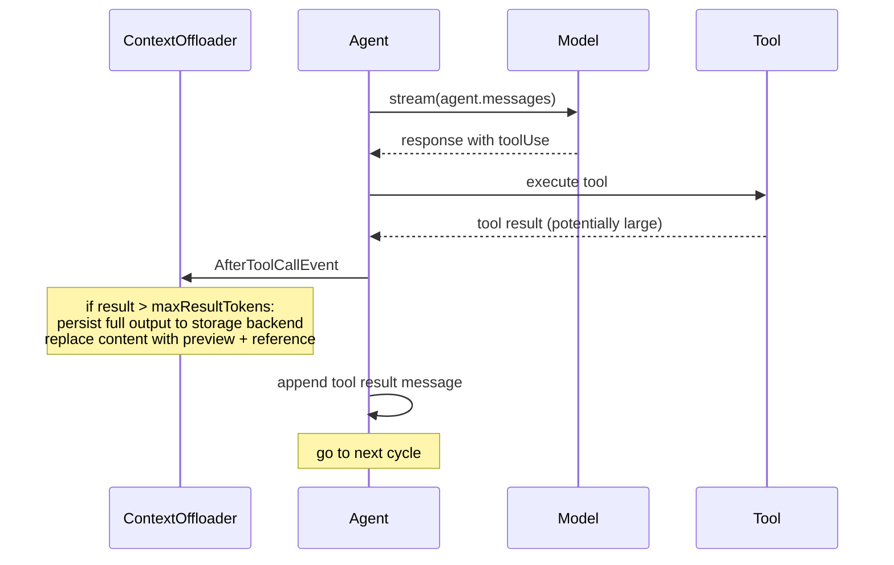

# Context Offloader

**Status**: Accepted

**Date**: 2026-04-16

**Issue**: [#1296: Large Tool Result Externalization](https://github.com/strands-agents/sdk-python/issues/1296)

**Related**:
- [#1678: Large Content Aliasing](https://github.com/strands-agents/sdk-python/issues/1678)

**Scope**: Cross-SDK design. Python implementation in [#2162](https://github.com/strands-agents/sdk-python/pull/2162).

## Context

When a tool returns a large result (a file dump, API response, database query, or log output), the entire content enters the conversation history as a tool result message. A single oversized result can push context into overflow in one step.

The current `SlidingWindowConversationManager` handles this reactively: after a `ContextWindowOverflowError`, it replaces the result with a generic message:

```typescript
const toolResultTooLargeMessage = 'The tool result was too large!'
```

This has two problems.

1. **Data loss.** The full output is discarded permanently. The agent loses the ability to reference or reason about the content.

2. **Reactive timing.** The replacement only happens after the model has already rejected the request. The oversized result consumes context space, triggers an overflow, wastes a round-trip, and only then gets truncated.

This design proposes intercepting large tool results at execution time, before they enter the conversation. The full output is persisted to a pluggable storage backend, and the conversation receives a truncated preview with a reference to the stored artifact.

## Decision

We implement tool result externalization as a `Plugin` that hooks `AfterToolCallEvent`. If a tool result exceeds a configurable size threshold, the plugin externalizes the full output and replaces the conversation content according to a configurable strategy.

The following diagram shows where externalization fits in the agent loop:



The plugin accepts a required `storage` parameter implementing the `Storage` interface, and a configurable `maxResultTokens` threshold (default 2,500 tokens). Token estimation uses the model's `countTokens` method (tiktoken when available, chars/4 heuristic fallback):

```typescript
export interface Storage {
  store(key: string, content: Uint8Array, contentType?: string): Promise<string>
  retrieve(reference: string): Promise<[Uint8Array, string]>
}
```

The SDK ships three built-in implementations:

| Implementation | Behavior | Use case |
|----------------|----------|----------|
| `InMemoryStorage` | Stores content in memory. Zero filesystem side effects. Content type preserved per block. | Testing, serverless, context-only optimization. |
| `FileStorage` | Writes to a local directory with `.metadata.json` sidecar for content type tracking. | Debugging, auditing, offline retrieval. |
| `S3Storage` | Writes to an S3 bucket. Content type preserved via S3 object metadata. Follows `S3SessionManager` patterns. | Production workloads, shared storage. |

Storage is a required parameter — the user must explicitly choose a backend. This avoids implicit behavior and makes the persistence model clear.

When a tool result exceeds `maxResultTokens`, each content block is stored individually to the storage backend with its content type preserved. The plugin then replaces the original content with a truncated preview plus per-block references.

The replacement content looks like:

```
[Offloaded: 3 blocks, ~5,432 tokens]
[Use the preview below to answer if possible.]

<first N tokens as preview>

[Stored references:]
  mem_1_tooluse_abc123_0 (text, 12,345 chars)
  mem_1_tooluse_abc123_1 (json, 8,901 bytes)
```

When `includeRetrievalTool` is enabled, the guidance additionally directs the agent to use `retrieve_offloaded_content` with a reference to get the full content.

### Content Type Handling

Tool results can contain multiple content block types. The plugin handles each type as follows:

| Type | Behavior |
|------|----------|
| Text | Stored as `text/plain`, replaced with a truncated preview. |
| JSON | Stored as `application/json` (serialized), replaced with a preview. |
| Image | Stored in native format (e.g., `image/png`), replaced with a placeholder + reference. |
| Document | Stored in native format (e.g., `application/pdf`), replaced with a placeholder + reference. |

Each content block is stored individually with its content type preserved. The plugin estimates the total token count of the tool result using the model's `countTokens` method. If the total exceeds `maxResultTokens`, it stores all blocks and replaces the result with a preview plus per-block references.

### Retrieval Tool

The plugin registers a built-in `retrieve_offloaded_content` tool by default (`includeRetrievalTool: true`) that the agent can call to fetch offloaded content by reference. Retrieval returns content in its native type: text as string, JSON as a JSON block, images as image blocks, documents as document blocks. This avoids requiring the user to separately configure a file-reading or S3 tool, and keeps the storage backend opaque to the model. Retrieval results are excluded from re-offloading to prevent circular offload loops. The retrieval tool can be disabled via `includeRetrievalTool: false`.

When the retrieval tool is enabled, the offloaded result includes inline guidance instructing the agent to prefer the preview and only retrieve when needed.

### SDK Changes Required

**New package: `plugins/context-offloader/`.** Contains the `ContextOffloader` plugin class, `Storage` interface, built-in storage implementations, and the `retrieve_offloaded_content` tool.

## Developer Experience

```typescript
import { Agent } from '@strands-agents/sdk'
import { ContextOffloader, InMemoryStorage, FileStorage, S3Storage } from '@strands-agents/sdk/vended-plugins/context-offloader'

// In-memory: context reduction only
const agent = new Agent({
  tools: [dataAnalysis, apiClient, fileProcessor],
  plugins: [
    new ContextOffloader({
      storage: new InMemoryStorage(),
    }),
  ],
})

// File storage: persists artifacts to disk, custom thresholds
const agent = new Agent({
  tools: [dataAnalysis, apiClient, fileProcessor],
  plugins: [
    new ContextOffloader({
      storage: new FileStorage({ artifactDir: './my-artifacts' }),
      maxResultTokens: 5_000,
      previewTokens: 2_000,
    }),
  ],
})

// S3 storage: persists artifacts to a bucket
const agent = new Agent({
  tools: [dataAnalysis, apiClient, fileProcessor],
  plugins: [
    new ContextOffloader({
      storage: new S3Storage({
        bucket: 'my-agent-artifacts',
        prefix: 'tool-results/',
      }),
    }),
  ],
})
```

Existing behavior is completely unchanged. Agents without the plugin continue to handle large results reactively.

## Alternatives Considered

### 1. Truncation Without Persistence

The current `SlidingWindowConversationManager` already truncates large results, but discards the full output. Truncation without persistence is simpler (no file system dependency) but loses data permanently. Externalization preserves the full output for debugging and potential retrieval by the agent.

### 2. Configuring Externalization on the Agent or Tool

Instead of a plugin, externalization could be a per-tool config or an agent-level setting. This would be more discoverable but would not compose as cleanly with other plugins. The plugin pattern keeps externalization independent and opt-in.

### 3. Strategy Pattern (Bundled Storage + Preview)

An alternative interface bundles storage and preview generation into a single `externalize()` method. This is more flexible for custom formatting but couples two concerns. The separate storage protocol enables the retrieval tool to call `retrieve()` directly without understanding the preview format.

## Consequences

### What Becomes Easier

Large tool results no longer blow up the context window or get silently discarded. The full output is preserved in the configured storage backend while the conversation receives a compact preview. The built-in retrieval tool allows the agent to fetch the full output on demand without requiring the user to configure separate file or S3 tools.

### What Becomes Harder or Requires Attention

Storage requires explicit configuration — there is no implicit default. When using file or S3 storage, artifacts accumulate and require cleanup. The preview may not contain the information the model needs, leading to follow-up retrieval tool calls.

### Migration

No breaking changes. The plugin is purely additive and opt-in.

## Willingness to Implement

Yes.
