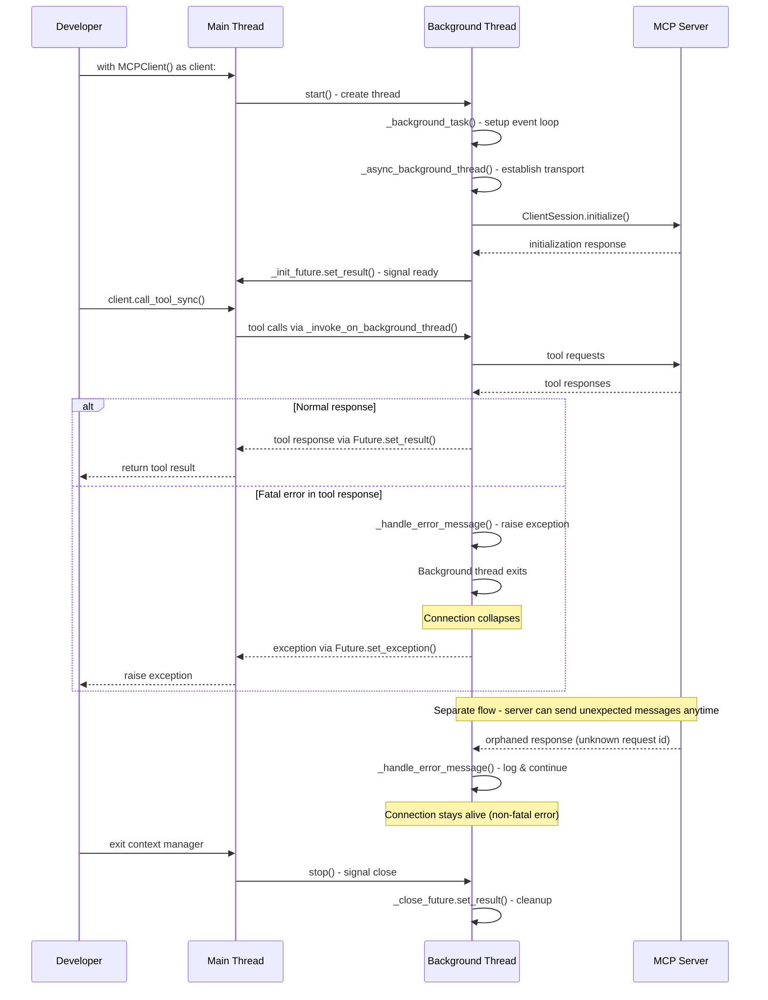

# MCP Client Architecture

## Overview

The MCPClient enables developers to use MCP tools in Strands agents without dealing with async complexity. Since MCP requires async operations but Strands aims for simple synchronous usage (`agent = Agent(); agent("Do something")`), the client uses a background thread with its own event loop to handle MCP communication. This creates challenges around thread synchronization, hanging prevention, and connection stability that this architecture addresses.

## Background Thread Flow



## Thread Synchronization & Event Loop Management

### Why Two Different Future Types?

**The challenge is synchronizing between the main thread (no event loop) and background thread (with event loop).**

**Main Thread Problem**:
```python
self._init_future: futures.Future[None] = futures.Future()
```
When `MCPClient.__init__()` runs, no event loop exists yet. The background thread hasn't started, so we cannot use `asyncio.Future`. We must use `concurrent.futures.Future` which works without an event loop. This allows the main thread to block safely on `self._init_future.result(timeout=startup_timeout)` until the background thread signals readiness.

**Background Thread Solution**:
```python
self._close_future: asyncio.futures.Future[None] | None = None
# Later in _async_background_thread:
self._close_future = asyncio.Future()  # Created inside event loop
```
Once the background thread's event loop is running, we can create `asyncio.Future` objects. The background thread needs to `await self._close_future` to stay alive because we want to keep the MCP connection running on this dedicated event loop. The session must remain active to handle incoming messages and process tool calls. We cannot use `concurrent.futures.Future` here because blocking on `.result()` would freeze the event loop, preventing it from processing MCP messages. Using `asyncio.Future` with `await` keeps the event loop responsive while waiting for the shutdown signal.

## Exception Handling, Hanging, & Connection Termination

### Hanging Scenarios & Defenses

**Hanging Scenario 1: Silent Exception Swallowing** ([PR #922](https://github.com/strands-agents/sdk-python/pull/922))

*Problem*: MCP SDK silently swallows server exceptions (HTTP timeouts, connection errors) without a message handler. Tool calls timeout on server side but client waits indefinitely for responses that never arrive.

*Defense*: `message_handler=self._handle_error_message` in ClientSession
```python
async with ClientSession(
    read_stream,
    write_stream,
    message_handler=self._handle_error_message,  # Prevents hanging
    elicitation_callback=self._elicitation_callback,
) as session:
```

*How it works in Strands' threaded setup*: 

1. **Main thread calls** `client.call_tool_sync()` and blocks on `invoke_future.result()`
2. **Background thread** submits the tool request to MCP server via `asyncio.run_coroutine_threadsafe()`
3. **Server times out** and sends an exception message back to the MCP client
4. **Without message handler**: MCP SDK silently ignores the exception, never calls `Future.set_result()` or `Future.set_exception()`
5. **Main thread hangs forever** waiting for `invoke_future.result()` that will never complete
6. **With `_handle_error_message`**: Exception is raised in background thread, propagates to `Future.set_exception()`, unblocks main thread

The threading architecture makes this particularly problematic because the main thread has no way to detect that the background thread received an error - it can only wait for the Future to complete. Without the message handler, that Future never gets resolved.

**Hanging Scenario 2: 5xx Server Errors** ([PR #1169](https://github.com/strands-agents/sdk-python/pull/1169))

*Problem*: When MCP servers return 5xx errors, the underlying client raises an exception that cancels all TaskGroup tasks and tears down the entire asyncio background thread. Pending tool calls hang forever waiting for responses from a dead connection.

*Defense*: Session closure detection in `_invoke_on_background_thread`
```python
async def run_async() -> T:
    invoke_event = asyncio.create_task(coro)
    tasks = [invoke_event, close_future]
    done, pending = await asyncio.wait(tasks, return_when=asyncio.FIRST_COMPLETED)
    
    if done.pop() == close_future:
        raise RuntimeError("Connection to the MCP server was closed")
    else:
        return await invoke_event
```

*How it works*: All tool calls race against `close_future`. When the background thread dies from 5xx errors, `close_future` completes and pending operations immediately fail with a clear error message instead of hanging.

### Defense Against Premature Connection Collapse

Before [PR #922](https://github.com/strands-agents/sdk-python/pull/922), the MCP client would never collapse connections because exceptions were silently ignored. After adding `_handle_error_message`, we introduced the risk of collapsing connections on client-side errors that should be recoverable. The challenge is ensuring we:

1. **DO collapse** when we want to (fatal server errors)
2. **DO NOT collapse** when we don't want to (client-side errors, orphaned responses)
3. **DO notify users** when collapse occurs ([PR #1169](https://github.com/strands-agents/sdk-python/pull/1169) detection)

**Non-Fatal Error Patterns**:
```python
# Errors that should NOT terminate the connection
_NON_FATAL_ERROR_PATTERNS = ["unknown request id"]
```

**Why "unknown request id" is Non-Fatal**:
Client receives a response from server with an ID it doesn't recognize (orphaned response). This happens when responses arrive after their corresponding requests have timed out or been cancelled. More broadly, once a connection is established, the server can send whatever it wants - the client should generally remain stable and not collapse the connection over unexpected messages. "Unknown request id" is just one example of server behavior that shouldn't terminate an otherwise healthy connection.

**Connection Decision Flow**:
1. MCP server sends error message to client
2. `ClientSession` calls `message_handler=self._handle_error_message`
3. **Decision point**: Is error in `_NON_FATAL_ERROR_PATTERNS`?
   - **Yes**: Log and continue (connection stays alive)
   - **No**: Raise exception (connection collapses)
4. If collapsed: Exception propagates to `_async_background_thread`
5. Background thread exits, `_close_exception` set for main thread
6. Pending operations detect collapse via `close_future` and fail with clear error

**Why This Strategy Works**:
We get the benefits of [PR #922](https://github.com/strands-agents/sdk-python/pull/922) (no hanging) while avoiding unnecessary connection collapse from recoverable client-side errors. When collapse does occur, [PR #1169](https://github.com/strands-agents/sdk-python/pull/1169) ensures users get clear error messages instead of hanging.