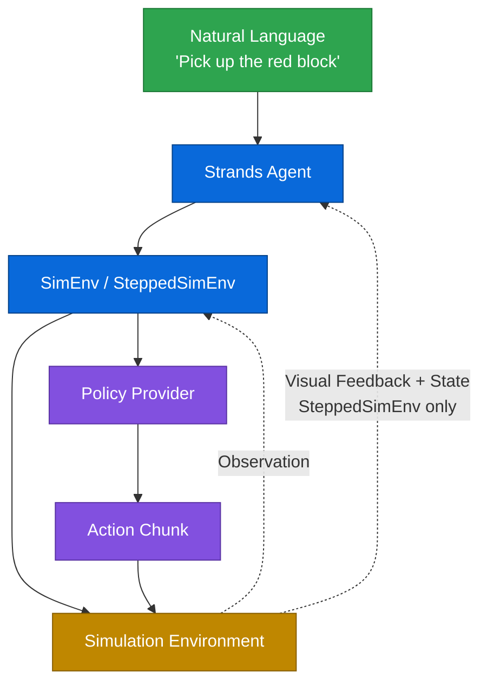
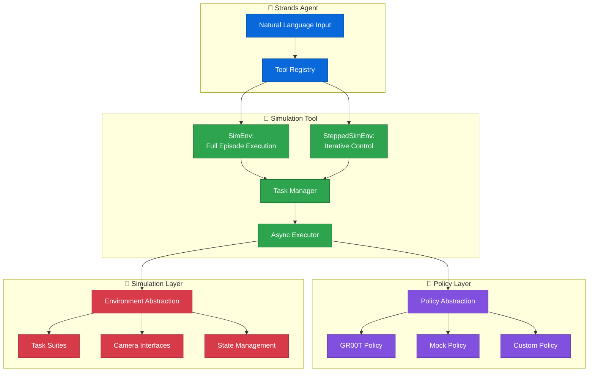

[Strands Robots Sim](https://github.com/strands-labs/robots-sim) is a Python library for controlling robots in simulated environments with natural language through Strands Agents. It lets you develop and test robot control strategies without physical hardware, using the same policy abstraction as [Strands Robots](robots.md).

The library provides two execution modes as Strands agent tools: `SimEnv` for full episode execution where the agent specifies a task and the policy runs to completion, and `SteppedSimEnv` for iterative control where the agent observes camera feedback after each batch of steps and adapts its instructions accordingly. This enables a dual-system pattern where the agent handles high-level reasoning and planning while a VLA policy handles low-level motor control.

## Getting started

### Installation

```bash
pip install strands-robots-sim

# For simulation environment dependencies (e.g. Libero)
pip install strands-robots-sim[sim]
```

### Basic usage

```python
from strands import Agent
from strands_robots_sim import SimEnv, gr00t_inference

sim_env = SimEnv(
    tool_name="my_sim",
    env_type="libero",
    task_suite="libero_10",
    data_config="libero_10",
)

agent = Agent(tools=[sim_env, gr00t_inference])

# Start inference service
agent.tool.gr00t_inference(
    action="start",
    checkpoint_path="/data/checkpoints/model",
    port=8000,
    data_config="examples.Libero.custom_data_config:LiberoDataConfig",
)

# Run a task
agent("Run the task 'pick up the red block' for 5 episodes with video recording")
```

## How it works



The agent receives a natural language instruction and routes it to a simulation tool. The tool coordinates with a policy provider to generate action chunks, which are executed in the simulation environment. Observations flow back for the next inference cycle. In `SteppedSimEnv` mode, camera images and state are also returned to the agent so it can reason about progress and adapt.

### Architecture



## Execution modes

### SimEnv - full episode execution

The agent specifies a task once and the policy runs the full episode autonomously. This is the simpler mode, suited for benchmarking and well-defined tasks.

```python
from strands_robots_sim import SimEnv

sim_env = SimEnv(
    tool_name="my_sim",
    env_type="libero",
    task_suite="libero_10",
    data_config="libero_10",
)

agent = Agent(tools=[sim_env, gr00t_inference])

# Blocking execution
agent.tool.my_sim(
    action="execute",
    instruction="pick up the red block",
    policy_port=8000,
    max_episodes=5,
    max_steps_per_episode=200,
    record_video=True,
)

# Or async execution with status monitoring
agent.tool.my_sim(
    action="start",
    instruction="stack the blocks",
    policy_port=8000,
    max_episodes=10,
)
agent.tool.my_sim(action="status")
agent.tool.my_sim(action="stop")
```

### SteppedSimEnv - iterative agent control

The agent acts as a planner, executing a limited number of steps per call and receiving camera images and state back. It can then reason about progress, decompose complex tasks into subtasks, and adapt instructions based on what it observes.

```python
from strands_robots_sim import SteppedSimEnv

stepped_sim = SteppedSimEnv(
    tool_name="my_stepped_sim",
    env_type="libero",
    task_suite="libero_10",
    data_config="libero_10",
    steps_per_call=10,
    max_steps_per_episode=500,
)

agent = Agent(tools=[stepped_sim, gr00t_inference])

# Reset to a specific task
agent.tool.my_stepped_sim(
    action="reset_episode",
    task_name="KITCHEN_SCENE1_put_the_black_bowl_on_top_of_the_cabinet",
)

# Execute steps - returns camera images, state, reward, done status
agent.tool.my_stepped_sim(
    action="execute_steps",
    instruction="move gripper toward the bowl",
    policy_port=8000,
    num_steps=10,
)

# Agent observes the result and decides what to do next
agent.tool.my_stepped_sim(action="get_state")
```

In practice, you hand the full loop to the agent with a planning prompt. The agent decomposes a complex task like "pick up the block and place it in the drawer" into subtasks (locate block, grasp, lift, move to drawer, place), executes each with `execute_steps`, observes camera feedback, and adapts if something goes wrong.

### Comparing the modes

| Feature | SimEnv | SteppedSimEnv |
|---------|--------|---------------|
| Control flow | One-shot execution | Step-by-step iteration |
| Agent feedback | Final reward only | Camera images + state per batch |
| Use case | Known tasks, benchmarking | Complex tasks requiring adaptation |
| Error recovery | None | Agent can retry with different instructions |

## Dual-system architecture

The framework implements a pattern inspired by System 1 / System 2 thinking. The Strands Agent serves as the deliberate planner (System 2) - it reasons about goals, decomposes tasks, and adapts strategy based on observations. The VLA policy serves as the fast executor (System 1) - it maps visual observations and language instructions to motor actions with low latency.

In `SimEnv` mode, System 2 fires once to specify the task and System 1 handles the rest. In `SteppedSimEnv` mode, the two systems collaborate iteratively: System 2 observes, plans, and issues instructions every N steps while System 1 executes the low-level control between each planning cycle.

## Policy and environment abstraction

The library uses the same `Policy` abstract class as Strands Robots. It ships with GR00T and mock providers, and you can add custom VLA models by subclassing `Policy`.

```python
from strands_robots_sim import create_policy

policy = create_policy(provider="groot", data_config="libero", host="localhost", port=8000)
policy = create_policy(provider="mock")
```

Simulation environments are similarly abstracted through a `SimulationEnvironment` base class. The library ships with a Libero integration, and the factory supports adding new backends:

```python
from strands_robots_sim.envs import create_simulation_environment

env = create_simulation_environment(env_type="libero", task_suite="libero_10")
```

### Supported task suites

The current Libero integration includes:

| Suite | Tasks | Description |
|-------|-------|-------------|
| `libero_spatial` | 10 | Spatial reasoning tasks |
| `libero_object` | 10 | Object-centric tasks |
| `libero_goal` | 10 | Goal-conditioned manipulation |
| `libero_10` | 10 | Standard benchmark |
| `libero_90` | 90 | Extended benchmark for comprehensive evaluation |

## Complete example

This example shows the stepped execution mode where the agent plans and adapts:

```python
from strands import Agent
from strands_robots_sim import SteppedSimEnv, gr00t_inference

stepped_sim = SteppedSimEnv(
    tool_name="my_stepped_sim",
    env_type="libero",
    task_suite="libero_10",
    data_config="libero_10",
    steps_per_call=10,
    max_steps_per_episode=500,
)

agent = Agent(tools=[stepped_sim, gr00t_inference])

agent.tool.gr00t_inference(
    action="start",
    checkpoint_path="/data/checkpoints/model",
    port=8000,
    data_config="examples.Libero.custom_data_config:LiberoDataConfig",
)

agent("""
Task: open the top drawer

You are a robot task planner. Decompose this task into subtasks and execute
them step-by-step using the my_stepped_sim tool.

1. Reset the episode with action="reset_episode"
2. For each subtask, call action="execute_steps" with the subtask as instruction
3. Observe camera images and state after each batch
4. Adapt your approach based on what you see
5. Continue until reward reaches 1.0 or the episode ends
""")

agent.tool.gr00t_inference(action="stop", port=8000)
```

## Links

- [GitHub repository](https://github.com/strands-labs/robots-sim)
- [PyPI package](https://pypi.org/project/strands-robots-sim/)
- [Strands Robots](robots.md) - physical robot control
- [Libero](https://github.com/Lifelong-Robot-Learning/LIBERO)
- [NVIDIA Isaac GR00T](https://github.com/NVIDIA/Isaac-GR00T)
