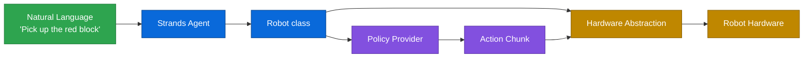
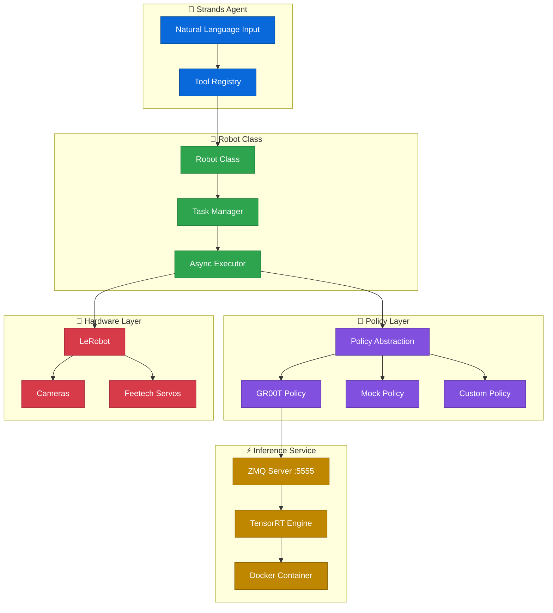
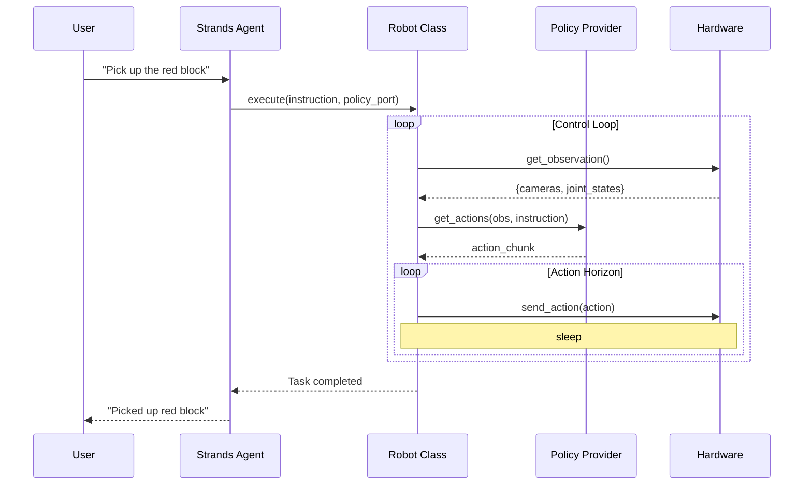

[Strands Robots](https://github.com/strands-labs/robots) is a Python library for controlling physical robots with natural language. It provides a policy abstraction layer for vision-language-action (VLA) models and a hardware abstraction layer for robot control, letting you tell a robot what to do without programming it.

The library provides a set of Strands Agents tools that handle several components of the robotics stack - from camera capture and servo calibration to policy inference and real-time control loops. An agent equipped with these tools can interpret instructions like "pick up the red block" and translate them into coordinated motor actions.

## Getting started

### Installation

```bash
pip install strands-robots
```

### Basic usage

```python
from strands import Agent
from strands_robots import Robot, gr00t_inference

robot = Robot(
    tool_name="my_arm",
    robot="so101_follower",
    cameras={
        "front": {"type": "opencv", "index_or_path": "/dev/video0", "fps": 30},
        "wrist": {"type": "opencv", "index_or_path": "/dev/video2", "fps": 30},
    },
    port="/dev/ttyACM0",
    data_config="so100_dualcam",
)

agent = Agent(tools=[robot, gr00t_inference])

# Start the inference service
agent.tool.gr00t_inference(
    action="start",
    checkpoint_path="/data/checkpoints/model",
    port=5555,
    data_config="so100_dualcam",
)

# Control the robot with natural language
agent("Use my_arm to pick up the red block using GR00T policy on port 5555")
```

The `Robot` class is a Strands `AgentTool` that the agent can invoke directly. When the agent decides to use the robot, it calls the tool with an instruction and policy port, and the tool handles the entire observation-inference-action loop internally.

## How it works

The system chains together three layers: a Strands Agent that interprets natural language, a policy provider that maps camera observations and instructions to action chunks, and a hardware abstraction layer that sends those actions to physical actuators.



Each control cycle, the Robot class captures observations (camera frames and joint states), sends them to the policy for inference, receives an action chunk, and executes those actions on the hardware.

### Architecture



### Control flow



## Core concepts

### Robot class

The `Robot` class wraps a robot and exposes it as a Strands agent tool with four actions:

| Action | Behavior | Use case |
|--------|----------|----------|
| `execute` | Blocks until the task completes or times out | Single-step tasks |
| `start` | Returns immediately, runs task in background | Long-running tasks |
| `status` | Reports current task progress | Monitoring async tasks |
| `stop` | Interrupts a running task | Emergency stop |

```python
# Blocking - agent waits for completion
agent("Use my_arm to pick up the red block using GR00T policy on port 5555")

# Async - agent can check status or do other work
agent("Start my_arm waving using GR00T on port 5555, then check status")

# Stop
agent("Stop my_arm immediately")
```

Constructor parameters:

| Parameter | Type | Description |
|-----------|------|-------------|
| `tool_name` | `str` | Name the agent uses to reference this robot |
| `robot` | `str`, `RobotConfig`, or `Robot` | Robot type string (e.g. `"so101_follower"`), a config object, or a pre-built robot instance |
| `cameras` | `dict` | Camera configuration mapping names to settings |
| `port` | `str` | Serial port for the robot (e.g. `"/dev/ttyACM0"`) |
| `data_config` | `str` | Policy data configuration name |
| `control_frequency` | `float` | Control loop frequency in Hz (default: 50) |
| `action_horizon` | `int` | Number of actions to execute per inference step (default: 8) |

### Policy abstraction

Policies are the bridge between observations and actions. The library defines a `Policy` abstract class that any VLA model can implement:

```python
from strands_robots import Policy, create_policy

# GR00T policy (ships with the library)
policy = create_policy(
    provider="groot",
    data_config="so100_dualcam",
    host="localhost",
    port=5555,
)

# Mock policy (for testing without hardware)
policy = create_policy(provider="mock")
```

The `create_policy` factory ships with `"groot"` and `"mock"` providers. You can integrate additional VLA models by subclassing `Policy` and implementing `get_actions()` and `set_robot_state_keys()`.

### Inference management

The `gr00t_inference` tool manages policy inference services running in Docker containers.

```python
# Start with TensorRT acceleration
agent.tool.gr00t_inference(
    action="start",
    checkpoint_path="/data/checkpoints/model",
    port=5555,
    data_config="so100_dualcam",
    use_tensorrt=True,
)

# Check status
agent.tool.gr00t_inference(action="status", port=5555)

# Stop
agent.tool.gr00t_inference(action="stop", port=5555)
```

Available actions: `start`, `stop`, `status`, `list`, `restart`, and `find_containers`.

## Additional tools

Beyond the core robot and inference tools, the library includes several utilities that the agent can use for setup, calibration, and data collection.

### Camera tool

Camera management supporting OpenCV and RealSense cameras.

```python
from strands_robots import lerobot_camera

agent = Agent(tools=[lerobot_camera])

agent("Discover all connected cameras")
agent("Capture images from front and wrist cameras")
agent("Record 30 seconds of video from the front camera")
```

Actions: `discover`, `capture`, `capture_batch`, `record`, `preview`, `test`.

### Teleoperation tool

Record demonstrations for imitation learning using a leader-follower setup.

```python
from strands_robots import lerobot_teleoperate

agent.tool.lerobot_teleoperate(
    action="start",
    robot_type="so101_follower",
    robot_port="/dev/ttyACM0",
    teleop_type="so101_leader",
    teleop_port="/dev/ttyACM1",
    dataset_repo_id="my_user/cube_picking",
    dataset_single_task="Pick up the red cube",
    dataset_num_episodes=50,
)
```

Actions: `start`, `stop`, `list`, `replay`.

### Pose tool

Store, retrieve, and execute named robot poses for repeatable positioning.

```python
from strands_robots import pose_tool

agent = Agent(tools=[robot, pose_tool])

agent("Save the current position as 'home'")
agent("Go to the home pose")
agent("Move the gripper to 50%")
```

Actions: `store_pose`, `load_pose`, `list_poses`, `move_motor`, `incremental_move`, `reset_to_home`.

### Serial tool

Low-level serial communication for servos and custom protocols.

Actions: `list_ports`, `feetech_position`, `feetech_ping`, `send`, `monitor`.

## Complete example

```python
from strands import Agent
from strands_robots import Robot, gr00t_inference, lerobot_camera, pose_tool

robot = Robot(
    tool_name="orange_arm",
    robot="so101_follower",
    cameras={
        "wrist": {"type": "opencv", "index_or_path": "/dev/video0", "fps": 15},
        "front": {"type": "opencv", "index_or_path": "/dev/video2", "fps": 15},
    },
    port="/dev/ttyACM0",
    data_config="so100_dualcam",
)

agent = Agent(tools=[robot, gr00t_inference, lerobot_camera, pose_tool])

agent.tool.gr00t_inference(
    action="start",
    checkpoint_path="/data/checkpoints/gr00t-wave/checkpoint-300000",
    port=5555,
    data_config="so100_dualcam",
)

while True:
    user_input = input("\n> ")
    if user_input.lower() in ["exit", "quit"]:
        break
    agent(user_input)

agent.tool.gr00t_inference(action="stop", port=5555)
```

This gives you an interactive loop where you can issue natural language commands to the robot, check camera feeds, save poses, and manage inference services - all through conversation with the agent.

## Links

- [GitHub repository](https://github.com/strands-labs/robots)
- [PyPI package](https://pypi.org/project/strands-robots/)
- [NVIDIA Isaac GR00T](https://github.com/NVIDIA/Isaac-GR00T)
- [LeRobot](https://github.com/huggingface/lerobot)
- [Jetson Containers](https://github.com/dusty-nv/jetson-containers)
