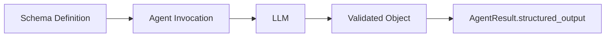

## Introduction

Structured output enables you to get type-safe, validated responses from language models using schema definitions. Instead of receiving raw text that you need to parse, you can define the exact structure you want and receive a validated object that matches your schema. This transforms unstructured LLM outputs into reliable, program-friendly data structures that integrate seamlessly with your application's type system and validation rules.

In Python, structured output uses [Pydantic](https://docs.pydantic.dev/latest/concepts/models/) models. In TypeScript, it uses [Zod](https://zod.dev/) schemas for runtime validation and type inference.



Key benefits:

- **Type Safety**: Get typed objects instead of raw strings
- **Automatic Validation**: Schema validation ensures responses match your structure
- **Clear Documentation**: Schema serves as documentation of expected output
- **IDE Support**: IDE type hinting from LLM-generated responses
- **Error Prevention**: Catch malformed responses early


## Basic Usage

Define an output structure using a schema. In Python, use a Pydantic model and pass it to `structured_output_model`. In TypeScript, use a Zod schema and pass it to `structuredOutputSchema`. Then, access the validated output from the `AgentResult`.

<Tabs>
<Tab label="Python">

```python
from pydantic import BaseModel, Field
from strands import Agent

# 1) Define the Pydantic model
class PersonInfo(BaseModel):
    """Model that contains information about a Person"""
    name: str = Field(description="Name of the person")
    age: int = Field(description="Age of the person")
    occupation: str = Field(description="Occupation of the person")

# 2) Pass the model to the agent
agent = Agent()
result = agent(
    "John Smith is a 30 year-old software engineer",
    structured_output_model=PersonInfo
)

# 3) Access the `structured_output` from the result
person_info: PersonInfo = result.structured_output
print(f"Name: {person_info.name}")      # "John Smith"
print(f"Age: {person_info.age}")        # 30
print(f"Job: {person_info.occupation}") # "software engineer"
```
</Tab>
<Tab label="TypeScript">

```typescript
--8<-- "user-guide/concepts/agents/structured-output.ts:basic_usage"
```
</Tab>
</Tabs>

:::tip[Async Support]
Structured Output is supported with async in both Python and TypeScript:

<Tabs>
<Tab label="Python">

```python
import asyncio
agent = Agent()
result = asyncio.run(
    agent.invoke_async(
        "John Smith is a 30 year-old software engineer",
        structured_output_model=PersonInfo
    )
)
```
</Tab>
<Tab label="TypeScript">
```typescript
--8<-- "user-guide/concepts/agents/structured-output.ts:async_support"
```
</Tab>
</Tabs>
:::

## More Information

### How It Works

The structured output system converts your schema definitions into tool specifications that guide the language model to produce correctly formatted responses. All of the model providers supported in Strands can work with Structured Output.

In Python, Strands accepts the `structured_output_model` parameter in agent invocations, which manages the conversion, validation, and response processing automatically. In TypeScript, the `structuredOutputSchema` parameter (either at agent initialization or per-invocation) handles this process. The validated result is available in the `AgentResult.structured_output` (Python) or `AgentResult.structuredOutput` (TypeScript) field.


### Error Handling

When structured output validation fails, Strands throws a custom exception that can be caught and handled appropriately:

<Tabs>
<Tab label="Python">

```python
from pydantic import ValidationError
from strands.types.exceptions import StructuredOutputException

try:
    result = agent(prompt, structured_output_model=MyModel)
except StructuredOutputException as e:
    print(f"Structured output failed: {e}")
```
</Tab>
<Tab label="TypeScript">

```typescript
--8<-- "user-guide/concepts/agents/structured-output.ts:error_handling"
```
</Tab>
</Tabs>

### Migration from Legacy API

:::caution[Deprecated API (Python Only)]
The `Agent.structured_output()` and `Agent.structured_output_async()` methods are deprecated in Python. Use the new `structured_output_model` parameter approach instead.
:::

#### Before (Deprecated)

<Tabs>
<Tab label="Python">

```python
# Old approach - deprecated
result = agent.structured_output(PersonInfo, "John is 30 years old")
print(result.name)  # Direct access to model fields
```
</Tab>
<Tab label="TypeScript">

```typescript
// No deprecated API in TypeScript
```
</Tab>
</Tabs>

#### After (Recommended)

<Tabs>
<Tab label="Python">

```python
# New approach - recommended
result = agent("John is 30 years old", structured_output_model=PersonInfo)
print(result.structured_output.name)  # Access via structured_output field
```
</Tab>
<Tab label="TypeScript">

```typescript
// TypeScript approach
const agent = new Agent({ structuredOutputSchema: PersonSchema })
const result = await agent.invoke('John is 30 years old')
console.log(result.structuredOutput.name)  // Access via structuredOutput field
```
</Tab>
</Tabs>

### Best Practices

- **Keep schemas focused**: Define specific schemas for clear purposes
- **Use descriptive field names**: Include helpful descriptions with field metadata
- **Handle errors gracefully**: Implement proper error handling strategies with fallbacks

### Related Documentation

For Python, refer to Pydantic documentation:

- [Models and schema definition](https://docs.pydantic.dev/latest/concepts/models/)
- [Field types and constraints](https://docs.pydantic.dev/latest/concepts/fields/)
- [Custom validators](https://docs.pydantic.dev/latest/concepts/validators/)

For TypeScript, refer to Zod documentation:

- [Zod documentation](https://zod.dev/)
- [Schema types](https://zod.dev/?id=primitives)
- [Schema methods](https://zod.dev/?id=strings)

## Cookbook

### Auto Retries with Validation

Automatically retry validation when initial extraction fails due to schema validation:

<Tabs>
<Tab label="Python">

```python
from strands.agent import Agent
from pydantic import BaseModel, field_validator


class Name(BaseModel):
    first_name: str

    @field_validator("first_name")
    @classmethod
    def validate_first_name(cls, value: str) -> str:
        if not value.endswith('abc'):
            raise ValueError("You must append 'abc' to the end of my name")
        return value


agent = Agent()
result = agent("What is Aaron's name?", structured_output_model=Name)
```
</Tab>
<Tab label="TypeScript">

```typescript
--8<-- "user-guide/concepts/agents/structured-output.ts:auto_retries"
```
</Tab>
</Tabs>

### Streaming Structured Output

Stream agent execution while using structured output. The structured output is available in the final result:

<Tabs>
<Tab label="Python">

```python
from strands import Agent
from pydantic import BaseModel, Field

class WeatherForecast(BaseModel):
    """Weather forecast data."""
    location: str
    temperature: int
    condition: str
    humidity: int
    wind_speed: int
    forecast_date: str

streaming_agent = Agent()

async for event in streaming_agent.stream_async(
    "Generate a weather forecast for Seattle: 68°F, partly cloudy, 55% humidity, 8 mph winds, for tomorrow",
    structured_output_model=WeatherForecast
):
    if "data" in event:
        print(event["data"], end="", flush=True)
    elif "result" in event:
        print(f'The forecast for today is: {event["result"].structured_output}')
```
</Tab>
<Tab label="TypeScript">

```typescript
--8<-- "user-guide/concepts/agents/structured-output.ts:streaming"
```
</Tab>
</Tabs>

### Combining with Tools

Combine structured output with tool usage to format tool execution results:

<Tabs>
<Tab label="Python">

```python
from strands import Agent
from strands_tools import calculator
from pydantic import BaseModel, Field

class MathResult(BaseModel):
    operation: str = Field(description="the performed operation")
    result: int = Field(description="the result of the operation")

tool_agent = Agent(
    tools=[calculator]
)
res = tool_agent("What is 42 + 8", structured_output_model=MathResult)
```
</Tab>
<Tab label="TypeScript">

```typescript
--8<-- "user-guide/concepts/agents/structured-output.ts:combining_tools"
```
</Tab>
</Tabs>

### Multiple Output Types

Reuse a single agent instance with different structured output schemas for varied extraction tasks:

<Tabs>
<Tab label="Python">

```python
from strands import Agent
from pydantic import BaseModel, Field
from typing import Optional

class Person(BaseModel):
    """A person's basic information"""
    name: str = Field(description="Full name")
    age: int = Field(description="Age in years", ge=0, le=150)
    email: str = Field(description="Email address")
    phone: Optional[str] = Field(description="Phone number", default=None)

class Task(BaseModel):
    """A task or todo item"""
    title: str = Field(description="Task title")
    description: str = Field(description="Detailed description")
    priority: str = Field(description="Priority level: low, medium, high")
    completed: bool = Field(description="Whether task is completed", default=False)


agent = Agent()
person_res = agent("Extract person: John Doe, 35, john@test.com", structured_output_model=Person)
task_res = agent("Create task: Review code, high priority, completed", structured_output_model=Task)
```
</Tab>
<Tab label="TypeScript">

```typescript
--8<-- "user-guide/concepts/agents/structured-output.ts:multiple_types"
```
</Tab>
</Tabs>

### Using Conversation History

Extract structured information from prior conversation context without repeating questions:

<Tabs>
<Tab label="Python">

```python
from strands import Agent
from pydantic import BaseModel
from typing import Optional

agent = Agent()

# Build up conversation context
agent("What do you know about Paris, France?")
agent("Tell me about the weather there in spring.")

class CityInfo(BaseModel):
    city: str
    country: str
    population: Optional[int] = None
    climate: str

# Extract structured information from the conversation
result = agent(
    "Extract structured information about Paris from our conversation",
    structured_output_model=CityInfo
)

print(f"City: {result.structured_output.city}")     # "Paris"
print(f"Country: {result.structured_output.country}") # "France"
```
</Tab>
<Tab label="TypeScript">

```typescript
--8<-- "user-guide/concepts/agents/structured-output.ts:conversation_history"
```
</Tab>
</Tabs>


### Agent-Level Defaults

You can also set a default structured output schema that applies to all agent invocations:

<Tabs>
<Tab label="Python">

```python
class PersonInfo(BaseModel):
    name: str
    age: int
    occupation: str

# Set default structured output model for all invocations
agent = Agent(structured_output_model=PersonInfo)
result = agent("John Smith is a 30 year-old software engineer")

print(f"Name: {result.structured_output.name}")      # "John Smith"
print(f"Age: {result.structured_output.age}")        # 30
print(f"Job: {result.structured_output.occupation}") # "software engineer"
```
</Tab>
<Tab label="TypeScript">

```typescript
--8<-- "user-guide/concepts/agents/structured-output.ts:agent_defaults"
```
</Tab>
</Tabs>

:::note[Note]
Since this is on the agent init level, not the invocation level, the expectation is that the agent will attempt structured output for each invocation.
:::


### Overriding Agent Defaults

Even when you set a default schema at the agent initialization level, you can override it for specific invocations:

<Tabs>
<Tab label="Python">

```python
class PersonInfo(BaseModel):
    name: str
    age: int
    occupation: str

class CompanyInfo(BaseModel):
    name: str
    industry: str
    employees: int

# Agent with default PersonInfo model
agent = Agent(structured_output_model=PersonInfo)

# Override with CompanyInfo for this specific call
result = agent(
    "TechCorp is a software company with 500 employees",
    structured_output_model=CompanyInfo
)

print(f"Company: {result.structured_output.name}")      # "TechCorp"
print(f"Industry: {result.structured_output.industry}") # "software"
print(f"Size: {result.structured_output.employees}")    # 500
```
</Tab>
<Tab label="TypeScript">

```typescript
--8<-- "user-guide/concepts/agents/structured-output.ts:overriding_defaults"
```
</Tab>
</Tabs>
