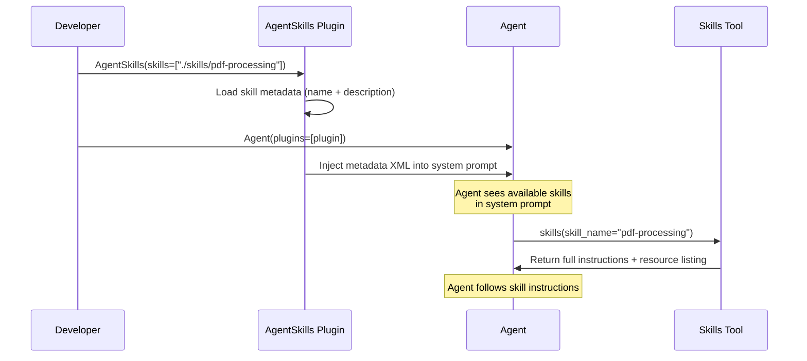

Skills give your agent on-demand access to specialized instructions without bloating the system prompt. Instead of front-loading every possible instruction into a single prompt, you define modular skill packages that the agent discovers and activates only when relevant.

The `AgentSkills` plugin follows the [Agent Skills specification](https://agentskills.io/specification) and uses progressive disclosure: lightweight metadata (name and description) is injected into the system prompt, and full instructions are loaded on-demand when the agent activates a skill through a tool call. This keeps the context window lean while giving the agent access to deep, specialized knowledge.

## What are skills?

As agents take on more complex tasks, their system prompts grow. A single agent handling PDF processing, data analysis, code review, and email drafting can end up with a massive prompt containing instructions for every capability. This leads to several problems:

- **Context window bloat** — Large prompts consume tokens that could be used for reasoning and conversation
- **Instruction confusion** — Models struggle to follow dozens of unrelated instructions packed into one prompt
- **Maintenance burden** — Monolithic prompts are hard to update, version, and share across teams

Skills solve this by breaking instructions into self-contained packages. The agent sees a menu of available skills and loads the full instructions only when it needs them — similar to how a developer opens a reference manual only when working on a specific task.

## How skills work

The `AgentSkills` plugin operates in three phases:



1. **Discovery** — On initialization, the plugin reads skill metadata (name and description) and injects it as an XML block into the agent's system prompt. The agent can see what skills are available without loading their full instructions.

2. **Activation** — When the agent determines it needs a skill, it calls the `skills` tool with the skill name. The tool returns the complete instructions, metadata, and a listing of any available resource files.

3. **Execution** — The agent follows the loaded instructions. If the skill includes resource files (scripts, reference documents, assets), the agent can access them through whatever tools you've provided.

The injected system prompt metadata looks like this:

```xml
<available_skills>
<skill>
<name>pdf-processing</name>
<description>Extract text and tables from PDF files.</description>
<location>/path/to/pdf-processing/SKILL.md</location>
</skill>
</available_skills>
```

This XML block is refreshed before each invocation, so changes to available skills (through `set_available_skills` / `setAvailableSkills`) take effect immediately. Activated skills are tracked in [agent state](../agents/state.mdx) for session persistence.

## Usage

The `AgentSkills` plugin accepts skill sources in several forms — filesystem paths, parent directories, HTTPS URLs, or programmatic `Skill` instances. In Python you can pass a single source or a list; in TypeScript the `skills` parameter is always an array.

<Tabs>
<Tab label="Python">

```python
from strands import Agent, AgentSkills, Skill

# Single skill directory — no list needed
plugin = AgentSkills(skills="./skills/pdf-processing")

# Parent directory — loads all child directories containing SKILL.md
plugin = AgentSkills(skills="./skills/")

# Mixed sources
plugin = AgentSkills(skills=[
    "./skills/pdf-processing",     # Single skill directory
    "./skills/",                   # Parent directory (loads all children)
    Skill(                         # Programmatic skill
        name="custom-greeting",
        description="Generate custom greetings",
        instructions="Always greet the user by name with enthusiasm.",
    ),
])

agent = Agent(plugins=[plugin])
```
</Tab>
<Tab label="TypeScript">

```typescript
--8<-- "user-guide/concepts/plugins/skills_imports.ts:usage"

--8<-- "user-guide/concepts/plugins/skills.ts:usage"
```
</Tab>
</Tabs>

### Providing tools for resource access

The `AgentSkills` plugin handles only skill discovery and activation. It does not bundle tools for reading files or executing scripts. This is deliberate — it keeps the plugin decoupled from any assumptions about where skills live or how resources are accessed.

When a skill is activated, the tool response includes a listing of available resource files (from `scripts/`, `references/`, and `assets/` subdirectories), but to actually read those files or run scripts, you provide your own tools. This gives you full control over what the agent can access.

<Tabs>
<Tab label="Python">

For filesystem-based skills, `file_read` and `shell` from `strands-agents-tools` are the easiest way to get started:

```python
from strands import Agent, AgentSkills
from strands_tools import file_read, shell

plugin = AgentSkills(skills="./skills/")

agent = Agent(
    plugins=[plugin],
    tools=[file_read, shell],
)
```
</Tab>
<Tab label="TypeScript">

For filesystem-based skills, the vended `bash` and `fileEditor` tools are the easiest way to get started:

```typescript
--8<-- "user-guide/concepts/plugins/skills_imports.ts:tools"

--8<-- "user-guide/concepts/plugins/skills.ts:tools"
```
</Tab>
</Tabs>

You can also use other tools depending on your environment. For example, an HTTP request tool for skills with remote resources, or a code interpreter tool for executing scripts in a sandboxed environment. Choose tools that match your skill's resource access patterns and your security requirements.

### Programmatic skill creation

Use the `Skill` class to create skills in code without filesystem directories:

<Tabs>
<Tab label="Python">

```python
from strands import Skill

# Create directly
skill = Skill(
    name="code-review",
    description="Review code for best practices and bugs",
    instructions="Review the provided code. Check for...",
)

# Parse from SKILL.md content
skill = Skill.from_content("""---
name: code-review
description: Review code for best practices and bugs
---
Review the provided code. Check for...
""")

# Load from a specific directory
skill = Skill.from_file("./skills/code-review")

# Load all skills from a parent directory
skills = Skill.from_directory("./skills/")
```
</Tab>
<Tab label="TypeScript">

```typescript
--8<-- "user-guide/concepts/plugins/skills_imports.ts:programmatic"

--8<-- "user-guide/concepts/plugins/skills.ts:programmatic"
```
</Tab>
</Tabs>

### Managing skills at runtime

You can add, replace, or inspect skills after the plugin is created. Changes take effect on the next agent invocation because the plugin refreshes the system prompt XML before each call.

<Tabs>
<Tab label="Python">

```python
from strands import Agent, AgentSkills, Skill

plugin = AgentSkills(skills="./skills/pdf-processing")
agent = Agent(plugins=[plugin])

# View available skills
for skill in plugin.get_available_skills():
    print(f"{skill.name}: {skill.description}")

# Add a new skill at runtime
new_skill = Skill(
    name="summarize",
    description="Summarize long documents",
    instructions="Read the document and produce a concise summary...",
)
plugin.set_available_skills(
    plugin.get_available_skills() + [new_skill]
)

# Replace all skills
plugin.set_available_skills(["./skills/new-set/"])

# Check which skills the agent has activated
activated = plugin.get_activated_skills(agent)
print(f"Activated skills: {activated}")
```
</Tab>
<Tab label="TypeScript">

```typescript
--8<-- "user-guide/concepts/plugins/skills_imports.ts:runtime"

--8<-- "user-guide/concepts/plugins/skills.ts:runtime"
```
</Tab>
</Tabs>

## SKILL.md format

Skills follow the [Agent Skills specification](https://agentskills.io/specification). A skill is a directory containing a `SKILL.md` file with YAML frontmatter and markdown instructions. See the specification for full details on authoring skills.

```markdown
---
name: pdf-processing
description: Extract text and tables from PDF files
allowed-tools: file_read shell
---
# PDF processing

You are a PDF processing expert. When asked to extract content from a PDF:

1. Use `shell` to run the extraction script at `scripts/extract.py`
2. Use `file_read` to review the output
3. Summarize the extracted content for the user
```

The frontmatter fields are as follows.

| Field | Required | Description |
|-------|----------|-------------|
| `name` | Yes | Unique identifier. Lowercase alphanumeric and hyphens, 1–64 characters. |
| `description` | Yes | What the skill does. This text appears in the system prompt. |
| `allowed-tools` | No | Space-delimited list of tool names the skill uses. |
| `metadata` | No | Additional key-value pairs for custom data. |
| `license` | No | License identifier (for example, `Apache-2.0`). |
| `compatibility` | No | Compatibility information string. |

:::note[`allowed-tools` behavior]
The `allowed-tools` field is currently informational. When a skill is activated, the listed tool names are included in the instructions returned to the agent, but tool access is not enforced or restricted at runtime. This field is still experimental in the Agent Skills specification.
:::

:::note[Name validation]
Skill names must match the parent directory name. By default, validation issues produce warnings rather than errors. Pass `strict=True` (Python) or `strict: true` (TypeScript) to raise exceptions instead.
:::

### Resource directories

Skills can include resource files organized in three standard subdirectories:

```
my-skill/
├── SKILL.md
├── scripts/       # Executable scripts the agent can run
│   └── process.py
├── references/    # Reference documents and guides
│   └── API.md
└── assets/        # Static files (templates, configs, data)
    └── template.json
```

When the agent activates a skill, the tool response includes a listing of all resource files found in these directories. The agent can then use the tools you've provided to access them.

## Configuration

The `AgentSkills` constructor accepts the following parameters.

<Tabs>
<Tab label="Python">

| Parameter | Type | Default | Description |
|-----------|------|---------|-------------|
| `skills` | `SkillSources` | Required | One or more skill sources (paths, HTTPS URLs, `Skill` instances, or a mix). Accepts a single value or a list. |
| `state_key` | `str` | `"agent_skills"` | Key for storing plugin state in `agent.state`. |
| `max_resource_files` | `int` | `20` | Maximum number of resource files listed in skill activation responses. |
| `strict` | `bool` | `False` | If `True`, raise exceptions on validation issues instead of logging warnings. |

</Tab>
<Tab label="TypeScript">

| Parameter | Type | Default | Description |
|-----------|------|---------|-------------|
| `skills` | `SkillSource[]` | Required | Array of skill sources (paths, `Skill` instances, or HTTPS URLs). |
| `stateKey` | `string` | `'agent_skills'` | Key for storing plugin state in `agent.appState`. |
| `maxResourceFiles` | `number` | `20` | Maximum number of resource files listed in skill activation responses. |
| `strict` | `boolean` | `false` | If `true`, throw on validation issues instead of logging warnings. |

</Tab>
</Tabs>

Activated skills are tracked in [agent state](../agents/state.mdx) under the configured state key. This means activated skills persist across invocations within the same session and can be serialized for [session management](../agents/session-management.mdx).

## Comparison with other approaches

Skills work best when your agent needs to handle **multiple specialized domains** but doesn't need all instructions loaded at once. Consider the following comparison.

| Approach | Best for | Trade-off |
|----------|----------|-----------|
| System prompt | Small, always-relevant instructions | Grows unwieldy with many capabilities |
| [Steering](./steering) | Dynamic, context-aware guidance and validation | More complex to set up |
| Skills | Modular, domain-specific instruction sets | Requires a tool call to activate |
| Multi-agent | Fundamentally different roles or models | Higher complexity and latency |

Use skills when you want a single agent that can handle a wide range of tasks by loading the right instructions at the right time, without the overhead of a multi-agent architecture.

## Related topics

- [Plugins](./index.mdx) — The plugin system that powers skills
- [Steering](./steering) — Context-aware guidance for complex tasks
- [Agent state](../agents/state.mdx) — How activated skills are persisted
- [Session management](../agents/session-management.mdx) — Persist skills across sessions
- [Agent Skills specification](https://agentskills.io/specification) — The open specification skills are built on
