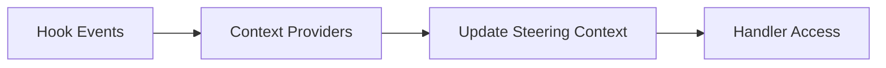
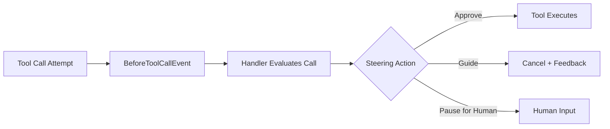
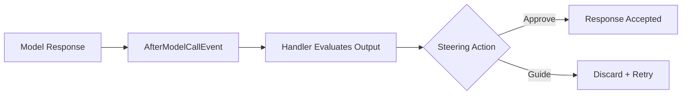
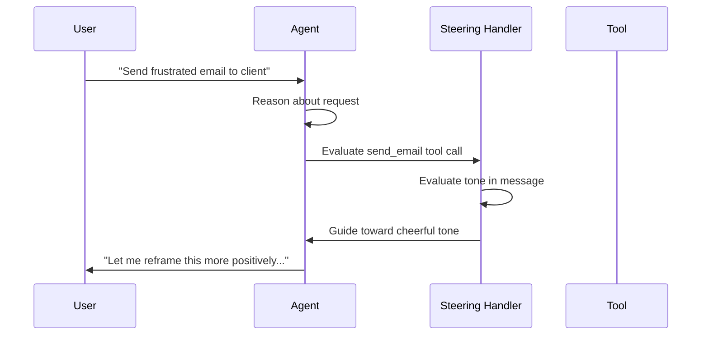

Steering provides modular prompting for complex agent tasks through context-aware guidance that appears when relevant, rather than front-loading all instructions in monolithic prompts. This lets you assign agents complex, multi-step tasks while maintaining effectiveness through just-in-time feedback loops.

:::note[TypeScript SDK]
In TypeScript, steering handlers use the [interventions](../agents/interventions/steering/) framework rather than plugins. See [Steering (Interventions)](../agents/interventions/steering/) for the full TypeScript API reference including `SteeringHandler`, `LLMSteeringHandler`, and context providers.
:::

## What Is Steering?

Building agents for complex multi-step tasks runs into a prompting wall. Traditional approaches require front-loading all instructions, business rules, and operational guidance into a single prompt. For tasks with 30+ steps, monolithic prompts become unwieldy: agents ignore instructions, hallucinate behaviors, or fail to follow critical procedures.

A common workaround is decomposing the agent into a graph with predefined nodes and edges that control execution flow. While this improves predictability and reduces prompt complexity, it limits the adaptive reasoning that makes agents valuable in the first place, and it is costly to maintain as requirements change.

Steering takes a different approach: **modular prompting**. Instead of front-loading all instructions, you define context-aware steering handlers that provide feedback at the right moment. Each handler defines the business rules to enforce and the lifecycle hooks where agent behavior should be validated, like before a tool call or before returning output to the user.

## Context Population

To give the handler something to reason about, attach a provider that observes agent activity and records it as steering context.



**Context Providers** observe agent activity and contribute structured data into the handler's steering context. The built-in tool ledger provider tracks tool call history, timing, and results. Steering handlers read from this context when deciding whether to intervene.

## Steering Moments

### Before a Tool Call

When you want the handler to validate a tool call before it runs, return a steering action from the before-tool-call moment:



The handler returns one of three actions:

- **`Proceed`**: tool executes immediately
- **`Guide`**: tool is cancelled, agent receives contextual feedback
- **`Interrupt`**: tool execution pauses for human input

### After a Model Response

When you want the handler to validate the model's output before it reaches the user, return a steering action from the after-model-call moment:



The handler returns one of two actions:

- **`Proceed`**: accept the response as-is
- **`Guide`**: discard the response and retry with guidance injected into the conversation

After-model steering enables handlers to validate responses, ensure required tools are used before completion, or guide conversation flow based on output.

## Getting Started

### Natural Language Steering

When you want to express guidance in plain English rather than imperative code, use the `LLMSteeringHandler`. The handler operates on whatever context you provide and makes contextual decisions across the full steering context.

For best practices on writing steering prompts, see the [Agent Standard Operating Procedures (SOP)](https://github.com/strands-agents/agent-sop) framework, which provides structured templates for effective agent prompts.

Steering handlers are attached via `plugins=[handler]` on the agent:

```python
from strands import Agent, tool
from strands.vended_plugins.steering import LLMSteeringHandler


@tool
def send_email(recipient: str, subject: str, message: str) -> str:
    """Send an email to a recipient."""
    return f"Email sent to {recipient}"


handler = LLMSteeringHandler(
    system_prompt="""
    You are providing guidance to ensure emails maintain a cheerful, positive tone.

    Guidance:
    - Review email content for tone and sentiment
    - Suggest more cheerful phrasing if the message seems negative or neutral
    - Encourage use of positive language and friendly greetings

    When agents attempt to send emails, check if the message tone
    is appropriately cheerful and provide feedback if improvements are needed.
    """
)

agent = Agent(
    tools=[send_email],
    plugins=[handler],
)

agent(
    "Send a frustrated email to tom@example.com, "
    "a client who keeps rescheduling important meetings at the last minute"
)
print(agent.messages)

# Typical: agent.messages includes a cancelled send_email ToolUseBlock,
# a guidance message, then a retried send_email with cheerier wording.
```



## Tool Ledger Provider

The tool ledger provider tracks tool call history for audit trails and usage-based guidance. It captures every tool invocation with inputs, execution time, and success/failure status.

The ledger captures:

**Tool Call History**: every tool invocation with inputs, execution time, and result status. Before tool calls, it records pending status with timestamp and arguments. After tool calls, it updates with completion timestamp, final status, results, and any errors.

**Session Metadata**: session start time and other context that persists across the handler's lifecycle.

**Structured Data**: the ledger is stored in JSON-serializable form in the handler's steering context, making it directly accessible to LLM-based steering decisions.

The `LedgerProvider` retains all tool calls for the lifetime of the handler instance.

## Comparison with Other Approaches

### Steering vs. Workflow Frameworks

Workflow frameworks force you to specify discrete steps and control flow logic upfront, making agents brittle and requiring extensive developer time to define complex decision trees. When business requirements change, you rebuild the workflow logic. Steering uses modular prompting where you define contextual guidance that appears when relevant rather than prescribing exact execution paths. This maintains the adaptive reasoning that makes agents valuable while enabling reliable execution of complex procedures.

### Steering vs. Traditional Prompting

Traditional prompting requires front-loading all instructions into a single prompt. For complex tasks with 30+ steps, this leads to prompt bloat where agents ignore instructions, hallucinate behaviors, or fail to follow critical procedures. Steering provides context-aware reminders that appear at the right moment, like post-it notes that guide agents when they need specific information. This keeps context windows lean while maintaining agent effectiveness on complex tasks.
