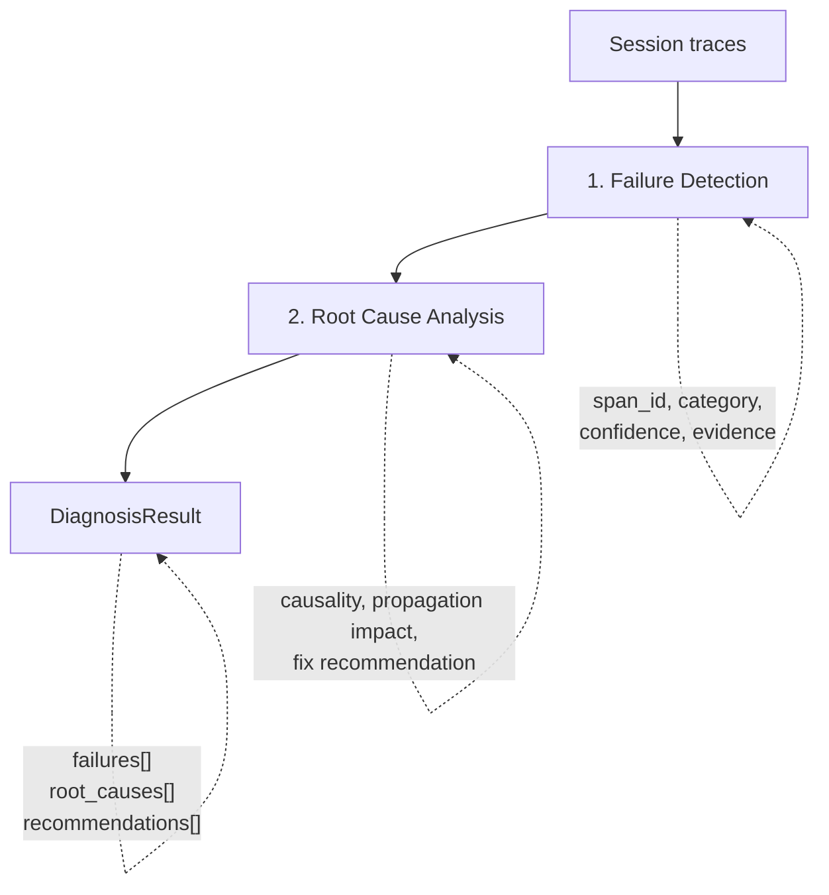

## Overview

Detectors answer **"why did my agent fail?"** by analyzing execution traces for failures, performing root cause analysis, and producing actionable fix recommendations. While evaluators tell you _whether_ an agent performed well, detectors tell you _what went wrong and how to fix it_.

Detectors operate on `Session` objects (the same trace format used by trace-based evaluators) and use LLM-based analysis to identify semantic failures that go beyond simple error codes — hallucinations, tool misuse, reasoning breakdowns, policy violations, and more.

## Why Detectors?

Evaluators give you a score. Detectors give you a diagnosis.

**Evaluators alone:**

- Tell you a case scored 0.3 / 1.0
- Don't explain which step failed or why
- Require manual trace inspection to debug
- Don't suggest what to change

**Evaluators + Detectors:**

- Score the case _and_ identify the specific failing spans
- Classify failures (hallucination, tool error, policy violation, etc.)
- Trace causal chains between failures (primary vs. secondary)
- Recommend concrete fixes (system prompt changes, tool description updates)

## When to Use Detectors

Use detectors when you need to:

- **Debug failing evaluations**: Understand why specific test cases fail
- **Identify failure patterns**: Detect recurring issues across sessions (hallucinations, tool misuse)
- **Get fix recommendations**: Receive actionable suggestions for system prompt or tool description changes
- **Automate root cause analysis**: Replace manual trace inspection with LLM-based diagnosis
- **Monitor production agents**: Analyze traces from remote providers for systematic issues

## Available Detectors

### Failure Detection

**[`detect_failures`](failure_detection.md)**

- **Purpose**: Identify semantic failures in agent execution traces
- **Output**: List of failures with span location, category, confidence, and evidence
- **Categories**: ~20 failure types including hallucinations, execution errors, tool misuse, repetitive behavior, and orchestration errors

### Root Cause Analysis

**[`analyze_root_cause`](root_cause_analysis.md)**

- **Purpose**: Determine the fundamental cause of detected failures
- **Output**: Causal analysis with propagation impact, fix type, and recommendation
- **Strategy**: 3-tier fallback (direct, pruned, chunked) for handling large sessions

### Session Diagnosis

**[`diagnose_session`](diagnosis.md)**

- **Purpose**: Run failure detection and root cause analysis as a single pipeline
- **Output**: Combined result with failures, root causes, and deduplicated recommendations
- **Integration**: Can be wired into `Experiment` via `DiagnosisConfig` for automatic diagnosis of failing cases

## Quick Example

```python
from strands_evals.detectors import diagnose_session

# session is a Session object from a trace provider or in-memory mapper
result = diagnose_session(session)

# What failed?
for failure in result.failures:
    print(f"Span {failure.span_id}: {failure.category}")
    print(f"  Evidence: {failure.evidence}")

# Why did it fail?
for rc in result.root_causes:
    print(f"Root cause at {rc.location}: {rc.root_cause_explanation}")
    print(f"  Fix ({rc.fix_type}): {rc.fix_recommendation}")

# Deduplicated recommendations
for rec in result.recommendations:
    print(f"  - {rec}")
```

## Detectors vs Evaluators

| Aspect | Evaluators | Detectors |
|--------|-----------|-----------|
| **Question** | "How well did the agent do?" | "Why did it fail?" |
| **Output** | Score + pass/fail | Failures + root causes + fix recommendations |
| **Granularity** | Per-case or per-session | Per-span |
| **Purpose** | Measure quality | Diagnose problems |
| **Use Case** | Benchmarking, regression testing | Debugging, improvement |

**Use Together:** Run evaluators to score your agent, then use detectors on failing cases to understand what went wrong and how to fix it. The `Experiment` class supports this workflow natively via `DiagnosisConfig`.

## Integration with Experiments

Detectors integrate directly into the evaluation pipeline. Pass a `DiagnosisConfig` to `Experiment` to automatically diagnose failing cases:

```python
from strands_evals import Experiment, Case, DiagnosisConfig
from strands_evals.evaluators import GoalSuccessRateEvaluator
from strands_evals.detectors import DiagnosisTrigger

experiment = Experiment(
    cases=test_cases,
    evaluators=[GoalSuccessRateEvaluator()],
    diagnosis_config=DiagnosisConfig(trigger=DiagnosisTrigger.ON_FAILURE),
)

reports = experiment.run_evaluations(my_task)

# View recommendations for failing cases
reports[0].display(include_recommendations=True)
```

See the [Session Diagnosis guide](diagnosis.md) for the full integration walkthrough.

## How It Works

Detectors use a two-phase analysis pipeline:



Both phases handle large sessions that exceed LLM context limits through automatic chunking with overlap and merge strategies.

## Next Steps

- [Failure Detection](failure_detection.md): Identify what went wrong in agent traces
- [Root Cause Analysis](root_cause_analysis.md): Understand why failures happened
- [Session Diagnosis](diagnosis.md): Run the full pipeline and integrate with experiments

## Related Documentation

- [Getting Started](../quickstart.md): Set up your first evaluation experiment
- [Evaluators Overview](../evaluators/index.md): Score agent performance
- [Remote Trace Providers](../how-to/trace_providers.md): Fetch traces from production backends
