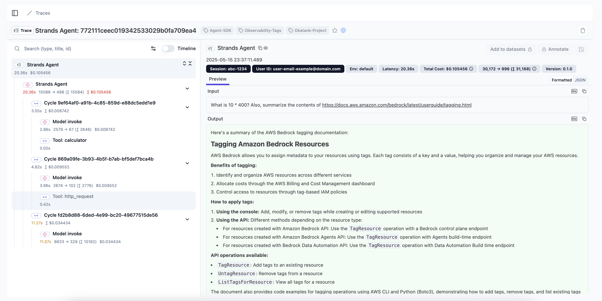

Tracing is a fundamental component of the Strands SDK's observability framework, providing detailed insights into your agent's execution. Using the OpenTelemetry standard, Strands traces capture the complete journey of a request through your agent, including LLM interactions, retrievers, tool usage, and event loop processing.

## Understanding Traces in Strands

Traces in Strands provide a hierarchical view of your agent's execution, allowing you to:

1. **Track the entire agent lifecycle**: From initial prompt to final response
2. **Monitor individual LLM calls**: Examine prompts, completions, and token usage
3. **Analyze tool execution**: Understand which tools were called, with what parameters, and their results
4. **Measure performance**: Identify bottlenecks and optimization opportunities
5. **Debug complex workflows**: Follow the exact path of execution through multiple cycles

Each trace consists of multiple spans that represent different operations in your agent's execution flow:

```
+-------------------------------------------------------------------------------------+
| Strands Agent                                                                       |
| - gen_ai.system: <system name>                                                      |
| - gen_ai.agent.name: <agent name>                                                   |
| - gen_ai.operation.name: <operation>                                                |
| - gen_ai.request.model: <model identifier>                                          |
| - gen_ai.event.start_time: <timestamp>                                              |
| - gen_ai.event.end_time: <timestamp>                                                |
| - gen_ai.user.message: <user query>                                                 |
| - gen_ai.choice: <agent response>                                                   |
| - gen_ai.usage.prompt_tokens: <number>                                              |
| - gen_ai.usage.input_tokens: <number>                                               |
| - gen_ai.usage.completion_tokens: <number>                                          |
| - gen_ai.usage.output_tokens: <number>                                              |
| - gen_ai.usage.total_tokens: <number>                                               |
| - gen_ai.usage.cache_read_input_tokens: <number>                                    |
| - gen_ai.usage.cache_write_input_tokens: <number>                                   |
|                                                                                     |
|  +-------------------------------------------------------------------------------+  |
|  | Cycle <cycle-id>                                                              |  |
|  | - gen_ai.user.message: <formatted prompt>                                     |  |
|  | - gen_ai.assistant.message: <formatted prompt>                                |  |
|  | - event_loop.cycle_id: <cycle identifier>                                     |  |
|  | - gen_ai.event.end_time: <timestamp>                                          |  |
|  | - gen_ai.choice                                                               |  |
|  |   - tool.result: <tool result data>                                           |  |
|  |   - message: <formatted completion>                                           |  |
|  |                                                                               |  |
|  |  +-----------------------------------------------------------------------+    |  |
|  |  | Model invoke                                                          |    |  |
|  |  | - gen_ai.system: <system name>                                        |    |  |
|  |  | - gen_ai.operation.name: <operation>                                  |    |  |
|  |  | - gen_ai.user.message: <formatted prompt>                             |    |  |
|  |  | - gen_ai.assistant.message: <formatted prompt>                        |    |  |
|  |  | - gen_ai.request.model: <model identifier>                            |    |  |
|  |  | - gen_ai.event.start_time: <timestamp>                                |    |  |
|  |  | - gen_ai.event.end_time: <timestamp>                                  |    |  |
|  |  | - gen_ai.choice: <model response with tool use>                       |    |  |
|  |  | - gen_ai.usage.prompt_tokens: <number>                                |    |  |
|  |  | - gen_ai.usage.input_tokens: <number>                                 |    |  |
|  |  | - gen_ai.usage.completion_tokens: <number>                            |    |  |
|  |  | - gen_ai.usage.output_tokens: <number>                                |    |  |
|  |  | - gen_ai.usage.total_tokens: <number>                                 |    |  |
|  |  | - gen_ai.usage.cache_read_input_tokens: <number>                      |    |  |
|  |  | - gen_ai.usage.cache_write_input_tokens: <number>                     |    |  |
|  |  +-----------------------------------------------------------------------+    |  |
|  |                                                                               |  |
|  |  +-----------------------------------------------------------------------+    |  |
|  |  | Tool: <tool name>                                                     |    |  |
|  |  | - gen_ai.event.start_time: <timestamp>                                |    |  |
|  |  | - gen_ai.operation.name: <operation>                                  |    |  |
|  |  | - gen_ai.tool.name: <tool name>                                       |    |  |
|  |  | - gen_ai.tool.call.id: <tool use identifier>                          |    |  |
|  |  | - gen_ai.event.end_time: <timestamp>                                  |    |  |
|  |  | - gen_ai.choice: <tool execution result>                              |    |  |
|  |  | - tool.status: <execution status>                                     |    |  |
|  |  +-----------------------------------------------------------------------+    |  |
|  +-------------------------------------------------------------------------------+  |
+-------------------------------------------------------------------------------------+
```

## OpenTelemetry Integration

Strands natively integrates with OpenTelemetry, an industry standard for distributed tracing. This integration provides:

1. **Compatibility with existing observability tools**: Send traces to platforms like Jaeger, Grafana Tempo, AWS X-Ray, Datadog, and more
2. **Standardized attribute naming**: Using the OpenTelemetry semantic conventions
3. **Flexible export options**: Console output for development, OTLP endpoint for production
4. **Auto-instrumentation**: Trace creation is handled automatically when you enable tracing

## Enabling Tracing

<Tabs>
<Tab label="Python">

:::note[Install OpenTelemetry Dependencies]
To enable OTEL exporting, install Strands Agents with `otel` optional dependency:

```shell
pip install 'strands-agents[otel]'
```
:::
</Tab>
<Tab label="TypeScript">

:::note[Install OpenTelemetry Dependencies]
To enable OTEL exporting, install the OpenTelemetry peer dependencies: 

```shell
npm install @opentelemetry/api @opentelemetry/sdk-trace-node @opentelemetry/sdk-trace-base @opentelemetry/resources @opentelemetry/exporter-trace-otlp-http
```
:::
</Tab>
</Tabs>


### Environment Variables

```bash

# Specify custom OTLP endpoint
export OTEL_EXPORTER_OTLP_ENDPOINT="http://collector.example.com:4318"

# Set Default OTLP Headers
export OTEL_EXPORTER_OTLP_HEADERS="key1=value1,key2=value2"

# To use OTEL latest semantic conventions, and send tool defenitions as spans
export OTEL_SEMCONV_STABILITY_OPT_IN="gen_ai_latest_experimental,gen_ai_tool_definitions"

```

### Code Configuration

<Tabs>
<Tab label="Python">

```python
from strands import Agent

# Option 1: Skip StrandsTelemetry if global tracer provider and/or meter provider are already configured
# (your existing OpenTelemetry setup will be used automatically)
agent = Agent(
    model="us.anthropic.claude-sonnet-4-20250514-v1:0",
    system_prompt="You are a helpful AI assistant"
)

# Option 2: Use StrandsTelemetry to handle complete OpenTelemetry setup
# (Creates new tracer provider and sets it as global)
from strands.telemetry import StrandsTelemetry

strands_telemetry = StrandsTelemetry()
strands_telemetry.setup_otlp_exporter()     # Send traces to OTLP endpoint
strands_telemetry.setup_console_exporter()  # Print traces to console
strands_telemetry.setup_meter(
    enable_console_exporter=True,
    enable_otlp_exporter=True)       # Setup new meter provider and sets it as global

# Option 3: Use StrandsTelemetry with your own tracer provider
# (Keeps your tracer provider, adds Strands exporters without setting global)
from strands.telemetry import StrandsTelemetry

strands_telemetry = StrandsTelemetry(tracer_provider=user_tracer_provider)
strands_telemetry.setup_meter(enable_otlp_exporter=True)
strands_telemetry.setup_otlp_exporter().setup_console_exporter()  # Chaining supported

# Create agent (tracing will be enabled automatically)
agent = Agent(
    model="us.anthropic.claude-sonnet-4-20250514-v1:0",
    system_prompt="You are a helpful AI assistant"
)

# Use agent normally
response = agent("What can you help me with?")
```
</Tab>
<Tab label="TypeScript">

```typescript
--8<-- "user-guide/observability-evaluation/traces_imports.ts:code_configuration_option1_imports"

--8<-- "user-guide/observability-evaluation/traces.ts:code_configuration_option1"

--8<-- "user-guide/observability-evaluation/traces_imports.ts:code_configuration_option2_imports"

--8<-- "user-guide/observability-evaluation/traces.ts:code_configuration_option2"

--8<-- "user-guide/observability-evaluation/traces_imports.ts:code_configuration_option3_imports"

--8<-- "user-guide/observability-evaluation/traces.ts:code_configuration_option3"

--8<-- "user-guide/observability-evaluation/traces.ts:code_configuration_agent"
```
</Tab>
</Tabs>

## Trace Structure

Strands creates a hierarchical trace structure that mirrors the execution of your agent:
- **Agent Span**: The top-level span representing the entire agent invocation
      - Contains overall metrics like total token usage and cycle count
      - Captures the user prompt and final response

- **Cycle Spans**: Child spans for each event loop cycle
      - Tracks the progression of thought and reasoning
      - Shows the transformation from prompt to response

- **LLM Spans**: Model invocation spans
      - Contains prompt, completion, and token usage
      - Includes model-specific parameters

- **Tool Spans**: Tool execution spans
      - Captures tool name, parameters, and results
      - Measures tool execution time

## Captured Attributes

Strands traces include rich attributes that provide context for each operation:

### Agent-Level Attributes

| Attribute | Description |
|-----------|-------------|
| `gen_ai.system` | The agent system identifier ("strands-agents") |
| `gen_ai.agent.name` | Name of the agent |
| `gen_ai.user.message` | The user's initial prompt |
| `gen_ai.choice` | The agent's final response |
| `system_prompt` | System instructions for the agent |
| `gen_ai.request.model` | Model ID used by the agent |
| `gen_ai.event.start_time` | When agent processing began |
| `gen_ai.event.end_time` | When agent processing completed |
| `gen_ai.usage.prompt_tokens` | Total tokens used for prompts |
| `gen_ai.usage.input_tokens` | Total tokens used for prompts (duplicate) |
| `gen_ai.usage.completion_tokens` | Total tokens used for completions |
| `gen_ai.usage.output_tokens` | Total tokens used for completions (duplicate) |
| `gen_ai.usage.total_tokens` | Total token usage |
| `gen_ai.usage.cache_read_input_tokens` | Number of input tokens read from cache (Note: Not all model providers support cache tokens. This defaults to 0 in that case) |
| `gen_ai.usage.cache_write_input_tokens` | Number of input tokens written to cache (Note: Not all model providers support cache tokens. This defaults to 0 in that case) |

### Cycle-Level Attributes

| Attribute | Description |
|-----------|-------------|
| `event_loop.cycle_id` | Unique identifier for the reasoning cycle |
| `gen_ai.user.message` | The user's initial prompt |
| `gen_ai.assistant.message` | Formatted prompt for this reasoning cycle |
| `gen_ai.event.end_time` | When the cycle completed |
| `gen_ai.choice.message` | Model's response for this cycle |
| `gen_ai.choice.tool.result` | Results from tool calls (if any) |

### Model Invoke Attributes

| Attribute | Description |
|-----------|-------------|
| `gen_ai.system` | The agent system identifier |
| `gen_ai.operation.name` | Gen-AI operation name |
| `gen_ai.agent.name` | Name of the agent |
| `gen_ai.user.message` | Formatted prompt sent to the model |
| `gen_ai.assistant.message` | Formatted assistant prompt sent to the model |
| `gen_ai.request.model` | Model ID (e.g., "us.anthropic.claude-sonnet-4-20250514-v1:0") |
| `gen_ai.event.start_time` | When model invocation began |
| `gen_ai.event.end_time` | When model invocation completed |
| `gen_ai.choice` | Response from the model (may include tool calls) |
| `gen_ai.usage.prompt_tokens` | Total tokens used for prompts |
| `gen_ai.usage.input_tokens` | Total tokens used for prompts (duplicate) |
| `gen_ai.usage.completion_tokens` | Total tokens used for completions |
| `gen_ai.usage.output_tokens` | Total tokens used for completions (duplicate) |
| `gen_ai.usage.total_tokens` | Total token usage |
| `gen_ai.usage.cache_read_input_tokens` | Number of input tokens read from cache (Note: Not all model providers support cache tokens. This defaults to 0 in that case) |
| `gen_ai.usage.cache_write_input_tokens` | Number of input tokens written to cache (Note: Not all model providers support cache tokens. This defaults to 0 in that case) |

### Tool-Level Attributes

| Attribute | Description |
|-----------|-------------|
| `tool.status` | Execution status (success/error) |
| `gen_ai.tool.name` | Name of the tool called |
| `gen_ai.tool.call.id` | Unique identifier for the tool call |
| `gen_ai.operation.name` | Gen-AI operation name |
| `gen_ai.event.start_time` | When tool execution began |
| `gen_ai.event.end_time` | When tool execution completed |
| `gen_ai.choice` | Formatted tool result |

## Visualization and Analysis

Traces can be visualized and analyzed using any OpenTelemetry-compatible tool:



Common visualization options include:

1. **Jaeger**: Open-source, end-to-end distributed tracing
2. **Langfuse**: For Traces, evals, prompt management, and metrics
3. **AWS X-Ray**: For AWS-based applications
4. **Zipkin**: Lightweight distributed tracing
5. **Opik**: For evaluating and optimizing multi-agent systems

## Local Development Setup

For development environments, you can quickly set up a local collector and visualization:

```bash
# Pull and run Jaeger all-in-one container
docker run -d --name jaeger \
  -e COLLECTOR_ZIPKIN_HOST_PORT=:9411 \
  -e COLLECTOR_OTLP_ENABLED=true \
  -p 6831:6831/udp \
  -p 6832:6832/udp \
  -p 5778:5778 \
  -p 16686:16686 \
  -p 4317:4317 \
  -p 4318:4318 \
  -p 14250:14250 \
  -p 14268:14268 \
  -p 14269:14269 \
  -p 9411:9411 \
  jaegertracing/all-in-one:latest

```

Then access the Jaeger UI at http://localhost:16686 to view your traces.

You can also setup console export to inspect the spans:

<Tabs>
<Tab label="Python">

```python
from strands.telemetry import StrandsTelemetry

StrandsTelemetry().setup_console_exporter()
```
</Tab>
<Tab label="TypeScript">

```typescript
--8<-- "user-guide/observability-evaluation/traces_imports.ts:console_exporter_imports"

--8<-- "user-guide/observability-evaluation/traces.ts:console_exporter"
```
</Tab>
</Tabs>


## Advanced Configuration

### Sampling Control

For high-volume applications, you may want to implement sampling to reduce the volume of data to do this you can utilize the default [Open Telemetry Environment](https://opentelemetry.io/docs/specs/otel/configuration/sdk-environment-variables/) variables:

```bash
# Example: Sample 50% of traces
export OTEL_TRACES_SAMPLER="traceidratio"
export OTEL_TRACES_SAMPLER_ARG="0.5"
```

### Custom Attribute Tracking

You can add custom attributes to any span:

<Tabs>
<Tab label="Python">

```python
agent = Agent(
    system_prompt="You are a helpful assistant that provides concise responses.",
    tools=[http_request, calculator],
    trace_attributes={
        "session.id": "abc-1234",
        "user.id": "user-email-example@domain.com",
        "tags": [
            "Agent-SDK",
            "Okatank-Project",
            "Observability-Tags",
        ]
    },
)
```
</Tab>
<Tab label="TypeScript">

```typescript
--8<-- "user-guide/observability-evaluation/traces_imports.ts:custom_attributes_imports"

--8<-- "user-guide/observability-evaluation/traces.ts:custom_attributes"
```
</Tab>
</Tabs>

### Custom Spans

You can access the configured tracer to create your own custom spans alongside the auto-instrumented ones:

<Tabs>
<Tab label="Python">

```python
from opentelemetry import trace

# Get your configured tracer to optionally create your own custom spans
tracer = trace.get_tracer(__name__)
with tracer.start_as_current_span("my-custom-operation") as span:
    span.set_attribute("custom.key", "value")
    # ... do work ...
```
</Tab>
<Tab label="TypeScript">

```typescript
--8<-- "user-guide/observability-evaluation/traces_imports.ts:custom_spans_imports"

--8<-- "user-guide/observability-evaluation/traces.ts:custom_spans"
```
</Tab>
</Tabs>

:::tip
`getTracer()` (TypeScript) and `trace.get_tracer()` (Python) use the global tracer provider. When you use `setupTracer()` or `StrandsTelemetry()` without a custom provider, it's automatically registered as global — so your custom spans will use the same provider as the agent's auto-instrumented spans.
:::

### Configuring the exporters from source code

<Tabs>
<Tab label="Python">

The `StrandsTelemetry().setup_console_exporter()` and `StrandsTelemetry().setup_otlp_exporter()` methods accept keyword arguments that are passed to OpenTelemetry's [`ConsoleSpanExporter`](https://opentelemetry-python.readthedocs.io/en/latest/sdk/trace.export.html#opentelemetry.sdk.trace.export.ConsoleSpanExporter) and [`OTLPSpanExporter`](https://opentelemetry-python.readthedocs.io/en/latest/exporter/otlp/otlp.html#opentelemetry.exporter.otlp.proto.http.trace_exporter.OTLPSpanExporter) initializers, respectively. This allows you to save the log lines to a file or set up the OTLP endpoints from Python code:

```python
from os import linesep
from strands.telemetry import StrandsTelemetry

strands_telemetry = StrandsTelemetry()

# Save telemetry to a local file and configure the serialization format
logfile = open("my_log.jsonl", "wt")
strands_telemetry.setup_console_exporter(
    out=logfile,
    formatter=lambda span: span.to_json() + linesep,
)
# ... your agent-running code goes here ...
logfile.close()

# Configure OTLP endpoints programmatically
strands_telemetry.setup_otlp_exporter(
    endpoint="http://collector.example.com:4318",
    headers={"key1": "value1", "key2": "value2"},
)
```

For more information about the accepted arguments, refer to `ConsoleSpanExporter` and `OTLPSpanExporter` in the [OpenTelemetry API documentation](https://opentelemetry-python.readthedocs.io).
</Tab>
<Tab label="TypeScript">

The `telemetry.setupTracer()` function reads OTLP configuration from standard OpenTelemetry environment variables (`OTEL_EXPORTER_OTLP_ENDPOINT`, `OTEL_EXPORTER_OTLP_HEADERS`). For full control over exporter configuration, provide your own `NodeTracerProvider`:

```typescript
--8<-- "user-guide/observability-evaluation/traces_imports.ts:configuring_exporters_imports"

--8<-- "user-guide/observability-evaluation/traces.ts:configuring_exporters"
```

For more information about the accepted arguments, refer to the [OpenTelemetry JS documentation](https://opentelemetry.io/docs/languages/js/).
</Tab>
</Tabs>

## Best Practices

1. **Use appropriate detail level**: Balance between capturing enough information and avoiding excessive data
2. **Add business context**: Include business-relevant attributes like customer IDs or transaction values
3. **Implement sampling**: For high-volume applications, use sampling to reduce data volume
4. **Secure sensitive data**: Avoid capturing PII or sensitive information in traces
5. **Correlate with logs and metrics**: Use trace IDs to link traces with corresponding logs
6. **Monitor storage costs**: Be aware of the data volume generated by traces

## Common Issues and Solutions

| Issue | Solution |
|-------|----------|
| Missing traces | Check that your collector endpoint is correct and accessible |
| Excessive data volume | Implement sampling or filter specific span types |
| Incomplete traces | Ensure all services in your workflow are properly instrumented |
| High latency | Consider using batching and asynchronous export |
| Missing context | Use context propagation to maintain trace context across services |

## Example: End-to-End Tracing

This example demonstrates capturing a complete trace of an agent interaction:

<Tabs>
<Tab label="Python">

```python
from strands import Agent
from strands.telemetry import StrandsTelemetry
import os

os.environ["OTEL_EXPORTER_OTLP_ENDPOINT"] = "http://localhost:4318"
strands_telemetry = StrandsTelemetry()
strands_telemetry.setup_otlp_exporter()      # Send traces to OTLP endpoint
strands_telemetry.setup_console_exporter()   # Print traces to console

# Create agent
agent = Agent(
    model="us.anthropic.claude-sonnet-4-20250514-v1:0",
    system_prompt="You are a helpful AI assistant"
)

# Execute a series of interactions that will be traced
response = agent("Find me information about Mars. What is its atmosphere like?")
print(response)

# Ask a follow-up that uses tools
response = agent("Calculate how long it would take to travel from Earth to Mars at 100,000 km/h")
print(response)

# Each interaction creates a complete trace that can be visualized in your tracing tool
```
</Tab>
<Tab label="TypeScript">

```typescript
--8<-- "user-guide/observability-evaluation/traces_imports.ts:end_to_end_imports"

--8<-- "user-guide/observability-evaluation/traces.ts:end_to_end"
```
</Tab>
</Tabs>

## Sending traces to CloudWatch X-ray
There are several ways to send traces, metrics, and logs to CloudWatch. Please visit the following pages for more details and configurations:
1. [AWS Distro for OpenTelemetry Collector](https://aws-otel.github.io/docs/getting-started/x-ray#configuring-the-aws-x-ray-exporter)
2. [AWS CloudWatch OpenTelemetry User Guide](https://docs.aws.amazon.com/AmazonCloudWatch/latest/monitoring/CloudWatch-OpenTelemetry-Sections.html)
  - Please ensure Transaction Search is enabled in CloudWatch.
