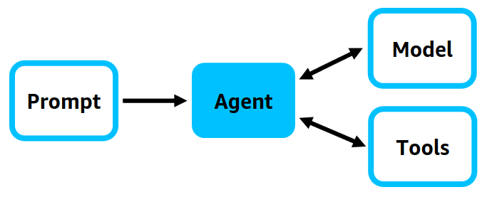
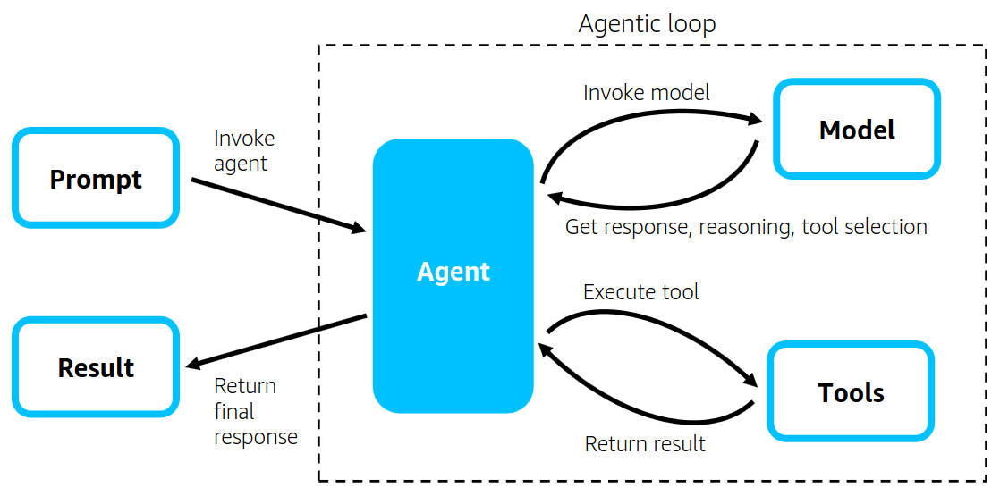
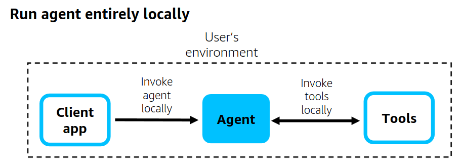
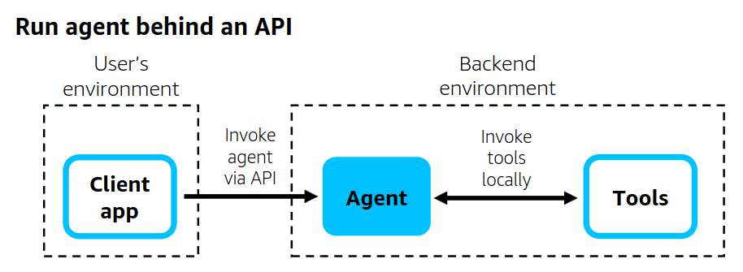
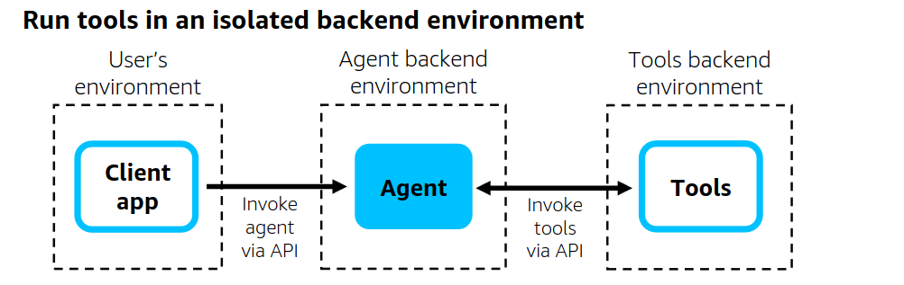
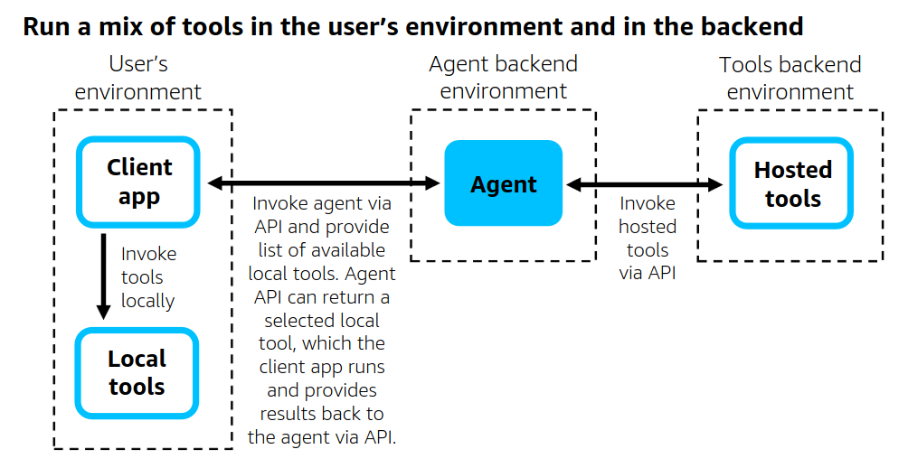

Traditional agent frameworks required developers to build elaborate orchestration logic, state machines, and predefined workflows to guide language models through tasks. Despite significant engineering effort, these agents often broke when encountering scenarios that weren't anticipated during development.

The Strands Agents SDK takes a different path with its **model-driven approach**. Rather than trying to predict and code for every possible scenario, we let modern large language models drive their own behavior, make intelligent decisions about tool usage, and adapt dynamically to whatever comes their way.

This approach emerged from real-world experience at AWS, where teams building production agents for [Kiro](https://kiro.dev/), [Amazon Q Developer](https://aws.amazon.com/q/developer/), and [AWS Glue](https://aws.amazon.com/glue/) discovered that the orchestration frameworks built for earlier models were actually getting in the way of what modern LLMs could do naturally.

## Why model-driven?

The model-driven approach is more resilient because it lets models reason through problems dynamically. When an API call fails, the model doesn't crash – it reasons about alternatives. When a user asks something unexpected, the model doesn't follow a predetermined "I don't understand" path – it figures out how to help using the available tools.

Using the model as the orchestrator doesn't mean sacrificing developer control. Strands provides a clean, simple interface that gets you started quickly, while offering powerful configurability when you need it. Built-in evaluation tools help you understand and validate agent behavior, ensuring you maintain confidence even as models make autonomous decisions.

## The agent loop

At the heart of this philosophy lies the [agent loop](/docs/user-guide/concepts/agents/agent-loop/) – a natural cycle of reasoning and action that reflects how intelligent systems think and work. This approach builds upon the ReAct paradigm ([ReAct: Synergizing Reasoning and Acting in Language Models](https://react-lm.github.io/)), which demonstrates how language models can generate both reasoning traces and task-specific actions in an interleaved manner.

The model engages in continuous reasoning:

- *"What am I trying to accomplish here?"*
- *"What information do I need?"*
- *"Which tools would be most effective?"*
- *"How do these results change my understanding?"*
- *"Should I continue exploring or provide an answer?"*

This internal reasoning process is what makes model-driven agents powerful. They don't just execute predefined steps – they think, adapt, and evolve their approach in real-time.



## Guiding intelligence through context

While the model drives its own behavior, that behavior is shaped by the context it receives. You guide agent intelligence not through rigid control structures, but through carefully crafted context:

**[System prompts](/docs/user-guide/concepts/agents/prompts/)** establish the agent's role and goals. Instead of dictating specific steps, effective system prompts describe what success looks like and provide principles for decision-making.

**[Tool specifications](/docs/user-guide/concepts/tools/)** define capability boundaries and usage guidance. Well-designed tool descriptions become part of the model's reasoning process.

**[Conversation history](/docs/user-guide/concepts/agents/conversation-management/)** maintains task continuity and evolving context. As conversations grow longer, managing this context becomes crucial for maintaining performance while preserving relevant information.

This represents a shift from procedural programming to contextual programming. Instead of writing "if this, then that" logic, you're crafting the context that helps the model figure out the best approach itself.

```python
from strands import Agent
from strands_tools import calculator, file_write, python_repl

# Simple: Get started in seconds
agent = Agent(
    tools=[calculator, file_write, python_repl],
    system_prompt="You are a helpful assistant that can perform calculations and verify them with code."
)

# The model autonomously decides: calculate first, then verify with code
agent("Calculate the compound interest on $10,000 at 5% annually for 10 years")
```



## Multi-agent patterns

The model-driven approach scales naturally. When you need multiple agents, the models coordinate themselves through several proven patterns:

### Agents-as-tools

[Agents-as-tools](/docs/user-guide/concepts/multi-agent/agents-as-tools/) creates hierarchical systems where an orchestrator agent delegates to specialists. The orchestrator reasons about which specialists to consult just like it would reason about tool selection.

### Swarms

[Swarms](/docs/user-guide/concepts/multi-agent/swarm/) enable agents to collaborate autonomously, deciding when to hand off tasks to each other. This works well for creative collaboration where multiple perspectives add value.

### Graphs

[Graphs](/docs/user-guide/concepts/multi-agent/graph/) provide deterministic workflows where execution follows predefined paths. While individual agents use model-driven execution, the graph structure ensures specific sequences are maintained – ideal for compliance requirements.

### Meta agents

Meta agents are equipped with tools that let them dynamically create other agents and orchestrate workflows. They represent the ultimate expression of the model-driven approach: agents that can architect their own orchestration.

## Production architectures

Strands is flexible enough to support a variety of production architectures:

**Local execution** – The agent runs entirely in the user's environment through a client application.



**API deployment** – The agent and its tools are deployed behind an API in production, using [AWS Lambda](/docs/user-guide/deploy/deploy_to_aws_lambda/), [AWS Fargate](/docs/user-guide/deploy/deploy_to_aws_fargate/), or [Amazon EC2](/docs/user-guide/deploy/deploy_to_amazon_ec2/).



**Isolated tools** – The agent invokes its tools via API, with tools running in an isolated backend environment separate from the agent's environment.



**Return of control** – The client is responsible for running tools, mixing backend-hosted tools with tools that run locally through the client application.



## Building confidence through evaluation

The model-driven approach requires robust [evaluation](/docs/user-guide/observability-evaluation/evaluation/) to build confidence that agents perform as expected. Since model-driven agents make dynamic decisions rather than following predetermined paths, evaluation becomes both more important and more nuanced.

Key evaluation dimensions include:

- **Tool selection appropriateness** – Did the agent choose the right tools for the task?
- **Reasoning quality** – Does the agent's approach make logical sense?
- **Adaptability** – How well does the agent handle unexpected scenarios?
- **Efficiency** – Does the agent accomplish tasks without unnecessary steps?

## Get started

The model-driven approach represents a fundamental shift in how we think about AI agents. Instead of trying to control every aspect of agent behavior through complex orchestration, we provide the right tools, context, and objectives, then let the model determine the best approach dynamically.

Ready to try it? Check out the [Strands Agents documentation](/) and [examples](/docs/examples/) to start building your own model-driven agents.
