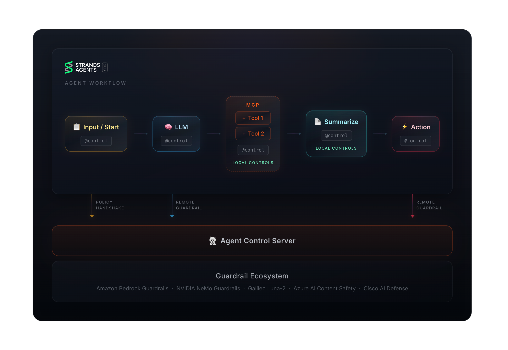

One of Strands Agents' core design principles is the model-driven approach: instead of hard-coding workflow logic into orchestration, you let the model reason through problems, choose tools, build context, and decide when it's ready to respond. The agent loop handles the mechanics. The model handles the judgment.

When the model is driving, you still need guardrails. What data can it expose in a response? Which tools can it call, and with what arguments? How should it handle a user message containing a Social Security number or a SQL injection attempt? These behaviors emerge at runtime from the model's decisions, and you can't pre-define every rule. Encoding safety logic directly into agent code scatters policy across the codebase, makes auditing harder, and forces redeployments for every policy update.

Strands gives you several ways to enforce safety at runtime. [Hooks](/docs/user-guide/concepts/agents/hooks/) let you subscribe to lifecycle events without changing core agent logic. [Steering](/docs/user-guide/concepts/plugins/steering/) lets you evaluate agent responses and guide the model to retry with corrective feedback, keeping the agent within the painted lines rather than stopping it cold. Teams deploying to AWS can also use [AgentCore Policy](https://docs.aws.amazon.com/bedrock-agentcore/latest/devguide/policy.html) as a complementary layer to enforce declarative agent-to-tool access controls on tool gateways, acting as the hard guardrail that keeps you safe when steering alone isn't enough.

Today we're excited to add another option to that toolkit: a launch partnership with Agent Control, an open-source runtime guardrails framework built by [Galileo](https://www.galileo.ai/), which is now [available for Strands](/docs/community/plugins/agent-control/).

## What Is Agent Control?

[Agent Control](https://github.com/agentcontrol/agent-control) provides an open-source runtime control plane for all your AI agents: configurable rules that evaluate inputs and outputs at every step against a set of policies managed centrally, without modifying your agent's code. Each Control defines:

* **Scope**: when a check runs (pre/post execution, LLM vs tool steps)
* **Selector**: what data to inspect (input, output, a specific field, tool name)
* **Evaluator**: how to assess the data (regex, list matching, JSON schema, or AI-powered evaluation via Galileo Luna-2)
* **Action**: what to do on a match (deny, steer, warn, log, or allow)



Controls live on the server. Agents fetch their assigned controls at runtime and evaluate on every relevant step. You can add, update, or disable controls via the dashboard or API without touching agent code or redeploying.

```python
# A control that blocks SSN patterns in LLM output
{
    "enabled": True,
    "execution": "server",
    "scope": {"step_types": ["llm"], "stages": ["post"]},
    "selector": {"path": "output"},
    "evaluator": {
        "name": "regex",
        "config": {"pattern": r"\b\d{3}-\d{2}-\d{4}\b"}
    },
    "action": {"decision": "deny"}
}
```

The Strands integration ships as part of the AgentControl SDK as a [Strands Plugin](/docs/community/plugins/agent-control/). `AgentControlPlugin` and `AgentControlSteeringHandler` are available once you install the `strands-agents` extra.

## AgentControlPlugin

```bash
pip install "agent-control-sdk[strands-agents]"
```

```python
import agent_control
from agent_control.integrations.strands import AgentControlPlugin
from strands import Agent
from strands.models.openai import OpenAIModel

# Initialize the SDK (registers agent, fetches controls)
agent_control.init(agent_name="customer-support-agent")

agent = Agent(
    model=OpenAIModel(model_id="gpt-5.2"),
    system_prompt="...",
    tools=[lookup_order, check_return_policy],
    plugins=[AgentControlPlugin(agent_name="customer-support-agent")]
)
```

`AgentControlPlugin` intercepts Strands lifecycle events and evaluates each one against your Agent Control server. If a deny control matches, a `ControlViolationError` is raised and the step does not proceed. The plugin automatically extracts tool names from events, so you can scope controls to specific tools without decorating the tool function itself.

## Shaping Agent Behavior: Deny and Steer

Agent Control includes two action types for unsafe content, and choosing between them shapes how your agent responds.

**Deny** is a hard block. When a deny control matches, `AgentControlPlugin` raises a `ControlViolationError` and execution stops. Use this for content that must never proceed: credentials in tool arguments, SQL injection patterns in queries, or PII in model output that should not be sent to a user.

**Steer** is a corrective signal. Instead of stopping the agent, a steer control surfaces what the policy found and asks the model to try again with that guidance. `AgentControlSteeringHandler` is built on Strands' `SteeringHandler`, which is designed for in-loop policy guidance.

Both components are imported from the same module and wired into the agent as plugins:

```python
import agent_control
from agent_control.integrations.strands import AgentControlPlugin, AgentControlSteeringHandler

agent_control.init(agent_name="banking-email-agent")

plugin = AgentControlPlugin(agent_name="banking-email-agent")
steering = AgentControlSteeringHandler(agent_name="banking-email-agent")

agent = Agent(
    model=OpenAIModel(model_id="gpt-5.2"),
    tools=[lookup_customer_account, send_monthly_account_summary],
    plugins=[plugin, steering]  # deny + steer as plugins
)
```

## Seeing It In Action: The Banking Email Demo

The banking email demo in the integration examples applies this pattern to a common regulated scenario: an automated agent that sends monthly account summaries to customers.

The agent needs access to raw account data (full account numbers, balances, SSNs) to draft a useful summary, but the outgoing email must never contain unmasked identifiers. Two Agent Control controls enforce this:

**A steer control on LLM post-output** scans the draft for account numbers, SSNs, and large dollar amounts, and returns corrective guidance (mask to last 4 digits, round large amounts).

**Two deny controls on tool pre-execution** hard-block the `send_monthly_account_summary` tool if the payload includes credentials or internal system data.

The agent's system prompt instructs it to draft the email before calling the send tool, giving the steer control a window to evaluate and correct the draft before it goes out.

Here's the flow for John's account summary:

```text
1. Agent calls lookup_customer_account("john@example.com")
   → Returns: account_number: "123456789012", balance: $45,234.56

2. Agent drafts email:
   "Account 123456789012 has balance $45,234.56, including a recent deposit of $15,000..."

3. AgentControlSteeringHandler evaluates draft against Agent Control server
   → steer-pii-redaction-llm-output matches
   → Returns Guide(): "Mask account numbers to last 4 digits. Round amounts to nearest $1K."

4. Agent retries with guidance:
   "Account ****9012 has balance approximately $45K, with recent deposit activity..."

5. AgentControlPlugin checks input before send_monthly_account_summary tool call
   → deny-credentials: no match → Proceed
   → deny-internal-info: no match → Proceed

6. Email sent ✅
```

The demo and all setup scripts live in the [agent-control repository](https://github.com/agentcontrol/agent-control). Clone it and run a few commands:

```bash
git clone https://github.com/agentcontrol/agent-control.git
cd agent-control

# Install the Strands example dependencies
cd examples/strands_agents
uv pip install -e .

# Configure
cp .env.example .env
# Add OPENAI_API_KEY and AGENT_CONTROL_URL

# Start the Agent Control server (requires Docker)
curl -fsSL https://raw.githubusercontent.com/agentcontrol/agent-control/docker-compose.yml | docker compose -f - up -d

# Set up controls on the server (in a new terminal)
cd steering_demo
uv run setup_email_controls.py

# Launch the Streamlit app
streamlit run email_safety_demo.py
```

From the sidebar, trigger John's or Sarah's account summary and watch the steer/retry cycle in the console: the before/after content, the steering context from Agent Control, and the tool enforcement at the send stage.

## Getting Started

Install Strands with the Agent Control integration:

```bash
pip install "agent-control-sdk[strands-agents]"
```

The Agent Control server, setup scripts, and working demos (including the banking email scenario above) live in the [agent-control repository](https://github.com/agentcontrol/agent-control).

If you're building Strands agents and thinking about production safety, these patterns apply broadly: PII protection, SQL injection prevention, content policy enforcement, output redaction for compliance. Controls live on the server, manageable via API or dashboard, so your safety posture can evolve independently of agent deployments.

We'd love to hear what you're building. If you run into issues or have questions, open an issue in the [GitHub repository](https://github.com/agentcontrol/agent-control/issues).
