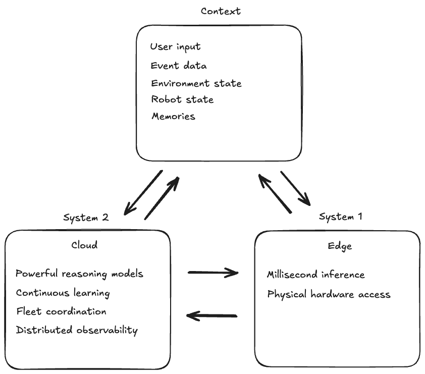
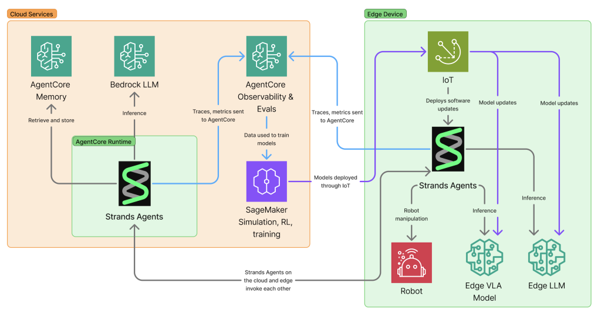
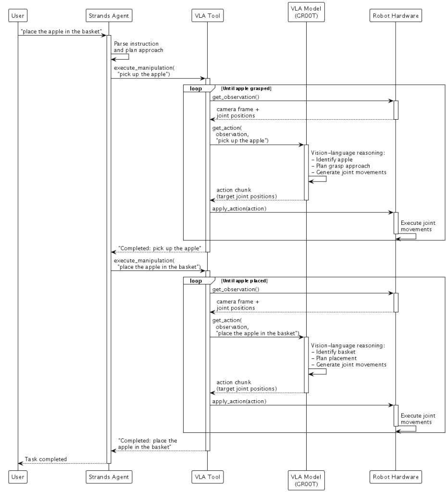
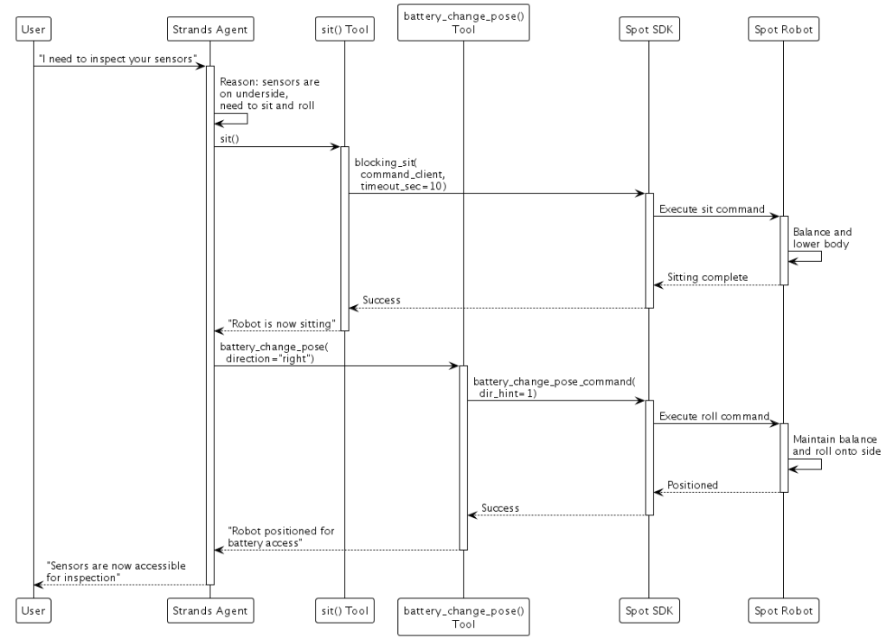
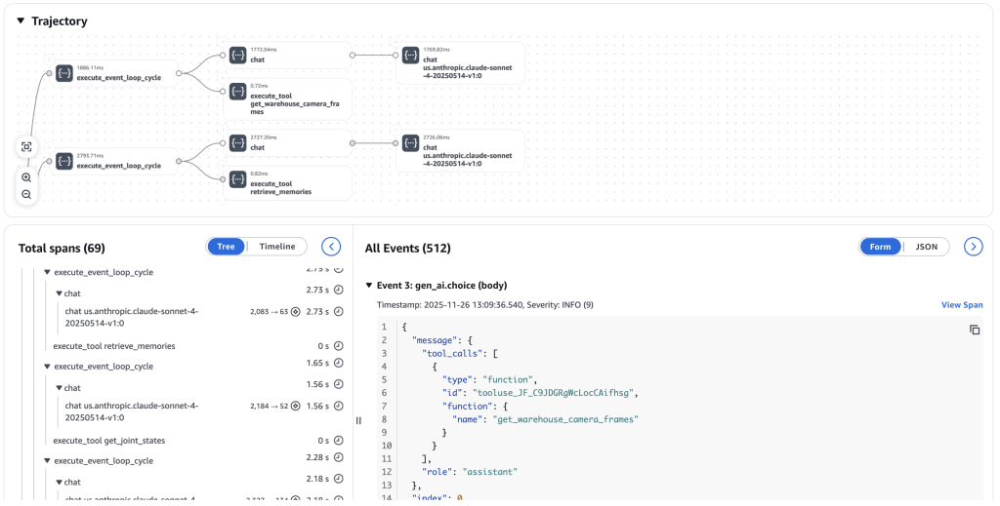

Agentic AI systems are rapidly expanding beyond the digital world and into the physical, where AI agents perceive, reason, and act in real environments. As AI systems increasingly interact with the physical world through robotics, autonomous vehicles, and smart infrastructure, a fundamental question emerges: how do we build agents that leverage massive cloud compute for complex reasoning while maintaining millisecond-level responsiveness for physical sensing and actuation?

This year has been transformative for agentic AI at AWS. We [launched Strands Agents in May 2025](/blog/introducing-strands-agents/), bringing a simple developer experience and [model-driven approach](/blog/strands-agents-model-driven-approach/) to agent development. In July, [we released version 1.0](https://aws.amazon.com/blogs/opensource/introducing-strands-agents-1-0-production-ready-multi-agent-orchestration-made-simple/) with multi-agent orchestration capabilities and [introduced Amazon Bedrock AgentCore](https://aws.amazon.com/blogs/aws/introducing-amazon-bedrock-agentcore-securely-deploy-and-operate-ai-agents-at-any-scale/) to accelerate AI agents to production at scale. At re:Invent 2025, we expanded Strands with the [TypeScript SDK](https://github.com/strands-agents/sdk-typescript), [evaluations](https://github.com/strands-agents/evals), [bidirectional streaming for voice agents](/docs/user-guide/concepts/bidirectional-streaming/quickstart/), and [steering for guiding agents within boundaries](/docs/user-guide/concepts/plugins/steering/). Today, we're exploring how these capabilities extend to the edge and physical AI, where agents don't just process information but work alongside us in the physical world.


Full code for the demonstrations can be found at:
* [Strands + NVIDIA GR00T + SO-101](https://github.com/aaronsu11/Dum-E)
* [Strands + Boston Dynamics Spot](https://github.com/strands-agents/samples/tree/main/python/08-edge/strands-spot-agent)

In these demonstrations, physical AI agents control two very different robots through a unified Strands Agents interface that connects AI agents to physical sensors and hardware. A 3D printed SO-101 [robotic arm](https://github.com/TheRobotStudio/SO-ARM100) handles manipulation with the [NVIDIA GR00T](https://github.com/NVIDIA/Isaac-GR00T) vision-language-action model (VLA) – "pick up the fruit and place it in the basket" causes it to identify the apple, grasp it, and complete the task. A [Boston Dynamics Spot](https://github.com/strands-agents/samples/tree/main/python/08-edge/strands-spot-agent) quadruped handles mobility and whole-body control – "inspect your sensors" makes Spot reason that sensors are on its underside, then autonomously sit and roll onto its side for access. Both demonstrations run on [NVIDIA Jetson](https://www.nvidia.com/en-us/autonomous-machines/embedded-systems/) edge hardware, showcasing how sophisticated AI capabilities can execute directly on embedded systems.

## The edge-cloud continuum

Physical AI applications reveal a tension that shapes how we architect intelligent systems. Consider a robotic arm catching a ball. The moment between seeing the ball and adjusting the gripper position must happen in milliseconds. Network latency to a cloud service, even with the fastest connections, makes this impossible. The inference must happen at the edge, on the device itself, with the near-instantaneous response times that physical reality demands. Yet that same robotic system benefits immensely from cloud capabilities. Planning a multi-step assembly task, coordinating with other robots, or learning from the collective experience of thousands of similar robots requires the computational scale that only the cloud provides. Models like [Anthropic's Claude Sonnet 4.5](https://aws.amazon.com/blogs/aws/introducing-claude-sonnet-4-5-in-amazon-bedrock-anthropics-most-intelligent-model-best-for-coding-and-complex-agents/) bring reasoning capabilities that transform how robots understand and execute complex tasks, but they're too large to run on edge hardware. This mirrors Daniel Kahneman's [System 1 and System 2 thinking](https://en.wikipedia.org/wiki/Thinking,_Fast_and_Slow) – the edge provides fast, instinctual responses while the cloud enables deliberate reasoning, long horizon planning, and continuous learning. The most capable physical AI systems use both, working together seamlessly.



The cloud enables additional capabilities that are infeasible at the edge. [AgentCore Memory](https://docs.aws.amazon.com/bedrock-agentcore/latest/devguide/memory.html) can maintain spatial and temporal context spanning hours or days, remembering not just what happened but where and when. Learnings can be gathered and applied across entire fleets instead of siloing to individual devices – when one robot discovers a better approach, that knowledge becomes available to all robots through shared memory. [Distributed observability](https://docs.aws.amazon.com/bedrock-agentcore/latest/devguide/observability.html) across entire fleets provides the ability to understand what AI agents and robots are doing when deployed at scale, offering insights that no single device could generate. [Amazon SageMaker](https://aws.amazon.com/sagemaker/) enables massive parallel simulation and training of models, allowing organizations to apply learnings from real-world and simulated deployments back into improved models that benefit the entire fleet.



This hybrid architecture enables entirely new categories of intelligent systems. Humanoid robots use cloud-based reasoning to plan multi-step tasks while executing precise physical movements with edge-based vision-language-action models. The cloud agent might plan "prepare breakfast," breaking it into steps and remembering what you prefer to eat, while the edge VLA model handles the millisecond-level control of grasping a strawberry without crushing it. Autonomous vehicles leverage cloud intelligence for route optimization and traffic prediction while maintaining real-time obstacle avoidance at the edge. The vehicle can't wait for a cloud response to avoid a pedestrian, but it benefits from cloud-based analysis of traffic patterns across the entire city.

## A progressive journey through code

Building edge and physical AI systems doesn't require starting with the full complexity of edge-cloud orchestration. The path forward is progressive iteration, starting simple and adding sophistication as your needs grow.

### Starting on the edge

First we will install the Strands Agents Python SDK with [Ollama](https://ollama.com/) on our edge device and pull the [Qwen3-VL](https://github.com/QwenLM/Qwen3-VL) model. [Install Ollama](https://ollama.com/download), then run these commands:

```bash
ollama pull qwen3-vl:2b
pip install 'strands-agents[ollama]'
```

A simple starting point is running models locally on edge devices. With Strands' [Ollama provider](/docs/user-guide/concepts/model-providers/ollama/), you can run open-source models like Qwen3-VL directly on edge hardware. Strands also supports [llama.cpp](/docs/user-guide/concepts/model-providers/llamacpp/) for high-performance inference with quantized models, and [MLX](https://github.com/cagataycali/strands-mlx) for running models on Apple Silicon:

```python
from strands import Agent
from strands.models.ollama import OllamaModel

edge_model = OllamaModel(
    host="http://localhost:11434",
    model_id="qwen3-vl:2b"
)

agent = Agent(
    model=edge_model,
    system_prompt="You are a helpful assistant running on edge hardware."
)
result = agent("Hello!")
```

Physical AI often requires understanding the physical world, not just processing text. Adding visual understanding through camera input is straightforward – the same agent that processes text can now process images, enabling it to see its physical environment:

```python
def get_camera_frame() -> bytes:
    # Example function that returns the current camera frame
    with open("camera_frame.jpg", "rb") as f:
        return f.read()

result = agent([
    {"text": "What objects do you see?"},
    {"image": {"source": {"bytes": get_camera_frame()}}}
])
```

Beyond vision, agents can access other sensors to understand their state. By wrapping sensor readings as tools, the agent can dynamically call them when needed to make informed decisions. Reading battery level helps the agent decide whether to continue a task or return to charge:

```python
@tool
def get_battery_level() -> str:
    """Get current battery level percentage and remaining duration."""
    # Example function that returns battery metrics
    percentage = robot.get_battery_percentage()
    duration = robot.get_battery_duration_minutes()
    return f"Battery level: {percentage}%, approximately {duration} minutes remaining"

agent = Agent(
    model=edge_model,
    tools=[get_battery_level],
    system_prompt="You are a robot assistant. Use available tools to answer questions."
)
result = agent("How long until you need to recharge?")
```

### Acting in the physical world

Physical AI systems follow a continuous cycle: sensing the environment, reasoning about what to do, and acting to change the world to achieve a goal. We've covered sensing through cameras and sensors. Now let's explore how agents translate decisions into physical actions.

Acting in the physical world means controlling hardware – motors that rotate robot joints, grippers that open and close, wheels that drive mobile platforms. A robotic arm might have six joints, each controlled by a motor that can rotate to specific angles. To pick up an object, the robot must coordinate all six joints simultaneously, moving from its current position to reach the object, adjusting the gripper angle, closing the gripper, and lifting. This coordination happens through sending target joint positions to the motors, which then move the robot's physical structure. We can approach this in two ways: using vision-language-action models that directly output robot actions, or using traditional robot SDKs with AI providing high-level commands.

**Vision-Language-Action Models** like [NVIDIA GR00T](https://developer.nvidia.com/isaac/gr00t) combine visual perception, language understanding, and action prediction in a single model. They take camera images, robot joint positions, and language instructions as input and directly output new target joint positions.

Consider the instruction "pick up the fruit that is the same color as you and place it in the basket." The VLA model's vision-language backbone first reasons about the instruction and what it sees in the camera image – identifying which object is the apple and which is the basket. By including the robot's current state (its joint positions), the model generates a sequence of new joint positions that will move the robot to the apple, close the gripper around it, move to the basket, and release. The model executes this as action chunks – small sequences of joint movements that the robot executes while continuously observing the scene. If someone moves the apple mid-task, the VLA model sees this in the next camera frame and generates corrected joint movements to reach the apple's new position.

Hugging Face's [LeRobot](https://github.com/huggingface/lerobot) provides data and hardware interfaces that make working with robotics hardware accessible. You record demonstrations using teleoperation or simulation, train the model on your data, and deploy it back to the robot. By combining hardware abstractions like LeRobot with VLA models like NVIDIA GR00T, we create edge AI applications that perceive, reason, and act in the physical world:

```python
@tool
def execute_manipulation(instruction: str) -> str:
    """Execute a manipulation task using your robotics hardware."""
    # Example function that runs inference on a VLA model and actuates a robot
    while not task_complete:
        observation = robot.get_observation() # Camera + joint positions
        action = vla.get_action(observation, instruction) # Inference from the VLA model
        robot.apply_action(action) # Execute joint movements
    return f"Completed: {instruction}"

robot_agent = Agent(
    model=edge_model,
    tools=[execute_manipulation],
    system_prompt="You control a robotic arm. Use the manipulation tool to complete physical tasks."
)

result = robot_agent("place the apple in the basket.")
```

This creates a natural division of labor – Strands handles high-level task decomposition while GR00T handles millisecond-level sensorimotor control with real-time self-correction.



To make this easier for builders, we've released an [experimental robotics class](https://github.com/strands-labs/robots) with a simple interface for connecting hardware with VLA models like NVIDIA GR00T.

```python
from strands import Agent
from strands_robots import Robot

# Create robot with cameras
robot = Robot(
    tool_name="my_arm",
    robot="so101_follower",
    cameras={
        "front": {"type": "opencv", "index_or_path": "/dev/video0", "fps": 30},
        "wrist": {"type": "opencv", "index_or_path": "/dev/video2", "fps": 30}
    },
    port="/dev/ttyACM0",
    data_config="so100_dualcam"
)

# Create agent with robot tool
agent = Agent(tools=[robot])

agent("place the apple in the basket")
```

**SDK-Based Control** works well when the robot manufacturer provides robust motion primitives and you want to leverage their tested control systems. With [Boston Dynamics Spot](https://bostondynamics.com/products/spot/), we wrap SDK commands as Strands tools:

```python
from bosdyn.client.robot_command import RobotCommandBuilder, blocking_command, blocking_stand, blocking_sit

@tool
def stand() -> str:
    """Command the robot to stand up."""
    blocking_stand(command_client, timeout_sec=10)
    return "Robot is now standing"

@tool
def sit() -> str:
    """Command the robot to sit down."""
    blocking_sit(command_client, timeout_sec=10)
    return "Robot is now sitting"

@tool
def battery_change_pose(direction: str = "right") -> str:
    """Position robot for battery access by rolling onto its side."""
    cmd = RobotCommandBuilder.battery_change_pose_command(
        dir_hint=1 if direction == "right" else 2
    )
    blocking_command(command_client, cmd, timeout_sec=20)
    return f"Robot positioned for battery access"

spot_agent = Agent(
    model=edge_model,
    tools=[stand, sit, battery_change_pose],
    system_prompt="You control a Boston Dynamics Spot robot."
)

result = spot_agent("I need to inspect your sensors")
```

When asked "I need to inspect your sensors", the agent reasons that sensors are on the robot's underside, then commands Spot to execute the sit and battery change pose. The SDK handles the complex balance and motor control needed to safely roll the robot onto its side.



### Bridging edge and cloud

Edge agents can delegate complex reasoning to the cloud when needed. VLA models provide millisecond-level control for physical actions, but when the system encounters situations requiring deeper reasoning – like planning multi-step tasks or making decisions based on historical patterns – it can consult more powerful cloud-based agents using the [agents-as-tools](/docs/user-guide/concepts/multi-agent/agents-as-tools/) pattern:

```python
from strands import Agent, tool
from strands.models import BedrockModel
from strands.models.ollama import OllamaModel

# Cloud agent with powerful reasoning
cloud_agent = Agent(
    model=BedrockModel(model_id="global.anthropic.claude-sonnet-4-5-20250929-v1:0"),
    system_prompt="Plan tasks step-by-step for edge robots."
)

# Expose cloud agent as a tool so that it can be delegated to
# using the agents-as-tools pattern
@tool
def plan_task(task: str) -> str:
    """Delegate complex planning to cloud-based reasoning."""
    return str(cloud_agent(task))

# Edge agent with local model
edge_agent = Agent(
    model=OllamaModel(
        host="http://localhost:11434",
        model_id="qwen3-vl:2b"
    ),
    tools=[plan_task],
    system_prompt="Complete tasks. Consult cloud for complex planning."
)

result = edge_agent("Fetch me a drink")
```

The inverse pattern is equally powerful. A cloud-based orchestrator can coordinate multiple edge devices, each handling its own real-time control while the cloud agent manages the overall workflow:

```python
@tool
def control_robot_arm(command: str) -> str:
    """Control robotic arm for manipulation tasks."""
    # Example function that invokes a remote robot arm agent
    return str(robot_arm_agent(command))

@tool
def control_mobile_robot(command: str) -> str:
    """Control mobile robot for navigation and transport."""
    # Example function that invokes a remote mobile agent
    return str(mobile_robot_agent(command))

warehouse_orchestrator = Agent(
    model=BedrockModel(model_id="global.anthropic.claude-sonnet-4-5-20250929-v1:0"),
    tools=[control_robot_arm, control_mobile_robot],
    system_prompt="You coordinate multiple robots in a warehouse environment."
)

result = warehouse_orchestrator(
    "Coordinate inventory check: scan shelves, retrieve items, and sort"
)
```

In a warehouse, this might mean coordinating robotic arms, mobile robots, and inspection drones to complete a complex inventory task. Each device maintains its own edge intelligence for immediate responses, but they work together under cloud orchestration.

## Learning and improving across fleets

While we've seen how cloud agents can orchestrate multiple edge devices, physical AI systems become even more capable when they can learn from collective experience and continuously improve through observation and feedback.



Consider a warehouse with dozens of mobile robots. When multiple robots encounter the same problem, patterns emerge that no single robot could detect. [AgentCore Memory](https://docs.aws.amazon.com/bedrock-agentcore/latest/devguide/memory.html) enables this collective intelligence – each robot stores observations to shared memory as it operates:

```python
from bedrock_agentcore.memory import MemoryClient

memory_client = MemoryClient(region_name="us-east-1")

# Robot stores observation after navigation issue
memory_client.create_event(
    memory_id=FLEET_MEMORY_ID,
    actor_id=robot_id,
    session_id=f"robot-{robot_id}",
    messages=[
        ("Navigation failure in north corridor - low confidence in visual localization. "
         "Location: north_corridor, light_level: high_contrast", "ASSISTANT")
    ]
)
```

A fleet coordinator can query this shared memory to discover that 87% of navigation failures in the north corridor occur between 2-4pm when afternoon sunlight through skylights confuses vision systems. This insight leads to immediate operational changes and informs model improvements.

[AgentCore Observability](https://docs.aws.amazon.com/bedrock-agentcore/latest/devguide/observability.html) provides the foundation for continuous improvement through a complete feedback loop: inference → simulate/act → observe → evaluate → optimize. The GenAI Observability dashboard in CloudWatch captures end-to-end traces from edge devices, revealing agent execution paths, memory retrieval operations, and latency breakdowns across the entire system. This observability data becomes training signal for reinforcement learning – successful behaviors are reinforced while failures inform corrections.

[Amazon SageMaker](https://aws.amazon.com/sagemaker/) enables massive parallel simulation and training to apply these learnings. Physical simulators like [NVIDIA Isaac Sim](https://developer.nvidia.com/isaac/sim) and [MuJoCo](https://mujoco.org/) provide realistic physics environments where robots can practice millions of scenarios safely before deployment. Digital simulators, including LLM-based user simulators, generate diverse interaction patterns that help agents handle edge cases. The cycle repeats: deploy to real robots, observe behaviors, simulate improvements at scale, train updated models, and deploy back to the fleet. Each iteration makes the entire fleet more capable. For a detailed walkthrough of setting up a scalable robot learning pipeline with Isaac GR00T fine-tuning on AWS, see our [embodied AI blog post series](https://aws.amazon.com/blogs/spatial/embodied-ai-blog-series-part-1/) on getting started with robot learning on AWS Batch.

## Building tomorrow's intelligent systems

What makes this moment interesting is the convergence we're seeing across several areas. Powerful multimodal reasoning models can understand and plan physical tasks, edge hardware enables VLA models to run locally with the low latency that physical systems demand, and open source robotics hardware is making physical AI development accessible to a broader community of builders. VLA models have emerged that enable robots to sense and act in dynamic environments with millisecond-level control, and the continuous learning loop – where agents improve through both simulation and real physical deployments – has become practical at scale on the cloud.

One of our goals at AWS is to make AI agent development accessible. This work extends that goal into the physical world. As David Silver and Richard S. Sutton describe in [Welcome to the Era of Experience](https://storage.googleapis.com/deepmind-media/Era-of-Experience%20/The%20Era%20of%20Experience%20Paper.pdf), AI agents are increasingly learning from experience in their environment – improving through model training, tuning, long-term memories, and context optimization. As these systems develop the ability to reason deeper about the physical world, they can begin to simulate future world states before taking action, predict the consequences of their decisions, and coordinate reliably as part of larger systems.

We're looking forward to seeing what you build over the coming months in this rapidly growing space.

Get started today:
* [Strands Agents](/)
* [Amazon Bedrock AgentCore](https://aws.amazon.com/bedrock/agentcore/)
* [Amazon SageMaker](https://aws.amazon.com/sagemaker/)
* [NVIDIA Isaac GR00T](https://github.com/NVIDIA/Isaac-GR00T)
* [Hugging Face LeRobot](https://github.com/huggingface/lerobot)
* [SO-101 robot arm](https://github.com/TheRobotStudio/SO-ARM100)
* [Boston Dynamics Spot](https://github.com/boston-dynamics/spot-sdk/)
* [Experimental Strands Robot Class](https://github.com/strands-labs/robots)
