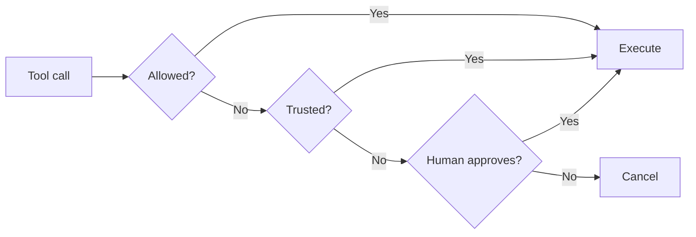

The `HumanInTheLoop` intervention handler pauses agent execution before tool calls to request human approval. It provides a configurable, drop-in way to add human oversight without writing custom interrupt logic. Pass it to `interventions` and choose how you want to collect the human's response.

## How It Works

The handler uses the [`confirm` action](./interventions) to pause for human input. Under the hood it builds on the SDK's [interrupt mechanism](../interrupts), but abstracts away the manual interrupt/resume loop when you provide an `ask` option.



## Usage

### Interrupt/Resume Mode (Default)

Without an `ask` option, the handler raises an interrupt and the agent pauses. The caller presents the interrupt to the user, collects their response, and resumes the agent. This is the same [interrupt/resume pattern](../interrupts#hooks) used throughout the SDK. For stateless deployments, combine with a [session manager](./session-management) to persist state between requests.

```typescript
--8<-- "user-guide/concepts/agents/human-in-the-loop_imports.ts:basic_interrupt_imports"

--8<-- "user-guide/concepts/agents/human-in-the-loop.ts:basic_interrupt"
```

### Stdio Mode

For CLI applications, pass `ask: 'stdio'` to prompt the user inline via Node.js readline. The agent blocks until the user responds, so no interrupt handling is needed on the caller side.

```typescript
--8<-- "user-guide/concepts/agents/human-in-the-loop_imports.ts:stdio_mode_imports"

--8<-- "user-guide/concepts/agents/human-in-the-loop.ts:stdio_mode"
```

### Custom UI Callback

For web UIs, Slack bots, or other custom interfaces, pass an async function to `ask`. The function receives a prompt string describing the tool call and must return the user's response.

```typescript
--8<-- "user-guide/concepts/agents/human-in-the-loop_imports.ts:custom_ask_imports"

--8<-- "user-guide/concepts/agents/human-in-the-loop.ts:custom_ask"
```

## Configuration

| Parameter | Type | Default | Description |
|-----------|------|---------|-------------|
| `allowedTools` | `string[]` | `undefined` | Tools that bypass approval. Supports `'*'` (all) and `'!toolName'` (negation). |
| `enableTrust` | `boolean` | `false` | When `true`, trust responses are remembered for the session. |
| `evaluateTrust` | Function | Accepts `'t'` or `'trust'` | Custom validator for trust responses. Only evaluated when `enableTrust` is `true`. |
| `evaluate` | Function | Accepts `true`, `'y'`, or `'yes'` | Custom validator for approval responses. |
| `ask` | Function or `'stdio'` | `undefined` | Pass an async function for custom UIs, `'stdio'` for CLI readline, or omit for interrupt/resume. |

### Allowed Tools

Use `allowedTools` to skip approval for safe, read-only tools:

```typescript
--8<-- "user-guide/concepts/agents/human-in-the-loop_imports.ts:allowed_tools_imports"

--8<-- "user-guide/concepts/agents/human-in-the-loop.ts:allowed_tools"
```

### Trust Mode

When `enableTrust` is `true`, a human can respond with `'t'` or `'trust'` to approve the current tool call AND remember that decision for the rest of the session. Subsequent calls to the same tool skip the prompt entirely. Trust works in all modes: interrupt/resume, stdio, and custom callbacks.

Trust state is stored in `agent.appState` and persists across turns within a session but resets when the agent is re-created. Negated tools (`'!toolName'`) cannot be trusted and always prompt.

```typescript
--8<-- "user-guide/concepts/agents/human-in-the-loop_imports.ts:trust_mode_imports"

--8<-- "user-guide/concepts/agents/human-in-the-loop.ts:trust_mode"
```

### Custom Evaluate

By default, the handler accepts `true`, `'y'`, or `'yes'` as approval. Use `evaluate` to define your own approval logic, for example requiring the user to type "confirm":

```typescript
--8<-- "user-guide/concepts/agents/human-in-the-loop_imports.ts:custom_evaluate_imports"

--8<-- "user-guide/concepts/agents/human-in-the-loop.ts:custom_evaluate"
```

## When to Use

Use `HumanInTheLoop` when you want tool-level approval gating with minimal code: it handles allow-lists, trust, and collection mode out of the box. Use [raw interrupts](../interrupts) when you need full control: custom interrupt shapes, multi-step interactions, or workflows beyond simple approve/deny.

## Related Topics

- [Interventions](./interventions): The intervention handler framework that HITL is built on
- [Interrupts](../interrupts): Low-level interrupt/resume mechanism
- [Agent State](./state): How trust decisions persist via `appState`
- [Session Management](./session-management): Persisting interrupt state across sessions
