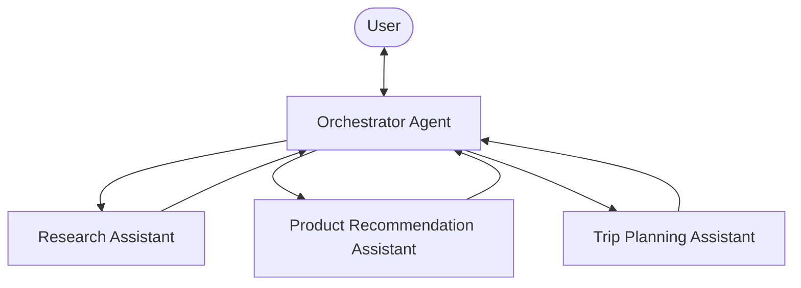

## The Concept: Agents as Tools

"Agents as Tools" is an architectural pattern in AI systems where specialized AI agents are wrapped as callable functions (tools) that can be used by other agents. This creates a hierarchical structure where:

1. **A primary "orchestrator" agent** handles user interaction and determines which specialized agent to call
2. **Specialized "tool agents"** perform domain-specific tasks when called by the orchestrator

This approach mimics human team dynamics, where a manager coordinates specialists, each bringing unique expertise to solve complex problems. Rather than a single agent trying to handle everything, tasks are delegated to the most appropriate specialized agent.

## Key Benefits and Core Principles

The "Agents as Tools" pattern offers several advantages:

- **Separation of concerns**: Each agent has a focused area of responsibility, making the system easier to understand and maintain
- **Hierarchical delegation**: The orchestrator decides which specialist to invoke, creating a clear chain of command
- **Modular architecture**: Specialists can be added, removed, or modified independently without affecting the entire system
- **Improved performance**: Each agent can have tailored system prompts and tools optimized for its specific task

## Strands Agents SDK Best Practices for Agent Tools

When implementing the "Agents as Tools" pattern with Strands Agents SDK:

1. **Clear tool documentation**: Write descriptive names and descriptions that explain the agent's expertise
2. **Focused system prompts**: Keep each specialized agent tightly focused on its domain
3. **Proper response handling**: Use consistent patterns to extract and format responses
4. **Tool selection guidance**: Give the orchestrator clear criteria for when to use each specialized agent

## Implementing Agents as Tools with Strands Agents SDK

Strands Agents SDK provides three ways to implement the "Agents as Tools" pattern: passing agents directly in the `tools` array for the simplest setup, `.as_tool()`/`.asTool()` when you need to customize tool name, description, or context behavior, and the `@tool` decorator or `tool()` function for full control over how the agent is invoked.



### Passing Agents Directly

The simplest way to use an agent as a tool is to pass it directly in the `tools` array. The SDK automatically converts it into a tool that accepts an `input` string parameter and returns the agent's text response.

<Tabs>
<Tab label="Python">

```python
from strands import Agent
from strands_tools import retrieve, http_request

# Create specialized agents
research_agent = Agent(
    system_prompt="""You are a specialized research assistant. Focus only on providing
    factual, well-sourced information in response to research questions.
    Always cite your sources when possible.""",
    tools=[retrieve, http_request],
)

product_agent = Agent(
    system_prompt="""You are a specialized product recommendation assistant.
    Provide personalized product suggestions based on user preferences.""",
    tools=[retrieve, http_request],
)

travel_agent = Agent(
    system_prompt="""You are a specialized travel planning assistant.
    Create detailed travel itineraries based on user preferences.""",
    tools=[retrieve, http_request],
)

# Create the orchestrator — agents are automatically converted to tools
orchestrator = Agent(
    system_prompt="""You are an assistant that routes queries to specialized agents:
    - For research questions and factual information → Use the research_agent tool
    - For product recommendations and shopping advice → Use the product_agent tool
    - For travel planning and itineraries → Use the travel_agent tool
    - For simple questions not requiring specialized knowledge → Answer directly

    Always select the most appropriate tool based on the user's query.""",
    tools=[research_agent, product_agent, travel_agent],
)
```
</Tab>
<Tab label="TypeScript">

```typescript
--8<-- "user-guide/concepts/multi-agent/agents-as-tools.ts:direct_passing"
```
</Tab>
</Tabs>

### Customizing Agent Tools

When you need to customize the tool name, description, or context behavior, use `.as_tool()` (Python) or `.asTool()` (TypeScript) explicitly:

<Tabs>
<Tab label="Python">

```python
orchestrator = Agent(
    system_prompt="You are an assistant that routes queries to specialized agents.",
    tools=[
        research_agent.as_tool(
            name="research_assistant",
            description="Process and respond to research-related queries requiring factual information.",
        ),
    ],
)
```
</Tab>
<Tab label="TypeScript">

```typescript
--8<-- "user-guide/concepts/multi-agent/agents-as-tools.ts:as_tool_customization"
```
</Tab>
</Tabs>

#### Context Management

By default, both direct passing and `.as_tool()`/`.asTool()` reset the agent's conversation context between invocations, ensuring every call starts from a clean baseline. To preserve the agent's conversation history across invocations:

<Tabs>
<Tab label="Python">

```python
# Agent will remember prior interactions within the same orchestrator session
orchestrator = Agent(
    system_prompt="You are an assistant that routes queries to specialized agents.",
    tools=[research_agent.as_tool(preserve_context=True)],
)
```
</Tab>
<Tab label="TypeScript">

```typescript
--8<-- "user-guide/concepts/multi-agent/agents-as-tools.ts:as_tool_context"
```
</Tab>
</Tabs>

### Creating Custom Agent Tools

For more control over how the agent is invoked — such as custom pre/post-processing, error handling, or passing multiple parameters — you can create a custom tool that wraps an agent:

<Tabs>
<Tab label="Python">

```python
from strands import Agent, tool
from strands_tools import retrieve, http_request

RESEARCH_ASSISTANT_PROMPT = """
You are a specialized research assistant. Focus only on providing
factual, well-sourced information in response to research questions.
Always cite your sources when possible.
"""

@tool
def research_assistant(query: str) -> str:
    """
    Process and respond to research-related queries.

    Args:
        query: A research question requiring factual information

    Returns:
        A detailed research answer with citations
    """
    try:
        research_agent = Agent(
            system_prompt=RESEARCH_ASSISTANT_PROMPT,
            tools=[retrieve, http_request]
        )

        response = research_agent(query)
        return str(response)
    except Exception as e:
        return f"Error in research assistant: {str(e)}"
```
</Tab>
<Tab label="TypeScript">

```typescript
--8<-- "user-guide/concepts/multi-agent/agents-as-tools.ts:research_assistant"
```
</Tab>
</Tabs>

You can create multiple specialized agents following the same pattern:

<Tabs>
<Tab label="Python">

```python
@tool
def product_recommendation_assistant(query: str) -> str:
    """
    Handle product recommendation queries by suggesting appropriate products.

    Args:
        query: A product inquiry with user preferences

    Returns:
        Personalized product recommendations with reasoning
    """
    try:
        product_agent = Agent(
            system_prompt="""You are a specialized product recommendation assistant.
            Provide personalized product suggestions based on user preferences.""",
            tools=[retrieve, http_request, dialog],
        )
        # Implementation with response handling
        # ...
        return processed_response
    except Exception as e:
        return f"Error in product recommendation: {str(e)}"

@tool
def trip_planning_assistant(query: str) -> str:
    """
    Create travel itineraries and provide travel advice.

    Args:
        query: A travel planning request with destination and preferences

    Returns:
        A detailed travel itinerary or travel advice
    """
    try:
        travel_agent = Agent(
            system_prompt="""You are a specialized travel planning assistant.
            Create detailed travel itineraries based on user preferences.""",
            tools=[retrieve, http_request],
        )
        # Implementation with response handling
        # ...
        return processed_response
    except Exception as e:
        return f"Error in trip planning: {str(e)}"
```
</Tab>
<Tab label="TypeScript">

```typescript
--8<-- "user-guide/concepts/multi-agent/agents-as-tools.ts:multiple_specialists"
```
</Tab>
</Tabs>

#### Creating the Orchestrator Agent

Create an orchestrator agent that has access to all specialized agents as tools:

<Tabs>
<Tab label="Python">

```python
from strands import Agent
from .specialized_agents import research_assistant, product_recommendation_assistant, trip_planning_assistant

MAIN_SYSTEM_PROMPT = """
You are an assistant that routes queries to specialized agents:
- For research questions and factual information → Use the research_assistant tool
- For product recommendations and shopping advice → Use the product_recommendation_assistant tool
- For travel planning and itineraries → Use the trip_planning_assistant tool
- For simple questions not requiring specialized knowledge → Answer directly

Always select the most appropriate tool based on the user's query.
"""

orchestrator = Agent(
    system_prompt=MAIN_SYSTEM_PROMPT,
    callback_handler=None,
    tools=[research_assistant, product_recommendation_assistant, trip_planning_assistant]
)
```
</Tab>
<Tab label="TypeScript">

```typescript
--8<-- "user-guide/concepts/multi-agent/agents-as-tools.ts:orchestrator"
```
</Tab>
</Tabs>

Here's how this multi-agent system might handle a complex user query:

<Tabs>
<Tab label="Python">

```python
# Example: E-commerce Customer Service System
customer_query = "I'm looking for hiking boots for a trip to Patagonia next month"

# The orchestrator automatically determines that this requires multiple specialized agents
response = orchestrator(customer_query)

# Behind the scenes, the orchestrator will:
# 1. First call the trip_planning_assistant to understand travel requirements for Patagonia
#    - Weather conditions in the region next month
#    - Typical terrain and hiking conditions
# 2. Then call product_recommendation_assistant with this context to suggest appropriate boots
#    - Waterproof options for potential rain
#    - Proper ankle support for uneven terrain
#    - Brands known for durability in harsh conditions
# 3. Combine these specialized responses into a cohesive answer that addresses both the
#    travel planning and product recommendation aspects of the query
```
</Tab>
<Tab label="TypeScript">

```typescript
--8<-- "user-guide/concepts/multi-agent/agents-as-tools.ts:usage"
```
</Tab>
</Tabs>

This example demonstrates how Strands Agents SDK enables specialized experts to collaborate on complex queries requiring multiple domains of knowledge. The orchestrator intelligently routes different aspects of the query to the appropriate specialized agents, then synthesizes their responses into a comprehensive answer.

## Remote Agents with A2A

You can also use remote agents as tools through the [Agent-to-Agent (A2A) protocol](agent-to-agent.md). The `A2AAgent` class lets you wrap a remote A2A-compatible agent as a tool in your orchestrator, following the same pattern described above but communicating over the network. See [A2AAgent as a Tool](agent-to-agent.md#as-a-tool) for details.

## Complete Working Example

For complete implementations of this pattern, see the following examples:

<Tabs>
<Tab label="Python">

The [Teacher's Assistant](../../../../examples/python/multi_agent_example/multi_agent_example/) example demonstrates an orchestrator agent that routes student queries to specialized agents for math, English, language translation, computer science, and general knowledge.

</Tab>
<Tab label="TypeScript">

The [Agents as Tools](https://github.com/strands-agents/sdk-typescript/tree/main/strands-ts/examples/agents-as-tools) example demonstrates an orchestrator agent that routes student queries to specialized tool agents for math, English, computer science, and general knowledge.

</Tab>
</Tabs>
