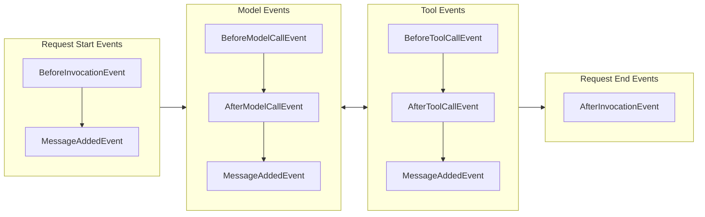
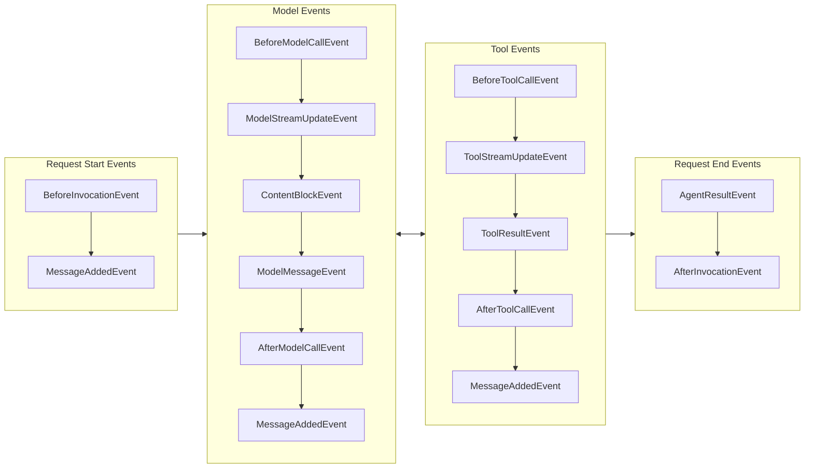
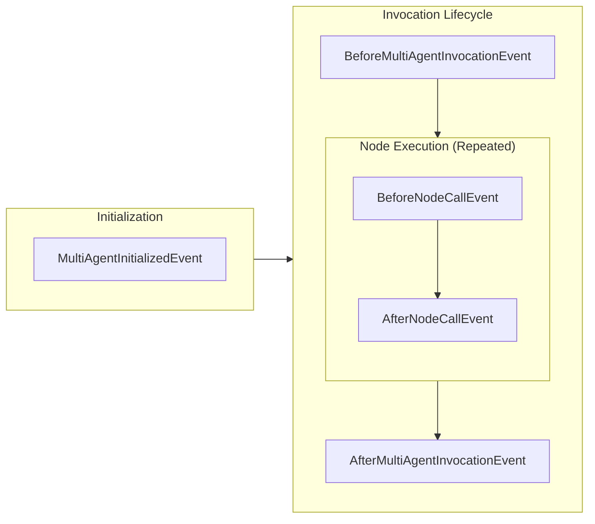
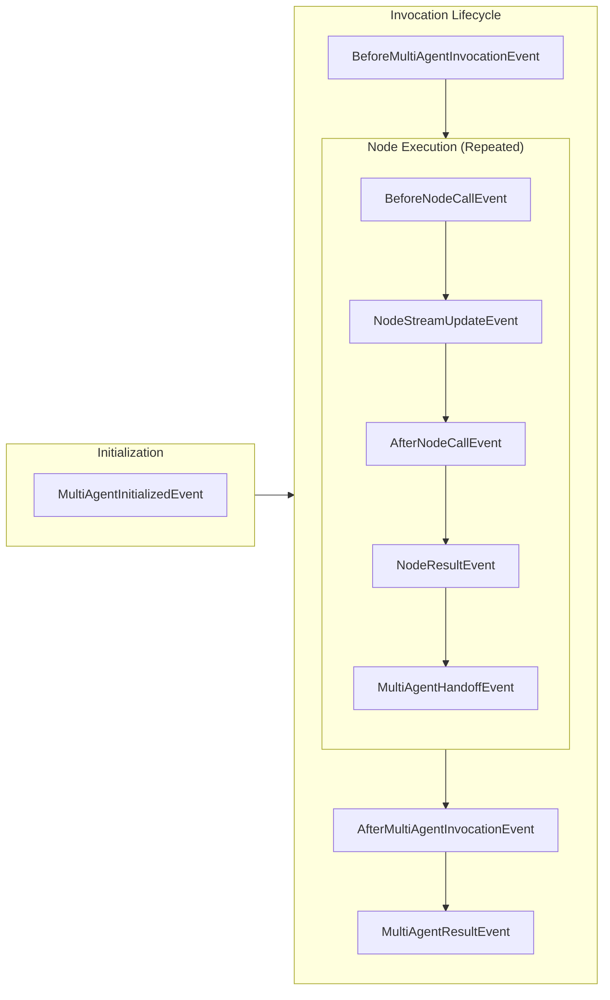

Hooks are a composable extensibility mechanism for extending agent functionality by subscribing to events throughout the agent lifecycle. The hook system enables both built-in components and user code to react to or modify agent behavior through strongly-typed event callbacks.

## Overview

The hooks system is a composable, type-safe system that supports multiple subscribers per event type. 

A **Hook Event** is a specific event in the lifecycle that callbacks can be associated with. A **Hook Callback** is a callback function that is invoked when the hook event is emitted.

Hooks enable use cases such as:

- Monitoring agent execution and tool usage
- Modifying tool execution behavior
- Adding validation and error handling
- Monitoring multi-agent execution flow and node transitions
- Debugging complex orchestration patterns
- Implementing custom logging and metrics collection

## Basic Usage

Hook callbacks are registered against specific event types and receive strongly-typed event objects when those events occur during agent execution. Each event carries relevant data for that stage of the agent lifecycle - for example, `BeforeInvocationEvent` includes agent and request details, while `BeforeToolCallEvent` provides tool information and parameters.

### Registering Individual Hook Callbacks

The simplest way to register a hook callback is using the `agent.add_hook()` method:

<Tabs>
<Tab label="Python">

```python
from strands import Agent
from strands.hooks import BeforeInvocationEvent, BeforeToolCallEvent

agent = Agent()

# Register individual callbacks
def my_callback(event: BeforeInvocationEvent) -> None:
    print("Custom callback triggered")

agent.add_hook(my_callback, BeforeInvocationEvent)

# Type inference: If your callback has a type hint, the event type is inferred
def typed_callback(event: BeforeToolCallEvent) -> None:
    print(f"Tool called: {event.tool_use['name']}")

agent.add_hook(typed_callback)  # Event type inferred from type hint
```
</Tab>
<Tab label="TypeScript">

```typescript
--8<-- "user-guide/concepts/agents/hooks.ts:individual_callback"
```
</Tab>
</Tabs>

For multi-agent orchestrators, you can register callbacks for orchestration events:

<Tabs>
<Tab label="Python">

```python
# Create your orchestrator (Graph or Swarm)
orchestrator = Graph(...)

# Register individual callbacks
def my_callback(event: BeforeNodeCallEvent) -> None:
    print(f"Custom callback triggered")

orchestrator.hooks.add_callback(BeforeNodeCallEvent, my_callback)
```
</Tab>
<Tab label="TypeScript">

```typescript
--8<-- "user-guide/concepts/agents/hooks.ts:orchestrator_callback"
```
</Tab>
</Tabs>

### Using Plugins for Multiple Hooks

For packaging multiple related hooks together, [Plugins](../plugins/index.md) provide a convenient way to bundle hooks with configuration and tools:

<Tabs>
<Tab label="Python">

```python
from strands import Agent
from strands.plugins import Plugin, hook
from strands.hooks import BeforeToolCallEvent, AfterToolCallEvent

class LoggingPlugin(Plugin):
    name = "logging-plugin"

    @hook
    def log_before(self, event: BeforeToolCallEvent) -> None:
        print(f"Calling: {event.tool_use['name']}")

    @hook
    def log_after(self, event: AfterToolCallEvent) -> None:
        print(f"Completed: {event.tool_use['name']}")

agent = Agent(plugins=[LoggingPlugin()])
```
</Tab>
<Tab label="TypeScript">

```typescript
--8<-- "user-guide/concepts/plugins/index.ts:plugin_for_hooks"
```
</Tab>
</Tabs>

See [Plugins](../plugins/index.md) for more information on creating and using plugins.

## Hook Event Lifecycle

### Single-Agent Lifecycle

The following diagram shows when hook events are emitted during a typical agent invocation where tools are invoked:

<Tabs>
<Tab label="Python">


</Tab>
<Tab label="TypeScript">


</Tab>
</Tabs>

### Multi-Agent Lifecycle

The following diagram shows when multi-agent hook events are emitted during orchestrator execution:

<Tabs>
<Tab label="Python">


</Tab>
<Tab label="TypeScript">


</Tab>
</Tabs>

### Available Events

<Tabs>
<Tab label="Python">

| Event                              | Description                                                                                                   |
|------------------------------------|---------------------------------------------------------------------------------------------------------------|
| `AgentInitializedEvent`            | Triggered when an agent has been constructed and finished initialization at the end of the agent constructor. |
| `BeforeInvocationEvent`            | Triggered at the beginning of a new agent invocation request                                                  |
| `AfterInvocationEvent`             | Triggered at the end of an agent request, regardless of success or failure. Uses reverse callback ordering    |
| `MessageAddedEvent`                | Triggered when a message is added to the agent's conversation history                                         |
| `BeforeModelCallEvent`             | Triggered before the model is invoked for inference                                                           |
| `AfterModelCallEvent`              | Triggered after model invocation completes. Uses reverse callback ordering                                    |
| `BeforeToolCallEvent`              | Triggered before a tool is invoked                                                                            |
| `AfterToolCallEvent`               | Triggered after tool invocation completes. Uses reverse callback ordering                                     |
| `MultiAgentInitializedEvent`       | Triggered when multi-agent orchestrator is initialized                                                        |
| `BeforeMultiAgentInvocationEvent`  | Triggered before orchestrator execution starts                                                                |
| `AfterMultiAgentInvocationEvent`   | Triggered after orchestrator execution completes. Uses reverse callback ordering                              |
| `BeforeNodeCallEvent`              | Triggered before individual node execution starts                                                             |
| `AfterNodeCallEvent`               | Triggered after individual node execution completes. Uses reverse callback ordering                           |
</Tab>
<Tab label="TypeScript">

All events extend `HookableEvent`, making them both streamable via `agent.stream()` and subscribable via hook callbacks.

| Event                    | Description                                                                                                   |
|--------------------------|---------------------------------------------------------------------------------------------------------------|
| `AgentInitializedEvent`  | Triggered when an agent has been constructed and finished initialization at the end of the agent constructor. |
| `BeforeInvocationEvent`  | Triggered at the beginning of a new agent invocation request                                                  |
| `AfterInvocationEvent`   | Triggered at the end of an agent request, regardless of success or failure. Uses reverse callback ordering    |
| `MessageAddedEvent`      | Triggered when a message is added to the agent's conversation history                                         |
| `BeforeModelCallEvent`   | Triggered before the model is invoked for inference                                                           |
| `AfterModelCallEvent`    | Triggered after model invocation completes. Uses reverse callback ordering                                    |
| `ModelStreamUpdateEvent` | Wraps each transient streaming delta from the model during inference. Access via `.event`                     |
| `ContentBlockEvent`      | Wraps a fully assembled content block (TextBlock, ToolUseBlock, ReasoningBlock). Access via `.contentBlock`   |
| `ModelMessageEvent`      | Wraps the complete model message after all blocks are assembled. Access via `.message`                        |
| `BeforeToolCallEvent`    | Triggered before a tool is invoked                                                                            |
| `AfterToolCallEvent`     | Triggered after tool invocation completes. Uses reverse callback ordering                                     |
| `BeforeToolsEvent`       | Triggered before tools are executed in a batch                                                                |
| `AfterToolsEvent`        | Triggered after tools are executed in a batch. Uses reverse callback ordering                                 |
| `ToolStreamUpdateEvent`  | Wraps streaming progress events from tool execution. Access via `.event`                                      |
| `ToolResultEvent`        | Wraps a completed tool result. Access via `.result`                                                           |
| `AgentResultEvent`       | Wraps the final agent result at the end of the invocation. Access via `.result`                               |
| `MultiAgentInitializedEvent`       | Triggered when a multi-agent orchestrator has finished initialization                                |
| `BeforeMultiAgentInvocationEvent`  | Triggered before orchestrator execution starts                                                       |
| `AfterMultiAgentInvocationEvent`   | Triggered after orchestrator execution completes. Uses reverse callback ordering                     |
| `BeforeNodeCallEvent`              | Triggered before individual node execution starts                                                    |
| `NodeStreamUpdateEvent`            | Wraps an inner streaming event from a node with the node's identity. Access via `.event`             |
| `NodeCancelEvent`                  | Triggered when a node is cancelled via `BeforeNodeCallEvent.cancel`                                  |
| `AfterNodeCallEvent`               | Triggered after individual node execution completes. Uses reverse callback ordering                  |
| `NodeResultEvent`                  | Wraps a completed node result. Access via `.result`                                                  |
| `MultiAgentHandoffEvent`           | Triggered when execution transitions between nodes                                                   |
| `MultiAgentResultEvent`            | Wraps the final multi-agent result at the end of orchestration. Access via `.result`                 |
</Tab>
</Tabs>

## Hook Behaviors

### Event Properties

Most event properties are read-only to prevent unintended modifications. However, certain properties can be modified to influence agent behavior:

<Tabs>
<Tab label="Python">

- [`AfterModelCallEvent`](@api/python/strands.hooks.events#AfterModelCallEvent)
    - `retry` - Request a retry of the model invocation. See [Model Call Retry](#model-call-retry).

- [`BeforeToolCallEvent`](@api/python/strands.hooks.events#BeforeToolCallEvent)
    - `cancel_tool` - Cancel tool execution with a message. See [Limit Tool Counts](#limit-tool-counts).
    - `selected_tool` - Replace the tool to be executed. See [Tool Interception](#tool-interception).
    - `tool_use` - Modify tool parameters before execution. See [Fixed Tool Arguments](#fixed-tool-arguments).

- [`AfterToolCallEvent`](@api/python/strands.hooks.events#AfterToolCallEvent)
    - `result` - Modify the tool result. See [Result Modification](#result-modification).
    - `retry` - Request a retry of the tool invocation. See [Tool Call Retry](#tool-call-retry).
    - `exception` *(read-only)* - The original exception if the tool raised one, otherwise `None`. See [Exception Handling](#exception-handling).

- [`AfterInvocationEvent`](@api/python/strands.hooks.events#AfterInvocationEvent)
    - `resume` - Trigger a follow-up agent invocation with new input. See [Invocation resume](#invocation-resume).

</Tab>
<Tab label="TypeScript">

- `BeforeInvocationEvent`
    - `cancel` - Cancel the agent invocation with a message.

- `BeforeModelCallEvent`
    - `cancel` - Cancel the model call with a message.

- `BeforeToolsEvent`
    - `cancel` - Cancel all tool calls in a batch with a message. See [Limit Tool Counts](#limit-tool-counts).

- `BeforeToolCallEvent`
    - `cancel` - Cancel tool execution with a message. See [Limit Tool Counts](#limit-tool-counts).

- `AfterModelCallEvent`
    - `retry` - Request a retry of the model invocation.

- `AfterToolCallEvent`
    - `retry` - Request a retry of the tool invocation.
</Tab>
</Tabs>

### Callback Ordering

<Tabs>
<Tab label="Python">

After event callbacks run in reverse registration order for cleanup symmetry:

- **Before**: A, B, C (registration order)
- **After**: C, B, A (reverse registration order)

</Tab>
<Tab label="TypeScript">

By default, After event callbacks run in reverse registration order for cleanup symmetry. You can override this with explicit priority using the `order` option — lower values run first.

The SDK exports convenience presets that mark where the SDK's own hooks run, so you can position yours relative to them:

- `HookOrder.SDK_FIRST` (-100) — where the SDK's earliest hooks run
- `HookOrder.DEFAULT` (0) — implicit when no order is specified
- `HookOrder.SDK_LAST` (100) — where the SDK's latest hooks run

These are not enforced bounds — any numeric value works. Use values beyond them (e.g. `SDK_FIRST - 1`) to run before or after the SDK's hooks, or `-Infinity`/`Infinity` for guaranteed absolute ordering.

```typescript
--8<-- "user-guide/concepts/agents/hooks_imports.ts:hook_ordering_imports"

--8<-- "user-guide/concepts/agents/hooks.ts:hook_ordering"
```

Within the same order group, Before events preserve registration order and After events reverse it.

</Tab>
</Tabs>

## Advanced Usage

### Accessing Invocation State in Hooks

Invocation state provides configuration and context data passed through the agent or orchestrator invocation. This is particularly useful for:

1. **Custom Objects**: Access database client objects, connection pools, or other Python objects
2. **Request Context**: Access session IDs, user information, settings, or request-specific data  
3. **Multi-Agent Shared State**: In multi-agent patterns, access state shared across all agents - see [Shared State Across Multi-Agent Patterns](../multi-agent/multi-agent-patterns.md#shared-state-across-multi-agent-patterns)
4. **Custom Parameters**: Pass any additional data that hooks might need

<Tabs>
<Tab label="Python">

```python
from strands.hooks import BeforeToolCallEvent
import logging

def log_with_context(event: BeforeToolCallEvent) -> None:
    """Log tool invocations with context from invocation state."""
    # Access invocation state from the event
    user_id = event.invocation_state.get("user_id", "unknown")
    session_id = event.invocation_state.get("session_id")

    # Access non-JSON serializable objects like database connections
    db_connection = event.invocation_state.get("database_connection")
    logger_instance = event.invocation_state.get("custom_logger")

    # Use custom logger if provided, otherwise use default
    logger = logger_instance if logger_instance else logging.getLogger(__name__)

    logger.info(
        f"User {user_id} in session {session_id} "
        f"invoking tool: {event.tool_use['name']} "
        f"with DB connection: {db_connection is not None}"
    )

# Register the hook
agent = Agent(tools=[my_tool])
agent.hooks.add_callback(BeforeToolCallEvent, log_with_context)

# Execute with context including non-serializable objects
import sqlite3
custom_logger = logging.getLogger("custom")
db_conn = sqlite3.connect(":memory:")

result = agent(
    "Process the data",
    user_id="user123",
    session_id="sess456",
    database_connection=db_conn,  # Non-JSON serializable object
    custom_logger=custom_logger   # Non-JSON serializable object
)
```
</Tab>
<Tab label="TypeScript">

```typescript
--8<-- "user-guide/concepts/agents/hooks.ts:invocation_state_in_hooks"
```
</Tab>
</Tabs>

Multi-agent hook events provide access to:

<Tabs>
<Tab label="Python">

- **source**: The multi-agent orchestrator instance (for example: Graph/Swarm)
- **node_id**: Identifier of the node being executed (for node-level events)
- **invocation_state**: Configuration and context data passed through the orchestrator invocation
</Tab>
<Tab label="TypeScript">

- **orchestrator**: The multi-agent orchestrator instance (for example: Graph/Swarm)
- **nodeId**: Identifier of the node being executed (for node-level events)
- **state**: The `MultiAgentState` for the current invocation, including an `app` field for custom consumer state
</Tab>
</Tabs>

### Tool Interception

Modify or replace tools before execution:

<Tabs>
<Tab label="Python">

```python
class ToolInterceptor(HookProvider):
    def register_hooks(self, registry: HookRegistry) -> None:
        registry.add_callback(BeforeToolCallEvent, self.intercept_tool)

    def intercept_tool(self, event: BeforeToolCallEvent) -> None:
        if event.tool_use.name == "sensitive_tool":
            # Replace with a safer alternative
            event.selected_tool = self.safe_alternative_tool
            event.tool_use["name"] = "safe_tool"
```
</Tab>
<Tab label="TypeScript">

```ts
// Changing of tools is not yet available in TypeScript SDK
```
</Tab>
</Tabs>

### Result Modification

Modify tool results after execution:

<Tabs>
<Tab label="Python">

```python
class ResultProcessor(HookProvider):
    def register_hooks(self, registry: HookRegistry) -> None:
        registry.add_callback(AfterToolCallEvent, self.process_result)

    def process_result(self, event: AfterToolCallEvent) -> None:
        if event.tool_use.name == "calculator":
            # Add formatting to calculator results
            original_content = event.result["content"][0]["text"]
            event.result["content"][0]["text"] = f"Result: {original_content}"
```
</Tab>
<Tab label="TypeScript">

```ts
// Changing of tool results is not yet available in TypeScript SDK
```
</Tab>
</Tabs>

### Conditional Node Execution

Implement custom logic to modify orchestration behavior in multi-agent systems:

<Tabs>
<Tab label="Python">

```python
class ConditionalExecutionHook(HookProvider):
    def __init__(self, skip_conditions: dict[str, callable]):
        self.skip_conditions = skip_conditions

    def register_hooks(self, registry: HookRegistry) -> None:
        registry.add_callback(BeforeNodeCallEvent, self.check_execution_conditions)

    def check_execution_conditions(self, event: BeforeNodeCallEvent) -> None:
        node_id = event.node_id
        if node_id in self.skip_conditions:
            condition_func = self.skip_conditions[node_id]
            if condition_func(event.invocation_state):
                print(f"Skipping node {node_id} due to condition")
                # Note: Actual node skipping would require orchestrator-specific implementation
```
</Tab>
<Tab label="TypeScript">

```typescript
--8<-- "user-guide/concepts/agents/hooks.ts:conditional_node_execution"
```
</Tab>
</Tabs>

## Best Practices

### Composability

Design hooks to be composable and reusable:

<Tabs>
<Tab label="Python">

```python
class RequestLoggingHook(HookProvider):
    def register_hooks(self, registry: HookRegistry) -> None:
        registry.add_callback(BeforeInvocationEvent, self.log_request)
        registry.add_callback(AfterInvocationEvent, self.log_response)
        registry.add_callback(BeforeToolCallEvent, self.log_tool_use)

    ...
```
</Tab>
<Tab label="TypeScript">

```typescript
--8<-- "user-guide/concepts/agents/hooks.ts:composability"
```
</Tab>
</Tabs>

### Event Property Modifications

When modifying event properties, log the changes for debugging and audit purposes:

<Tabs>
<Tab label="Python">

```python
class ResultProcessor(HookProvider):
    def register_hooks(self, registry: HookRegistry) -> None:
        registry.add_callback(AfterToolCallEvent, self.process_result)

    def process_result(self, event: AfterToolCallEvent) -> None:
        if event.tool_use.name == "calculator":
            original_content = event.result["content"][0]["text"]
            logger.info(f"Modifying calculator result: {original_content}")
            event.result["content"][0]["text"] = f"Result: {original_content}"
```
</Tab>
<Tab label="TypeScript">

```ts
// Changing of tools is not yet available in TypeScript SDK
```
</Tab>
</Tabs>

### Orchestrator-Agnostic Design

Design multi-agent hooks to work with different orchestrator types:

<Tabs>
<Tab label="Python">

```python
class UniversalMultiAgentHook(HookProvider):
    def register_hooks(self, registry: HookRegistry) -> None:
        registry.add_callback(BeforeNodeCallEvent, self.handle_node_execution)

    def handle_node_execution(self, event: BeforeNodeCallEvent) -> None:
        orchestrator_type = type(event.source).__name__
        print(f"Executing node {event.node_id} in {orchestrator_type} orchestrator")

        # Handle orchestrator-specific logic if needed
        if orchestrator_type == "Graph":
            self.handle_graph_node(event)
        elif orchestrator_type == "Swarm":
            self.handle_swarm_node(event)

    def handle_graph_node(self, event: BeforeNodeCallEvent) -> None:
        # Graph-specific handling
        pass

    def handle_swarm_node(self, event: BeforeNodeCallEvent) -> None:
        # Swarm-specific handling
        pass
```
</Tab>
<Tab label="TypeScript">

```typescript
--8<-- "user-guide/concepts/agents/hooks.ts:orchestrator_agnostic_design"
```
</Tab>
</Tabs>

## Integration with Multi-Agent Systems

Multi-agent hooks complement single-agent hooks. Individual agents within the orchestrator can still have their own hooks, creating a layered monitoring and customization system:

<Tabs>
<Tab label="Python">

```python
# Single-agent hook for individual agents
class AgentLevelHook(HookProvider):
    def register_hooks(self, registry: HookRegistry) -> None:
        registry.add_callback(BeforeToolCallEvent, self.log_tool_use)

    def log_tool_use(self, event: BeforeToolCallEvent) -> None:
        print(f"Agent tool call: {event.tool_use['name']}")

# Multi-agent hook for orchestrator
class OrchestratorLevelHook(HookProvider):
    def register_hooks(self, registry: HookRegistry) -> None:
        registry.add_callback(BeforeNodeCallEvent, self.log_node_execution)

    def log_node_execution(self, event: BeforeNodeCallEvent) -> None:
        print(f"Orchestrator node execution: {event.node_id}")

# Create agents with individual hooks
agent1 = Agent(tools=[tool1], hooks=[AgentLevelHook()])
agent2 = Agent(tools=[tool2], hooks=[AgentLevelHook()])

# Create orchestrator with multi-agent hooks
orchestrator = Graph(
    agents={"agent1": agent1, "agent2": agent2},
    hooks=[OrchestratorLevelHook()]
)
```
</Tab>
<Tab label="TypeScript">

```typescript
--8<-- "user-guide/concepts/agents/hooks.ts:layered_hooks"
```
</Tab>
</Tabs>

This layered approach provides comprehensive observability and control across both individual agent execution and orchestrator-level coordination.

## Cookbook

This section contains practical hook implementations for common use cases.

### Fixed Tool Arguments

Useful for enforcing security policies, maintaining consistency, or overriding agent decisions with system-level requirements. This hook ensures specific tools always use predetermined parameter values regardless of what the agent specifies.

<Tabs>
<Tab label="Python">

```python
from typing import Any
from strands.hooks import HookProvider, HookRegistry, BeforeToolCallEvent

class ConstantToolArguments(HookProvider):
    """Use constant argument values for specific parameters of a tool."""

    def __init__(self, fixed_tool_arguments: dict[str, dict[str, Any]]):
        """
        Initialize fixed parameter values for tools.

        Args:
            fixed_tool_arguments: A dictionary mapping tool names to dictionaries of
                parameter names and their fixed values. These values will override any
                values provided by the agent when the tool is invoked.
        """
        self._tools_to_fix = fixed_tool_arguments

    def register_hooks(self, registry: HookRegistry, **kwargs: Any) -> None:
        registry.add_callback(BeforeToolCallEvent, self._fix_tool_arguments)

    def _fix_tool_arguments(self, event: BeforeToolCallEvent):
        # If the tool is in our list of parameters, then use those parameters
        if parameters_to_fix := self._tools_to_fix.get(event.tool_use["name"]):
            tool_input: dict[str, Any] = event.tool_use["input"]
            tool_input.update(parameters_to_fix)
```
</Tab>
<Tab label="TypeScript">

```typescript
--8<-- "user-guide/concepts/agents/hooks.ts:fixed_tool_arguments_class"
```
</Tab>
</Tabs>

For example, to always force the `calculator` tool to use precision of 1 digit:

<Tabs>
<Tab label="Python">

```python
fix_parameters = ConstantToolArguments({
    "calculator": {
        "precision": 1,
    }
})

agent = Agent(tools=[calculator], hooks=[fix_parameters])
result = agent("What is 2 / 3?")
```
</Tab>
<Tab label="TypeScript">

```typescript
--8<-- "user-guide/concepts/agents/hooks.ts:fixed_tool_arguments_usage"
```
</Tab>
</Tabs>

### Limit Tool Counts

Useful for preventing runaway tool usage, implementing rate limiting, or enforcing usage quotas. This hook tracks tool invocations per request and replaces tools with error messages when limits are exceeded.

<Tabs>
<Tab label="Python">

```python
from strands import tool
from strands.hooks import HookRegistry, HookProvider, BeforeToolCallEvent, BeforeInvocationEvent
from threading import Lock

class LimitToolCounts(HookProvider):
    """Limits the number of times tools can be called per agent invocation"""

    def __init__(self, max_tool_counts: dict[str, int]):
        """
        Initializer.

        Args:
            max_tool_counts: A dictionary mapping tool names to max call counts for 
                tools. If a tool is not specified in it, the tool can be called as many
                times as desired
        """
        self.max_tool_counts = max_tool_counts
        self.tool_counts = {}
        self._lock = Lock()

    def register_hooks(self, registry: HookRegistry) -> None:
        registry.add_callback(BeforeInvocationEvent, self.reset_counts)
        registry.add_callback(BeforeToolCallEvent, self.intercept_tool)

    def reset_counts(self, event: BeforeInvocationEvent) -> None:
        with self._lock:
            self.tool_counts = {}

    def intercept_tool(self, event: BeforeToolCallEvent) -> None:
        tool_name = event.tool_use["name"]
        with self._lock:
            max_tool_count = self.max_tool_counts.get(tool_name)
            tool_count = self.tool_counts.get(tool_name, 0) + 1
            self.tool_counts[tool_name] = tool_count

        if max_tool_count and tool_count > max_tool_count:
            event.cancel_tool = (
                f"Tool '{tool_name}' has been invoked too many and is now being throttled. "
                f"DO NOT CALL THIS TOOL ANYMORE "
            )
```
</Tab>
<Tab label="TypeScript">

```typescript
--8<-- "user-guide/concepts/agents/hooks.ts:limit_tool_counts_class"
```
</Tab>
</Tabs>

For example, to limit the `sleep` tool to 3 invocations per invocation:

<Tabs>
<Tab label="Python">

```python
limit_hook = LimitToolCounts(max_tool_counts={"sleep": 3})

agent = Agent(tools=[sleep], hooks=[limit_hook])

# This call will only have 3 successful sleeps
agent("Sleep 5 times for 10ms each or until you can't anymore")
# This will sleep successfully again because the count resets every invocation
agent("Sleep once")
```
</Tab>
<Tab label="TypeScript">

```typescript
--8<-- "user-guide/concepts/agents/hooks.ts:limit_tool_counts_usage"
```
</Tab>
</Tabs>

### Model Call Retry

Useful for implementing custom retry logic for model invocations. The `AfterModelCallEvent.retry` field allows hooks to request retries based on any criteria—exceptions, response validation, content quality checks, or any custom logic. This example demonstrates retrying on exceptions with exponential backoff:

<Tabs>
<Tab label="Python">

```python
import asyncio
import logging
from strands.hooks import HookProvider, HookRegistry, BeforeInvocationEvent, AfterModelCallEvent

logger = logging.getLogger(__name__)

class RetryOnServiceUnavailable(HookProvider):
    """Retry model calls when ServiceUnavailable errors occur."""

    def __init__(self, max_retries: int = 3):
        self.max_retries = max_retries
        self.retry_count = 0

    def register_hooks(self, registry: HookRegistry) -> None:
        registry.add_callback(BeforeInvocationEvent, self.reset_counts)
        registry.add_callback(AfterModelCallEvent, self.handle_retry)

    def reset_counts(self, event: BeforeInvocationEvent = None) -> None:
        self.retry_count = 0

    async def handle_retry(self, event: AfterModelCallEvent) -> None:
        if event.exception:
            if "ServiceUnavailable" in str(event.exception):
                logger.info("ServiceUnavailable encountered")
                if self.retry_count < self.max_retries:
                    logger.info("Retrying model call")
                    self.retry_count += 1
                    event.retry = True
                    await asyncio.sleep(2 ** self.retry_count)  # Exponential backoff
        else:
            # Reset counts on successful call
            self.reset_counts()
```
</Tab>
<Tab label="TypeScript">

```ts
// This feature is not yet available in TypeScript SDK
```
</Tab>
</Tabs>

For example, to retry up to 3 times on service unavailable errors:

<Tabs>
<Tab label="Python">

```python
from strands import Agent

retry_hook = RetryOnServiceUnavailable(max_retries=3)
agent = Agent(hooks=[retry_hook])

result = agent("What is the capital of France?")
```
</Tab>
<Tab label="TypeScript">

```ts
// This feature is not yet available in TypeScript SDK
```
</Tab>
</Tabs>

### Exception Handling

When a tool raises an exception, the agent converts it to an error result and returns it to the model, allowing the model to adjust its approach and retry. This works well for expected errors like validation failures, but for unexpected errors—assertion failures, configuration errors, or bugs—you may want to fail immediately rather than let the model retry futilely. The `exception` property on `AfterToolCallEvent` provides access to the original exception, enabling hooks to inspect error types and selectively propagate those that shouldn't be retried:

<Tabs>
<Tab label="Python">

```python
class PropagateUnexpectedExceptions(HookProvider):
    """Re-raise unexpected exceptions instead of returning them to the model."""

    def __init__(self, allowed_exceptions: tuple[type[Exception], ...] = (ValueError,)):
        self.allowed_exceptions = allowed_exceptions

    def register_hooks(self, registry: HookRegistry) -> None:
        registry.add_callback(AfterToolCallEvent, self._check_exception)

    def _check_exception(self, event: AfterToolCallEvent) -> None:
        if event.exception is None:
            return  # Tool succeeded
        if isinstance(event.exception, self.allowed_exceptions):
            return  # Let model retry these
        raise event.exception  # Propagate unexpected errors
```

```python
# Usage
agent = Agent(
    model=model,
    tools=[my_tool],
    hooks=[PropagateUnexpectedExceptions(allowed_exceptions=(ValueError, ValidationError))],
)
```

</Tab>
<Tab label="TypeScript">

```ts
// This feature is not yet available in TypeScript SDK
```
</Tab>
</Tabs>

### Tool Call Retry

Useful for implementing custom retry logic for tool invocations. The `AfterToolCallEvent.retry` field allows hooks to request that a tool be re-executed—for example, to handle transient errors, timeouts, or flaky external services. When `retry` is set to `True`, the tool executor discards the current result and invokes the tool again with the same `tool_use_id`.

:::note[Streaming behavior]
When a tool call is retried, intermediate streaming events (`ToolStreamEvent`) from discarded attempts will have already been emitted to callers. Only the final attempt's `ToolResultEvent` is emitted and added to conversation history. Callers consuming streamed events should be prepared to handle events from discarded attempts.
:::

<Tabs>
<Tab label="Python">

```python
import logging
from strands.hooks import HookProvider, HookRegistry, AfterToolCallEvent

logger = logging.getLogger(__name__)

class RetryOnToolError(HookProvider):
    """Retry tool calls that fail with errors."""

    def __init__(self, max_retries: int = 1):
        self.max_retries = max_retries
        self._attempt_counts: dict[str, int] = {}

    def register_hooks(self, registry: HookRegistry) -> None:
        registry.add_callback(AfterToolCallEvent, self.handle_retry)

    def handle_retry(self, event: AfterToolCallEvent) -> None:
        tool_use_id = str(event.tool_use.get("toolUseId", ""))
        tool_name = event.tool_use.get("name", "unknown")

        # Track attempts per tool_use_id
        attempt = self._attempt_counts.get(tool_use_id, 0) + 1
        self._attempt_counts[tool_use_id] = attempt

        if event.result.get("status") == "error" and attempt <= self.max_retries:
            logger.info(f"Retrying tool '{tool_name}' (attempt {attempt}/{self.max_retries})")
            event.retry = True
        elif event.result.get("status") != "error":
            # Clean up tracking on success
            self._attempt_counts.pop(tool_use_id, None)
```
</Tab>
<Tab label="TypeScript">

```ts
// This feature is not yet available in TypeScript SDK
```
</Tab>
</Tabs>

For example, to retry failed tool calls once:

<Tabs>
<Tab label="Python">

```python
from strands import Agent, tool

@tool
def flaky_api_call(query: str) -> str:
    """Call an external API that sometimes fails.

    Args:
        query: The query to send.
    """
    import random
    if random.random() < 0.5:
        raise RuntimeError("Service temporarily unavailable")
    return f"Result for: {query}"

retry_hook = RetryOnToolError(max_retries=1)
agent = Agent(tools=[flaky_api_call], hooks=[retry_hook])

result = agent("Look up the weather")
```
</Tab>
<Tab label="TypeScript">

```ts
// This feature is not yet available in TypeScript SDK
```
</Tab>
</Tabs>

### Invocation resume

The `AfterInvocationEvent.resume` property enables a hook to trigger a follow-up agent invocation after the current one completes. When you set `resume` to any valid agent input (a string, content blocks, or messages), the agent automatically re-invokes itself with that input instead of returning to the caller. This starts a full new invocation cycle, including firing `BeforeInvocationEvent`.

This is useful for building autonomous looping patterns where the agent continues processing based on its previous result—for example, re-evaluating after tool execution, injecting additional context, or implementing multi-step workflows within a single call.

:::note[Resume input types]
The `resume` value accepts any valid `AgentInput`: a string, a list of content blocks, a list of messages, or interrupt responses. When the agent is in an interrupt state, you must provide interrupt responses (not a plain string) to resume correctly.
:::

The following example checks the agent result and triggers one follow-up invocation to ask the model to summarize its work:

<Tabs>
<Tab label="Python">

```python
from strands import Agent
from strands.hooks import AfterInvocationEvent

resume_count = 0

async def summarize_after_tools(event: AfterInvocationEvent):
    """Resume once to ask the model to summarize its work."""
    global resume_count
    if resume_count == 0 and event.result and event.result.stop_reason == "end_turn":
        resume_count += 1
        event.resume = "Now summarize what you just did in one sentence."

agent = Agent()
agent.add_hook(summarize_after_tools)

# The agent processes the initial request, then automatically
# performs a second invocation to generate the summary
result = agent("Look up the weather in Seattle")
```
</Tab>
<Tab label="TypeScript">

```ts
// This feature is not yet available in TypeScript SDK
```
</Tab>
</Tabs>

You can also use `resume` to chain multiple re-invocations. Make sure to include a termination condition to avoid infinite loops:

<Tabs>
<Tab label="Python">

```python
from strands import Agent
from strands.hooks import AfterInvocationEvent

MAX_ITERATIONS = 3
iteration = 0

async def iterative_refinement(event: AfterInvocationEvent):
    """Re-invoke the agent up to MAX_ITERATIONS times for iterative refinement."""
    global iteration
    if iteration < MAX_ITERATIONS and event.result:
        iteration += 1
        event.resume = f"Review your previous response and improve it. Iteration {iteration} of {MAX_ITERATIONS}."

agent = Agent()
agent.add_hook(iterative_refinement)

result = agent("Draft a haiku about programming")
```
</Tab>
<Tab label="TypeScript">

```ts
// This feature is not yet available in TypeScript SDK
```
</Tab>
</Tabs>

#### Handling interrupts with resume

The `resume` property integrates with the [interrupt](../../tools/index.md) system. When an agent invocation ends because of an interrupt, a hook can automatically handle the interrupt by resuming with interrupt responses. This avoids returning the interrupt to the caller.

When the agent is in an interrupt state, you must resume with a list of `interruptResponse` objects. Passing a plain string raises a `TypeError`.

<Tabs>
<Tab label="Python">

```python
from strands import Agent, tool
from strands.hooks import AfterInvocationEvent, BeforeToolCallEvent

@tool
def send_email(to: str, body: str) -> str:
    """Send an email.

    Args:
        to: Recipient address.
        body: Email body.
    """
    return f"Email sent to {to}"

def require_approval(event: BeforeToolCallEvent):
    """Interrupt before sending emails to require approval."""
    if event.tool_use["name"] == "send_email":
        event.interrupt("email_approval", reason="Approve this email?")

async def auto_approve(event: AfterInvocationEvent):
    """Automatically approve all interrupted tool calls."""
    if event.result and event.result.stop_reason == "interrupt":
        responses = [
            {"interruptResponse": {"interruptId": intr.id, "response": "approved"}}
            for intr in event.result.interrupts
        ]
        event.resume = responses

agent = Agent(tools=[send_email])
agent.add_hook(require_approval)
agent.add_hook(auto_approve)

# The interrupt is handled automatically by the hook—
# the caller receives the final result directly
result = agent("Send an email to alice@example.com saying hello")
```
</Tab>
<Tab label="TypeScript">

```ts
// This feature is not yet available in TypeScript SDK
```
</Tab>
</Tabs>

## HookProvider Protocol

For advanced use cases, you can implement the `HookProvider` protocol to create objects that register multiple callbacks at once. This is useful when building reusable hook collections without the full plugin infrastructure:

<Tabs>
<Tab label="Python">

```python
from strands.hooks import HookProvider, HookRegistry, BeforeInvocationEvent, AfterInvocationEvent

class RequestLogger(HookProvider):
    def register_hooks(self, registry: HookRegistry) -> None:
        registry.add_callback(BeforeInvocationEvent, self.log_start)
        registry.add_callback(AfterInvocationEvent, self.log_end)

    def log_start(self, event: BeforeInvocationEvent) -> None:
        print(f"Request started for agent: {event.agent.name}")

    def log_end(self, event: AfterInvocationEvent) -> None:
        print(f"Request completed for agent: {event.agent.name}")

# Pass via hooks parameter
agent = Agent(hooks=[RequestLogger()])

# Or add after creation
agent.hooks.add_hook(RequestLogger())
```

For most use cases, [Plugins](../plugins/index.md) provide a more convenient way to bundle multiple hooks with additional features like auto-discovery and tool registration.

</Tab>
<Tab label="TypeScript">

:::note[TypeScript SDK]
The TypeScript SDK does not export a `HookProvider` interface. Instead, use the [Plugin](../plugins/index.md) class to bundle multiple hooks together. The `Plugin` class provides `initAgent()` for registering hooks and `getTools()` for providing tools.
:::

```typescript
--8<-- "user-guide/concepts/plugins/index.ts:plugin_for_hooks"
```
</Tab>
</Tabs>
