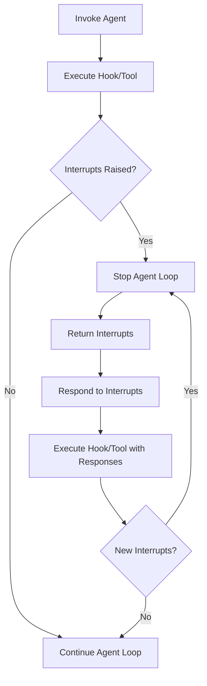

The interrupt system enables human-in-the-loop workflows by allowing users to pause agent execution and request human input before continuing. When an interrupt is raised, the agent stops its loop and returns control to the user. The user in turn provides a response to the agent. The agent then continues its execution starting from the point of interruption. Users can raise interrupts from either hook callbacks or tool definitions. The general flow looks as follows:



## Hooks

Users can raise interrupts within their [hook callbacks](./agents/hooks.md) to pause agent execution at specific life-cycle events in the agentic loop.

<Tabs>
<Tab label="Python">

Currently, only the `BeforeToolCallEvent` is interruptible. Interrupting on a `BeforeToolCallEvent` allows users to intercept tool calls before execution to request human approval or additional inputs.

```python
import json
from typing import Any

from strands import Agent, tool
from strands.hooks import BeforeToolCallEvent, HookProvider, HookRegistry


@tool
def delete_files(paths: list[str]) -> bool:
    # Implementation here
    pass


@tool
def inspect_files(paths: list[str]) -> dict[str, Any]:
    # Implementation here
    pass


class ApprovalHook(HookProvider):
    def __init__(self, app_name: str) -> None:
        self.app_name = app_name

    def register_hooks(self, registry: HookRegistry, **kwargs: Any) -> None:
        registry.add_callback(BeforeToolCallEvent, self.approve)

    def approve(self, event: BeforeToolCallEvent) -> None:
        if event.tool_use["name"] != "delete_files":
            return

        approval = event.interrupt(f"{self.app_name}-approval", reason={"paths": event.tool_use["input"]["paths"]})
        if approval.lower() != "y":
            event.cancel_tool = "User denied permission to delete files"


agent = Agent(
    hooks=[ApprovalHook("myapp")],
    system_prompt="You delete files older than 5 days",
    tools=[delete_files, inspect_files],
    callback_handler=None,
)

paths = ["a/b/c.txt", "d/e/f.txt"]
result = agent(f"paths=<{paths}>")

while True:
    if result.stop_reason != "interrupt":
        break

    responses = []
    for interrupt in result.interrupts:
        if interrupt.name == "myapp-approval":
            user_input = input(f"Do you want to delete {interrupt.reason['paths']} (y/N): ")
            responses.append({
                "interruptResponse": {
                    "interruptId": interrupt.id, 
                    "response": user_input
                }
            })
    
    result = agent(responses)

print(f"MESSAGE: {json.dumps(result.message)}")
```
</Tab>
<Tab label="TypeScript">

Both `BeforeToolCallEvent` and `BeforeToolsEvent` are interruptible. Interrupting on a `BeforeToolCallEvent` allows users to intercept individual tool calls before execution, while `BeforeToolsEvent` allows intercepting the entire batch of tool calls before any execute.

#### BeforeToolCallEvent

```typescript
--8<-- "user-guide/concepts/interrupts.ts:hooks_before_tool_call"
```

#### BeforeToolsEvent

```typescript
--8<-- "user-guide/concepts/interrupts.ts:hooks_before_tools"
```
</Tab>
</Tabs>

### Components

Interrupts in Strands are comprised of the following components:

<Tabs>
<Tab label="Python">

- `event.interrupt` - Raises an interrupt with a unique name and optional reason
    - The `name` must be unique across all interrupt calls configured on the `BeforeToolCallEvent`. In the example above, we demonstrate using `app_name` to namespace the interrupt call. This is particularly helpful if you plan to vend your hooks to other users.
    - You can assign additional context for raising the interrupt to the `reason` field. Note, the `reason` must be JSON-serializable. 
- `result.stop_reason` - Check if agent stopped due to "interrupt"
- `result.interrupts` - List of interrupts that were raised
    - Each `interrupt` contains the user provided name and reason, along with an instance id.
- `interruptResponse` - Content block type for configuring the interrupt responses.
    - Each `response` is uniquely identified by their interrupt's id and will be returned from the associated interrupt call when invoked the second time around. Note, the `response` must be JSON-serializable.
- `event.cancel_tool` - Cancel tool execution based on interrupt response
    - You can either set `cancel_tool` to `True` or provide a custom cancellation message.

For additional details on each of these components, refer to the [Python API Reference](@api/python/strands.types.interrupt).
</Tab>
<Tab label="TypeScript">

- [`BeforeToolCallEvent`](@api/typescript/BeforeToolCallEvent) / [`BeforeToolsEvent`](@api/typescript/BeforeToolsEvent) — hook events that expose the ability to interrupt via the `interrupt` method
    - `event.interrupt({ name, reason? })` — halts the agent loop. `name` is a string identifier and `reason` is an optional JSON-serializable value providing context for why the interrupt was raised.
    - The `name` must be unique across all interrupt calls configured on the same event. In the example above, we demonstrate using a namespace prefix for the interrupt call. This is particularly helpful if you plan to vend your hooks to other users.
    - `event.cancel` — cancel tool execution based on the interrupt response. Set to `true` for a default message or provide a custom cancellation message string.
- [`AgentResult`](@api/typescript/AgentResult) — returned by `invoke()` / `stream()`, contains interrupt information when the agent pauses
    - `result.stopReason` — check if agent stopped due to `'interrupt'`
    - `result.interrupts` — array of `Interrupt` objects, each containing the user-provided `name` and `reason`, along with a unique `id`
- `InterruptResponseContent` — content block type for resuming from an interrupt
    - Pass an array of these to `agent.invoke()` to resume. Each response is keyed by the interrupt's `id` and will be returned from the associated `interrupt()` call when the tool/hook re-executes. The `response` must be JSON-serializable.
</Tab>
</Tabs>

### Rules

Strands enforces the following rules for interrupts:

<Tabs>
<Tab label="Python">

- All hooks configured on the interrupted event will execute
- All hooks configured on the interrupted event are allowed to raise an interrupt
- A single hook can raise multiple interrupts but only one at a time
    - In other words, within a single hook, you can interrupt, respond to that interrupt, and then proceed to interrupt again.
- All tools running concurrently are interruptible
- All tools running concurrently that are not interrupted will execute
</Tab>
<Tab label="TypeScript">

- All hooks configured on the interrupted event will execute
- All hooks configured on the interrupted event are allowed to raise an interrupt
- A single hook can raise multiple interrupts but only one at a time
    - In other words, within a single hook, you can interrupt, respond to that interrupt, and then proceed to interrupt again.
- When an interrupt fires from `BeforeToolCallEvent`, `AfterToolCallEvent` does not fire for that tool — but `AfterToolsEvent` always fires
- When an interrupt fires mid-batch, completed tool results are preserved so the agent skips the model call on resume and only executes remaining tools
- Both assistant and tool result messages are appended only after tool execution completes, preventing dangling `toolUse` blocks without matching results
</Tab>
</Tabs>

## Tools

Users can also raise interrupts from their tool definitions.

<Tabs>
<Tab label="Python">

```python
from typing import Any

from strands import Agent, tool
from strands.types.tools import ToolContext


class DeleteTool:
    def __init__(self, app_name: str) -> None:
        self.app_name = app_name

    @tool(context=True)
    def delete_files(self, tool_context: ToolContext, paths: list[str]) -> bool:
        approval = tool_context.interrupt(f"{self.app_name}-approval", reason={"paths": paths})
        if approval.lower() != "y":
            return False

        # Implementation here

        return True


@tool
def inspect_files(paths: list[str]) -> dict[str, Any]:
    # Implementation here
    pass


agent = Agent(
    system_prompt="You delete files older than 5 days",
    tools=[DeleteTool("myapp").delete_files, inspect_files],
    callback_handler=None,
)

...

```

> ⚠️ Interrupts are not supported in [direct tool calls](./tools/index.md#direct-method-calls) (i.e., calls such as `agent.tool.my_tool()`).

</Tab>
<Tab label="TypeScript">

The tool callback receives a `context` parameter (the second argument) which provides the `interrupt` method.

```typescript
--8<-- "user-guide/concepts/interrupts.ts:tools_example"
```
</Tab>
</Tabs>

### Components

Tool interrupts work similarly to hook interrupts with only a few notable differences. For more on tool context, see [ToolContext](./tools/custom-tools.md#toolcontext).

<Tabs>
<Tab label="Python">

- `tool_context` - Strands object that defines the interrupt call
- `tool_context.interrupt` - Raises an interrupt with a unique name and optional reason
    - The `name` must be unique only among interrupt calls configured in the same tool definition. It is still advisable however to namespace your interrupts so as to more easily distinguish the calls when constructing responses outside the agent.
</Tab>
<Tab label="TypeScript">

- [`ToolContext`](@api/typescript/ToolContext) — the second argument passed to the tool callback, providing access to the `interrupt` method
    - `context.interrupt({ name, reason? })` — halts the agent loop. `name` is a string identifier and `reason` is an optional JSON-serializable value.
    - The `name` must be unique only among interrupt calls configured in the same tool definition. It is still advisable however to namespace your interrupts so as to more easily distinguish the calls when constructing responses outside the agent.
</Tab>
</Tabs>

### Rules

Strands enforces the following rules for tool interrupts:

<Tabs>
<Tab label="Python">

- All tools running concurrently will execute
- All tools running concurrently are interruptible
- A single tool can raise multiple interrupts but only one at a time
    - In other words, within a single tool, you can interrupt, respond to that interrupt, and then proceed to interrupt again.
</Tab>
<Tab label="TypeScript">

- A single tool can raise multiple interrupts but only one at a time
    - In other words, within a single tool, you can interrupt, respond to that interrupt, and then proceed to interrupt again.
- When an interrupt fires mid-batch, completed tool results are preserved so the agent skips the model call on resume and only executes remaining tools
</Tab>
</Tabs>

## Session Management

Users can session manage their interrupts and respond back at a later time under a new agent session. Additionally, users can session manage the responses to avoid repeated interrupts on subsequent tool calls.

<Tabs>
<Tab label="Python">

```python
##### server.py #####

import json
from typing import Any

from strands import Agent, tool
from strands.agent import AgentResult
from strands.hooks import BeforeToolCallEvent, HookProvider, HookRegistry
from strands.session import FileSessionManager
from strands.types.agent import AgentInput


@tool
def delete_files(paths: list[str]) -> bool:
    # Implementation here
    pass


@tool
def inspect_files(paths: list[str]) -> dict[str, Any]:
    # Implementation here
    pass


class ApprovalHook(HookProvider):
    def __init__(self, app_name: str) -> None:
        self.app_name = app_name

    def register_hooks(self, registry: HookRegistry, **kwargs: Any) -> None:
        registry.add_callback(BeforeToolCallEvent, self.approve)

    def approve(self, event: BeforeToolCallEvent) -> None:
        if event.tool_use["name"] != "delete_files":
            return

        if event.agent.state.get(f"{self.app_name}-approval") == "t":  # (t)rust
            return

        approval = event.interrupt(f"{self.app_name}-approval", reason={"paths": event.tool_use["input"]["paths"]})
        if approval.lower() not in ["y", "t"]:
            event.cancel_tool = "User denied permission to delete files"

        event.agent.state.set(f"{self.app_name}-approval", approval.lower())


def server(prompt: AgentInput) -> AgentResult:
    agent = Agent(
        hooks=[ApprovalHook("myapp")],
        session_manager=FileSessionManager(session_id="myapp", storage_dir="/path/to/storage"),
        system_prompt="You delete files older than 5 days",
        tools=[delete_files, inspect_files],
        callback_handler=None,
    )
    return agent(prompt)

##### client.py #####

def client(paths: list[str]) -> AgentResult:
    result = server(f"paths=<{paths}>")

    while True:
        if result.stop_reason != "interrupt":
            break

        responses = []
        for interrupt in result.interrupts:
            if interrupt.name == "myapp-approval":
                user_input = input(f"Do you want to delete {interrupt.reason['paths']} (t/y/N): ")
                responses.append({
                    "interruptResponse": {
                        "interruptId": interrupt.id, 
                        "response": user_input
                    }
                })
        
        result = server(responses)

    return result


paths = ["a/b/c.txt", "d/e/f.txt"]
result = client(paths)
print(f"MESSAGE: {json.dumps(result.message)}")
```
</Tab>
<Tab label="TypeScript">

```typescript
--8<-- "user-guide/concepts/interrupts.ts:session_management"
```
</Tab>
</Tabs>

### Components

Session managing interrupts involves the following key components:

<Tabs>
<Tab label="Python">

- `session_manager` - Automatically persists the agent interrupt state between tear down and start up
    - For more information on session management in Strands, please refer to [here](./agents/session-management.md).
- `agent.state` - General purpose key-value store that can be used to persist interrupt responses
    - On subsequent tool calls, you can reference the responses stored in `agent.state` to decide whether another interrupt is necessary. For more information on `agent.state`, please refer to [here](./agents/state.md#agent-state).
</Tab>
<Tab label="TypeScript">

- `sessionManager` - Automatically persists the agent interrupt state between tear down and start up
    - For more information on session management in Strands, please refer to [here](./agents/session-management.md).
- `agent.appState` - General purpose key-value store that can be used to persist interrupt responses
    - On subsequent tool calls, you can reference the responses stored in `appState` to decide whether another interrupt is necessary. For more information on `appState`, please refer to [here](./agents/state.md#agent-state).
</Tab>
</Tabs>

## MCP Elicitation

Similar to interrupts, an MCP server can request additional information from the user by sending an elicitation request to the connecting client. Currently, elicitation requests are handled by conventional means of an elicitation callback. For more details, please refer to the docs [here](./tools/mcp-tools.md#elicitation).

## Multi-Agents

Interrupts are supported in multi-agent patterns, enabling human-in-the-loop workflows across agent orchestration systems. The interfaces mirror those used for single-agent interrupts. You can raise interrupts from `BeforeNodeCallEvent` hooks executed before each node or from within the nodes themselves. Session management is also supported, allowing you to persist and resume your interrupted multi-agents.

:::note
Multi-agent interrupts are currently only available in the Python SDK. TypeScript multi-agent interrupt support is planned for a future release.
:::

### Swarm

A [Swarm](./multi-agent/swarm.md) is a collaborative agent orchestration system where multiple agents work together as a team to solve complex tasks. The following example demonstrates interrupting your swarm invocation through a `BeforeNodeCallEvent` hook.

<Tabs>
<Tab label="Python">

```python
import json

from strands import Agent
from strands.hooks import BeforeNodeCallEvent, HookProvider, HookRegistry
from strands.multiagent import Swarm, Status


class ApprovalHook(HookProvider):
    def __init__(self, app_name: str) -> None:
        self.app_name = app_name

    def register_hooks(self, registry: HookRegistry) -> None:
        registry.add_callback(BeforeNodeCallEvent, self.approve)

    def approve(self, event: BeforeNodeCallEvent) -> None:
        if event.node_id != "cleanup":
            return

        approval = event.interrupt(f"{self.app_name}-approval", reason={"resources": "example"})
        if approval.lower() != "y":
            event.cancel_node = "User denied permission to cleanup resources"


swarm = Swarm(
    [
        Agent(name="cleanup", system_prompt="You clean up resources older than 5 days.", callback_handler=None),
    ],
    hooks=[ApprovalHook("myapp")],
)

result = swarm("Clean up my resources")
while result.status == Status.INTERRUPTED:
    responses = []
    for interrupt in result.interrupts:
        if interrupt.name == "myapp-approval":
            user_input = input(f"Do you want to cleanup {interrupt.reason['resources']} (y/N): ")
            responses.append({
                "interruptResponse": {
                    "interruptId": interrupt.id,
                    "response": user_input,
                },
            })

    result = swarm(responses)

print(f"MESSAGE: {json.dumps(result.results['cleanup'].result.message, indent=2)}")
```
</Tab>
<Tab label="TypeScript">

```ts
// Multi-agent interrupts are not yet available in TypeScript SDK
```
</Tab>
</Tabs>

Swarms also support interrupts raised from within the nodes themselves following any of the single-agent interrupt patterns outlined above.

#### Components

<Tabs>
<Tab label="Python">

- `event.interrupt` - Raises an interrupt with a unique name and optional reason
    - The `name` must be unique across all interrupt calls configured on the `BeforeNodeCallEvent`. In the example above, we demonstrate using `app_name` to namespace the interrupt call. This is particularly helpful if you plan to vend your hooks to other users.
    - You can assign additional context for raising the interrupt to the `reason` field. Note, the `reason` must be JSON-serializable. 
- `result.status` - Check if the swarm stopped due to `Status.INTERRUPTED`
- `result.interrupts` - List of interrupts that were raised
    - Each `interrupt` contains the user provided name and reason, along with an instance id.
- `interruptResponse` - Content block type for configuring the interrupt responses.
    - Each `response` is uniquely identified by their interrupt's id and will be returned from the associated interrupt call when invoked the second time around. Note, the `response` must be JSON-serializable.
- `event.cancel_node` - Cancel node execution based on interrupt response
    - You can either set `cancel_node` to `True` or provide a custom cancellation message.
</Tab>
<Tab label="TypeScript">

```ts
// Multi-agent interrupts are not yet available in TypeScript SDK
```
</Tab>
</Tabs>

#### Rules

Strands enforces the following rules for interrupts in swarm:

- All hooks configured on the interrupted event will execute
- All hooks configured on the interrupted event are allowed to raise an interrupt
- A single hook can raise multiple interrupts but only one at a time
    - In other words, within a single hook, you can interrupt, respond to that interrupt, and then proceed to interrupt again.
- A single node can raise multiple interrupts following any of the single-agent interrupt patterns outlined above.

### Graph

A [Graph](./multi-agent/graph.md) is a deterministic agent orchestration system based on a directed graph, where agents are nodes executed according to edge dependencies. The following example demonstrates interrupting your graph invocation through a `BeforeNodeCallEvent` hook.

<Tabs>
<Tab label="Python">

```python
import json

from strands import Agent
from strands.hooks import BeforeNodeCallEvent, HookProvider, HookRegistry
from strands.multiagent import GraphBuilder, Status


class ApprovalHook(HookProvider):
    def __init__(self, app_name: str) -> None:
        self.app_name = app_name

    def register_hooks(self, registry: HookRegistry) -> None:
        registry.add_callback(BeforeNodeCallEvent, self.approve)

    def approve(self, event: BeforeNodeCallEvent) -> None:
        if event.node_id != "cleanup":
            return

        approval = event.interrupt(f"{self.app_name}-approval", reason={"resources": "example"})
        if approval.lower() != "y":
            event.cancel_node = "User denied permission to cleanup resources"


inspector_agent = Agent(name="inspector", system_prompt="You inspect resources.", callback_handler=None)
cleanup_agent = Agent(name="cleanup", system_prompt="You clean up resources older than 5 days.", callback_handler=None)

builder = GraphBuilder()
builder.add_node(inspector_agent, "inspector")
builder.add_node(cleanup_agent, "cleanup")
builder.add_edge("inspector", "cleanup")
builder.set_entry_point("inspector")
builder.set_hook_providers([ApprovalHook("myapp")])
graph = builder.build()

result = graph("Inspect and clean up my resources")
while result.status == Status.INTERRUPTED:
    responses = []
    for interrupt in result.interrupts:
        if interrupt.name == "myapp-approval":
            user_input = input(f"Do you want to cleanup {interrupt.reason['resources']} (y/N): ")
            responses.append({
                "interruptResponse": {
                    "interruptId": interrupt.id,
                    "response": user_input,
                },
            })

    result = graph(responses)

print(f"MESSAGE: {json.dumps(result.results['cleanup'].result.message, indent=2)}")
```
</Tab>
<Tab label="TypeScript">

```ts
// Multi-agent interrupts are not yet available in TypeScript SDK
```
</Tab>
</Tabs>

Graphs also support interrupts raised from within the nodes themselves following any of the single-agent interrupt patterns outlined above.

#### Components

<Tabs>
<Tab label="Python">

- `event.interrupt` - Raises an interrupt with a unique name and optional reason
    - The `name` must be unique across all interrupt calls configured on the `BeforeNodeCallEvent`. In the example above, we demonstrate using `app_name` to namespace the interrupt call. This is particularly helpful if you plan to vend your hooks to other users.
    - You can assign additional context for raising the interrupt to the `reason` field. Note, the `reason` must be JSON-serializable. 
- `result.status` - Check if the graph stopped due to `Status.INTERRUPTED`
- `result.interrupts` - List of interrupts that were raised
    - Each `interrupt` contains the user provided name and reason, along with an instance id.
- `interruptResponse` - Content block type for configuring the interrupt responses
    - Each `response` is uniquely identified by their interrupt's id and will be returned from the associated interrupt call when invoked the second time around. Note, the `response` must be JSON-serializable.
- `event.cancel_node` - Cancel node execution based on interrupt response
    - You can either set `cancel_node` to `True` or provide a custom cancellation message.
</Tab>
<Tab label="TypeScript">

```ts
// Multi-agent interrupts are not yet available in TypeScript SDK
```
</Tab>
</Tabs>

#### Rules

Strands enforces the following rules for interrupts in graph:

- All hooks configured on the interrupted event will execute
- All hooks configured on the interrupted event are allowed to raise an interrupt
- A single hook can raise multiple interrupts but only one at a time
    - In other words, within a single hook, you can interrupt, respond to that interrupt, and then proceed to interrupt again.
- A single node can raise multiple interrupts following any of the single-agent interrupt patterns outlined above
- All nodes running concurrently will execute
- All nodes running concurrently are interruptible
