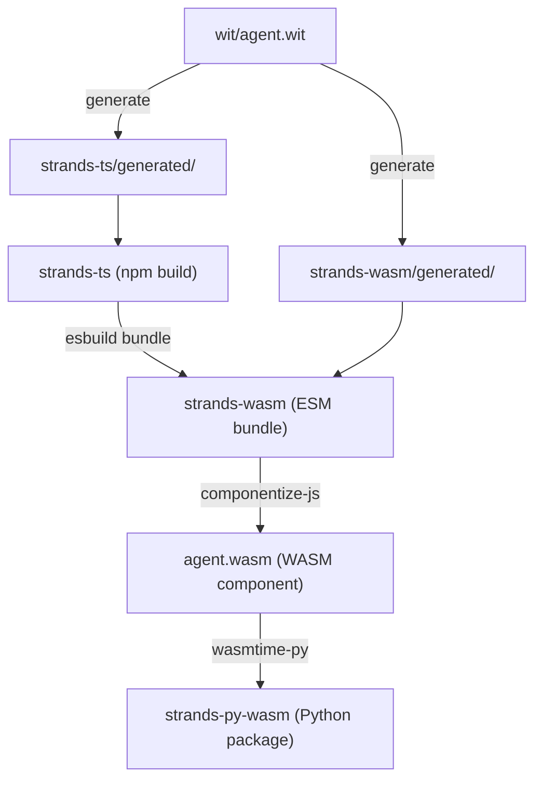

# strands-wasm

WASM build tooling and monorepo developer guide. Describes the WebAssembly component architecture, build pipeline, WIT contracts, and cross-package development workflow.

## How it works

The TypeScript SDK is compiled into a WebAssembly component (`strands-agent.wasm`). Python loads this component via wasmtime-py and drives it.

The WIT contract (`wit/agent.wit`) defines what crosses the WASM boundary:

- **Exports** (TS implements, Python calls): The `api` interface — agent construction, streaming, conversation management. All model provider HTTP calls (Bedrock, Anthropic, OpenAI, Gemini) happen inside the WASM guest.
- **Imports** (Python implements, TS calls back into): `tool-provider` for executing Python-defined tools, and `host-log` for routing log entries to Python's logging framework.

In WIT terminology, the WASM component is the "guest" and Python is the "host". When the TS agent loop decides a tool needs to run, it calls the `tool-provider` import which crosses the WASM boundary back to Python where the actual tool function lives.

## Getting started

### Prerequisites

- Node.js 20+
- Python 3.10+
- [wasmtime-py](https://github.com/bytecodealliance/wasmtime-py) (forked build with async component model support)

### First-time setup

```bash
git clone https://github.com/strands-agents/sdk-typescript.git
cd sdk-typescript
npm install
npm run dev -- bootstrap
```

`bootstrap` installs toolchains, generates type bindings, builds all layers, and runs all tests. If this command doesn't enable development out of the box, file an issue.

## Architecture

### Build pipeline

Changes flow through a pipeline. Each layer compiles into the next:



| Directory      | Language   | What it is                                                          |
| -------------- | ---------- | ------------------------------------------------------------------- |
| `wit/`         | WIT        | Interface contract between the WASM guest and host                  |
| `strands-ts/`  | TypeScript | Agent runtime: event loop, model providers, tools, hooks, streaming |
| `strands-wasm/` | TypeScript | Bridges the TS SDK to WIT exports, compiles to a WASM component    |
| `strands-py-wasm/`  | Python     | Python wrapper: Agent class, @tool decorator, direct WASM host      |
| `strands-dev/` | TypeScript | Dev CLI that orchestrates build, test, lint, and CI                 |
| `dev-docs/`    | Markdown   | Design proposal and team decisions                                  |

### Generated code

`npm run dev -- generate` produces type bindings from `wit/agent.wit` into:

- `strands-ts/generated/`
- `strands-wasm/generated/`

Generated files are created by running `npm run dev -- generate` (or `bootstrap`) and are gitignored. Do not edit them by hand. CI runs `generate --check` and fails if they are stale.

Python types are auto-generated into `strands-py-wasm/strands/_generated/types.py` by `strands-py-wasm/scripts/generate_types.py`.

### Tests

| Layer          | Framework | Location                                                          |
| -------------- | --------- | ----------------------------------------------------------------- |
| TypeScript SDK | vitest    | `strands-ts/src/**/__tests__/` (unit), `strands-ts/test/` (integ) |
| Python wrapper | pytest    | `strands-py-wasm/tests_integ/`                                         |

Add tests alongside the code you change. Bug fixes should include a test that reproduces the original issue.

## Making changes

Each layer depends on the layers above it in the pipeline. The `validate` command rebuilds and tests exactly the layers your change affects.

| What you changed                      | Validate command                      |
| ------------------------------------- | ------------------------------------- |
| WIT contract (`wit/agent.wit`)        | `npm run dev -- validate wit`         |
| TS SDK internals                      | `npm run dev -- validate ts`          |
| TS SDK public API                     | `npm run dev -- validate ts-api`      |
| WASM bridge (`strands-wasm/entry.ts`) | `npm run dev -- validate wasm`        |
| Pure Python (`strands-py-wasm/`)           | `npm run dev -- validate py`          |

**TS internals vs. public API:** The WASM bridge (`strands-wasm/entry.ts`) imports specific types and functions from `strands-ts/`. If your change modifies something the bridge imports, it is a public API change — use `validate ts-api`. If the bridge does not import it, use `validate ts`.

**WIT contract changes** cascade to every layer. After running `validate wit`, fix any compile errors in `strands-wasm/entry.ts` and the language wrappers. The build will not succeed until every layer matches the new contract.

## Dev CLI

```bash
npm run dev -- <command> [options]
```

Most commands accept layer flags (`--ts`, `--wasm`, `--py`). No flags means all layers.

| Command            | What it does                                                           |
| ------------------ | ---------------------------------------------------------------------- |
| `bootstrap`        | First-time setup: install, generate, build, test                       |
| `setup`            | Install toolchains (`--node`, `--python`)                              |
| `generate`         | Regenerate type bindings from WIT (`--check`)                          |
| `build`            | Compile layers (`--ts`, `--wasm`, `--py`, `--release`)                 |
| `test`             | Run tests (`--py`, `--ts`, or a specific `[file]`)                     |
| `check`            | Lint and type-check (`--ts`, `--py`)                                   |
| `fmt`              | Format all code (`--check` to verify without writing)                  |
| `validate <layer>` | Rebuild and test the layers affected by a change                       |
| `ci`               | Full pipeline: generate, format, lint, build, test                     |
| `rebuild`          | Clean rebuild: clean, generate, build                                  |
| `clean`            | Remove all build artifacts                                             |
| `example <name>`   | Run an example (`--py`, `--ts`)                                        |

## Code style

| Language   | Formatter     | Linter         |
| ---------- | ------------- | -------------- |
| TypeScript | `prettier`    | `tsc --noEmit` |
| Python     | `ruff format` | `ruff check`   |

```bash
npm run dev -- fmt       # format everything
npm run dev -- check     # lint everything
```

Comments are normative statements that describe what code does or why a decision was made. Avoid TODO's without associated issues, notes-to-self, and parenthetical asides.

## Submitting a PR

- Run `npm run dev -- ci` before pushing. This is the same pipeline CI runs.
- Keep PRs focused on a single change.
- Use conventional commit messages: `feat:`, `fix:`, `refactor:`, `docs:`, etc.
